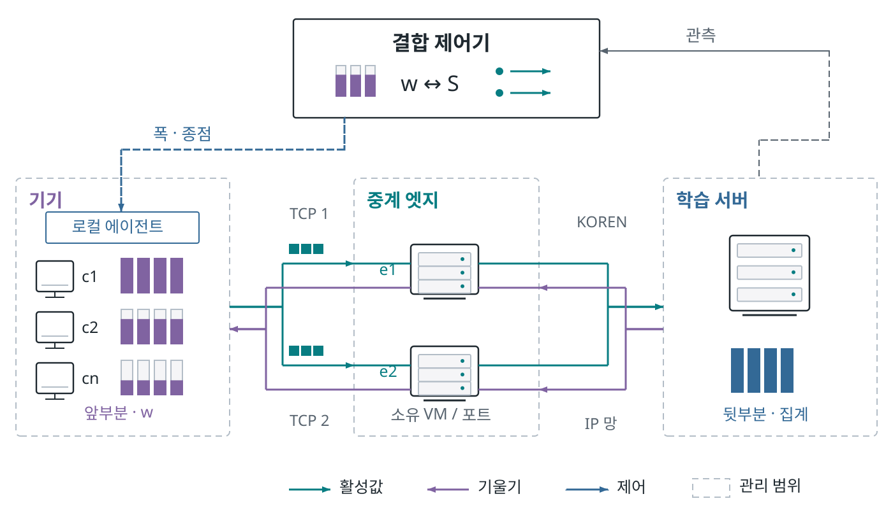

# AwareNet

## 분할 연합학습을 위한 폭·경로 적응형 스케줄러

분할 연합학습은 기기의 연산 부담을 줄이는 대신 매 배치의 활성값·기울기 전송을 기다린다. AwareNet은 **현재 폭을 유지한 경로 재배정의 이득을 먼저 평가하고, 남은 병목에 대해 시간 이득과 폭 축소 비용을 비교**한다. 기기의 계산 시간, 텐서 바이트, 공유 경로 용량을 입력받아 다음 라운드의 폭·중계 종점·전송 분할량을 정한다.

**[연구 홈페이지](https://sijoon-sung.github.io/AwareNet/) · [보고서 PDF](site/assets/report.pdf) · [원자료 색인](https://sijoon-sung.github.io/AwareNet/site/evidence.html) · [문서 목차](docs/INDEX.md)**

충남대학교 AwareNet · KOREN 넷챌린지 · 보고서 전면 개정 2026-09-27



### 핵심 결과: 시간과 정확도

KOREN의 VM 두 대와 HPC를 연결한 **32논리클라이언트** 실험에서 평균 라운드 시간은 정상 24.6%, 트래픽 몰림 42.6%, 연산 지연 40.3%, 용량 변동 26.7% 짧아졌다. 각 실행은 24라운드이며 초기 4라운드를 제외한 3시드 평균이다. 같은 실행의 최종 정확도와 응용 전송량은 보고서 표 4·5에 함께 제시한다.

별도의 **8프로세스·200라운드** 기록은 폭 보존 가중치 λ에 따른 시간·정확도 관계를 보여준다.

| 설정 | 평균 라운드 | 시간 단축 | 평균 폭 | 정확도 |
|---|---:|---:|---:|---:|
| 기준선 | 19.11초 | — | 1.000 | 65.52% |
| AwareNet λ=280 | 15.15초 | 20.7% | 1.000 | 65.22% |
| AwareNet λ=70 | 12.90초 | 32.5% | 0.977 | 63.17% |
| AwareNet λ=18 | 8.01초 | 58.1% | 0.832 | 53.59% |

정확도는 CIFAR-10 시험 데이터 앞 2,000개의 마지막 50라운드 평균을 구한 뒤 두 시드 간 평균했다. 두 계열 모두 비교군은 전폭·단일 출구·고정 배정의 기준선과 두 출구의 AwareNet이며, 규모별 연산·네트워크 조건은 보고서 표 3을 따른다. 같은 출구 수의 정책 비교와 목표 정확도 도달 시간은 후속 평가 항목이다.

### 기여

1. 경로 우선 평가와 폭 보존 비용을 이용하는 라운드 단위 스케줄러.
2. KOREN 교란 조건에서 라운드 시간과 실제 폭·경로 선택의 연결.
3. 200라운드 기록에 기반한 시간·학습 품질의 운영점 분석.

Jetson Orin Nano Super 8GB의 전력 모드별 90스텝 측정과 KOREN의 LoRA 분할·연합 집계 실행은 장비 비용과 분산 배치의 근거를 제공한다. 원시 측정·환경·실행 조건은 아래 자료에서 확인할 수 있다.

| 자료 | 내용 |
|---|---|
| [E1](https://sijoon-sung.github.io/AwareNet/site/evidence.html#E1) | KOREN 32프로세스 시나리오 로그·인자·교란 조건 |
| [E2](https://sijoon-sung.github.io/AwareNet/site/evidence.html#E2) | Jetson 3전력 모드의 스텝·전력·환경 기록 |
| [E4](https://sijoon-sung.github.io/AwareNet/site/evidence.html#E4) | LoRA 학습·집계·문답 평가·모델 메모리 기록 |
| [E7](https://sijoon-sung.github.io/AwareNet/site/evidence.html#E7) | 8프로세스 축소 실행·과거 실측값 주입 재현 |
| [E8](https://sijoon-sung.github.io/AwareNet/site/evidence.html#E8) | 이번 보고서의 지표 정의·시드별 수치·집계·그림 생성 코드 |

### 검산과 실행

보존된 원파일의 해시와 핵심 통계를 Python 표준 라이브러리로 검산한다.

```sh
python site/assets/evidence/verify_evidence.py
```

홈페이지는 빌드나 JavaScript 의존성이 없는 정적 파일이다.

```sh
python -m http.server 8000 --directory site
```

실험 실행은 [코드 지도](sfl/ARCHITECTURE.md), [실행 안내](docs/README_legacy.md)를 참고한다. 네트워크 집행·SDN 확장은 [E6 구현 자료](https://sijoon-sung.github.io/AwareNet/site/evidence.html#E6), 보조 가상망 실험은 [계측소 재현](observability/README.md)에서 다룬다. 운영자가 사용할 수 있는 기기 프로그램과 중계 종점이 현재 제어 대상이다.

### 자료 구조

- `output/prose_awarenet/`: **현재 제출 보고서 21쪽**, 그림 6개·표 6개, 복사용 HTML
- `site/`: 연구 홈페이지, E1–E8 원자료, 보고서와 보조 계측 기록
- `sfl/`: 폭·경로 계획, 전송·재조립, 분할 학습 및 SDN 확장
- `scripts/analysis/`: 실험 재집계·그림·보고서·홈페이지 생성
- `configs/measurements/`: 지표 정의, 출처·해시 원장
- `docs/`: 현재 제출 원고, 과거 실험·설계 기록 및 문서 색인

이 공개 저장소는 비공개 개발 저장소의 `awarenet` 작업본을 별도로 게시한다. 원시 측정 파일과 과거 실측값을 주입한 재현 파일은 [출처 원장](configs/measurements/publication_evidence_2026-09-27.json)에 따라 구분해 보존한다.
