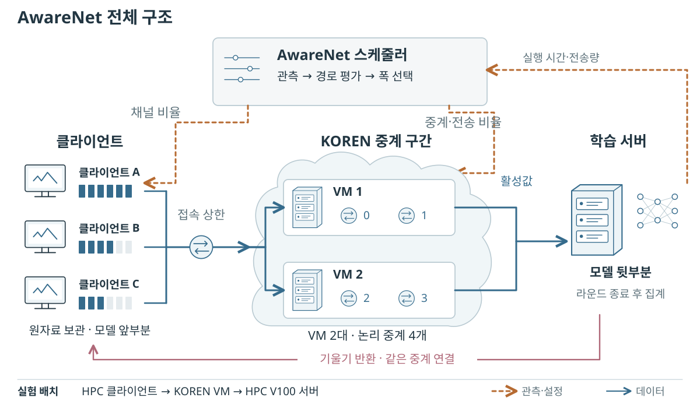
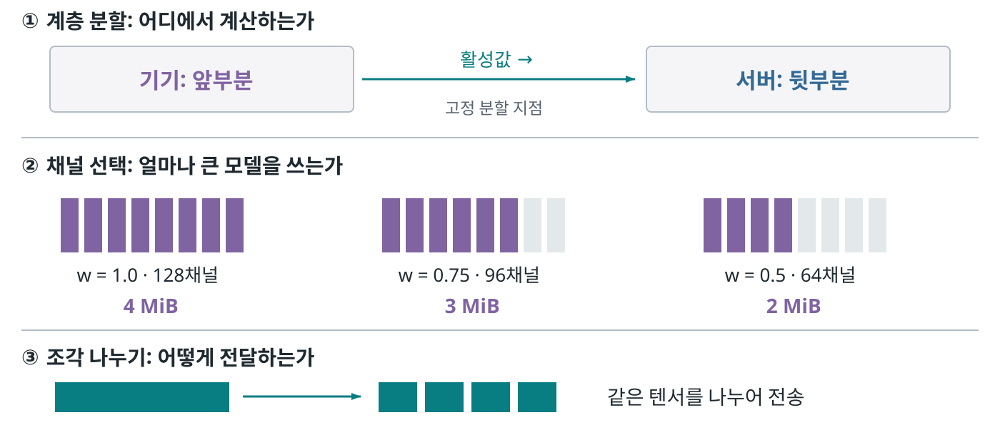
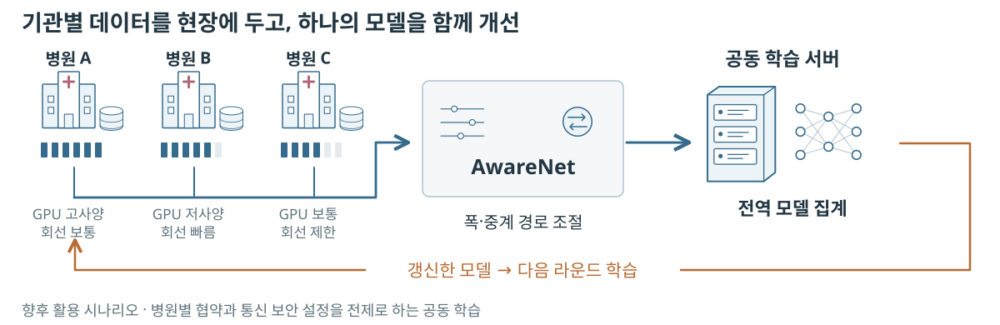
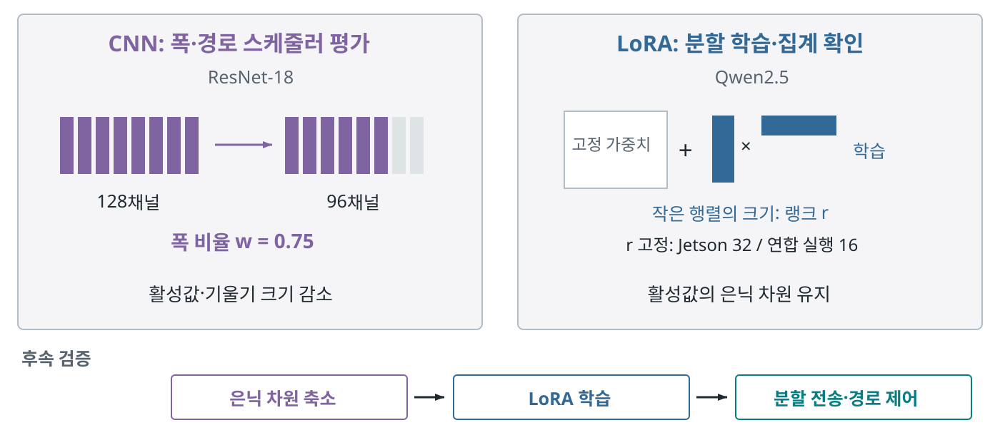

# AwareNet

## 분할 연합학습을 위한 폭·경로 적응형 스케줄러

분할 연합학습에서는 클라이언트가 모델 앞부분을, 서버가 뒷부분을 학습한다. 클라이언트의 계산이 느리거나 중간 계산 결과의 전송이 밀리면 전체 학습이 기다리게 된다. AwareNet은 **여유 있는 중계 서버를 먼저 찾고, 남은 지연에 대해 CNN 채널 수를 줄일지 판단**한다. 채널 수를 줄이면 계산량과 전송량이 함께 줄지만 모델도 작아지므로, 시간 이득과 축소 정도를 함께 비교한다.

**[연구 홈페이지](https://sijoon-sung.github.io/AwareNet/) · [최종평가 자료](https://sijoon-sung.github.io/AwareNet/site/submission.html) · [보고서 PDF](site/assets/report.pdf) · [원자료 색인](https://sijoon-sung.github.io/AwareNet/site/evidence.html) · [문서 목차](docs/INDEX.md)**

충남대학교 AwareNet · KOREN 넷챌린지 · 최종평가 양식 반영 2026-09-30



### 모델 축소의 비용과 교체 가능한 학습 모듈

출발점은 **클라이언트 부담을 줄이기 위한 모델 축소가 정확도에 영향을 줄 수 있다는 문제**다. CNN 평가에서는 ResNet-18의 채널 수를 조절했다. 모델 추출·집계를 전송 제어와 분리해, 다른 학습 알고리즘에도 해당 모델의 비용 프로파일을 연결할 수 있다. 네트워크 여유로 줄일 수 있는 지연을 먼저 처리하여 불필요한 축소를 줄인다. 채널 축소에도 품질 비용이 있으므로 시간과 정확도를 함께 평가한다.

CNN의 폭은 채널 수로 표현한다. 고정 분할 지점에서 128채널을 96·64채널로 줄이면 배치 32의 FP32 활성값은 4·3·2MiB가 된다. 폭 비율 w는 원래 채널 수 대비 사용하는 비율이다. 계층 분할은 계산 위치, 모델 폭 조절은 채널 수, 전송 조각 나누기는 전달 방식이다. [PyTorch 채널 정의](https://docs.pytorch.org/docs/stable/generated/torch.nn.Conv2d.html)와 [FjORD](https://arxiv.org/abs/2102.13451)의 용어를 따른다.



초기 FjORD 계열의 앞쪽 채널 선택에서, 라운드마다 선택 채널을 바꾸는 **FedRolex식 롤링 추출**도 추가·검증했다. 300라운드·두 폭 조건·세 시드의 기록이 남아 있다. 롤링은 ‘어떤 채널을 학습할지’, AwareNet은 ‘몇 개의 채널을 어느 경로로 학습·전송할지’를 결정한다. 본문의 24·200라운드 비교와 구분한 [적용 이력과 원자료](docs/03_리서치/FjORD_FedRolex_적용이력_2026-09-28.md)를 제공한다.

기대 효과는 병원처럼 데이터를 한곳에 모으기 어려운 여러 기관의 공동 학습을 지원하는 것이다. 계산·통신 상태에 맞춰 모델 폭과 중계 경로를 스케줄링하여 대기를 줄이고, 여러 기관의 데이터가 반영된 **전역 모델을 지속적으로 개선할 기반**을 마련한다. 아래 그림은 향후 적용 시나리오다. 효과는 목표 성능 도달 시간과 기관별 모델 성능으로 평가한다.



대역폭 재배분에서 채널·경로 조절로 바뀐 이유, 중계 서버를 선택한 이유, 고정 시간 목표를 수정한 과정은 [설계 선택과 용어 근거](docs/03_리서치/용어와_설계선택_활용시나리오_2026-09-27.md)에 정리했다. 원문은 [E9](https://sijoon-sung.github.io/AwareNet/site/evidence.html#E9)에서 확인할 수 있다.

### CNN과 LoRA 실험의 관계

**CNN에서는 폭·경로 스케줄러를 평가하고, LoRA 언어모델에서는 분할 학습과 연합 집계를 확인했다.** LoRA는 원래 가중치를 고정하고 추가한 저랭크 행렬을 학습한다. 랭크 r은 CNN 채널 수와 다른 변수이며, 랭크만 바꾸어도 분할 활성값의 은닉 차원은 유지된다. 현재 Jetson 측정은 r=32, KOREN 연합 실행은 r=16을 고정했다.



[용어·코드 근거와 수정 이유](docs/03_리서치/클라이언트_모델폭_LoRA_용어정리_2026-09-28.md) · [LoRA 원문](https://arxiv.org/abs/2106.09685)

모델 폭 축소와 LoRA를 함께 쓰는 확장도 검토했다. [SliceGPT](https://arxiv.org/abs/2401.15024)는 언어모델의 은닉 차원을 줄인 뒤 LoRA로 추가 학습한다. **은닉 차원 축소 → 고정 랭크 LoRA 학습 → 분할 전송·경로 제어** 순서의 [확장 설계와 검증 기준](docs/04_설계기록/LoRA_은닉차원축소_확장검토_2026-09-28.md)을 연결했다. 아래 수치는 기존 고정 은닉 차원 실험의 결과다.

### 실망 관측과 축소 실험

KOREN을 경유하는 실제 텐서 전송에서 동시 클라이언트 8개와 32개의 배치 왕복 중앙값은 각각 0.41초와 2.18초였다. 이를 바탕으로 회선 제한과 변동을 적용하고, CPU·메모리 한도 안에서 32개 논리 클라이언트의 단기 제어와 8개의 장기 학습을 수행했다. [전송 측정 원자료](site/assets/koren-link-measurements.zip)에서 그림의 값을 확인할 수 있다.

### 핵심 결과: 시간과 정확도

KOREN의 VM 두 대와 HPC를 연결한 **32논리클라이언트** 실험에서 평균 라운드 시간은 정상 24.6%, 트래픽 몰림 42.6%, 연산 지연 40.3%, 용량 변동 26.7% 짧아졌다. 각 실행은 24라운드이며 초기 4라운드를 제외한 3시드 평균이다. 실행 조건은 최종보고서 표 4에, 시간 결과는 그림 4에 정리했다. 정확도와 응용 전송량은 원자료 색인 E8에서 함께 확인할 수 있다.

별도의 **8프로세스·200라운드** 기록은 폭 축소 페널티 λ에 따른 시간·정확도 관계를 보여준다.

| 설정 | 평균 라운드 | 시간 단축 | 평균 폭 비율 | 정확도 |
|---|---:|---:|---:|---:|
| 기준선 | 19.11초 | — | 1.000 | 65.52% |
| AwareNet λ=280 | 15.15초 | 20.7% | 1.000 | 65.22% |
| AwareNet λ=70 | 12.90초 | 32.5% | 0.977 | 63.17% |
| AwareNet λ=18 | 8.01초 | 58.1% | 0.832 | 53.59% |

정확도는 CIFAR-10 시험 데이터 앞 2,000개의 마지막 50라운드 평균을 구한 뒤 두 시드 간 평균했다. 두 계열 모두 비교군은 전체 채널·단일 연결·고정 배정의 기준선과 두 연결의 AwareNet이며, 규모별 연산·네트워크 조건은 보고서 표 4를 따른다. 같은 연결 수의 정책 비교와 목표 정확도 도달 시간은 후속 평가 항목이다.

### 기여

1. 경로 우선 평가와 폭 보존 비용을 이용하는 라운드 단위 스케줄러.
2. KOREN 교란 조건에서 라운드 시간과 실제 폭·경로 선택의 연결.
3. 200라운드 기록에 기반한 시간·학습 품질의 설정별 비교.

Jetson Orin Nano Super 8GB의 전력 모드별 90스텝 측정과 KOREN의 LoRA 분할·연합 집계 실행은 장비 비용과 분산 배치의 근거를 제공한다. 원시 측정·환경·실행 조건은 아래 자료에서 확인할 수 있다.

| 자료 | 내용 |
|---|---|
| [E1](https://sijoon-sung.github.io/AwareNet/site/evidence.html#E1) | KOREN 32프로세스 시나리오 로그·인자·교란 조건 |
| [E2](https://sijoon-sung.github.io/AwareNet/site/evidence.html#E2) | Jetson 3전력 모드의 스텝·전력·환경 기록 |
| [E4](https://sijoon-sung.github.io/AwareNet/site/evidence.html#E4) | LoRA 학습·집계·문답 평가·모델 메모리 기록 |
| [E7](https://sijoon-sung.github.io/AwareNet/site/evidence.html#E7) | 8프로세스 축소 실행·과거 실측값 주입 재현 |
| [E9](https://sijoon-sung.github.io/AwareNet/site/evidence.html#E9) | 용어 출처·설계 선택의 변천·CNN 구현·활용 예시의 근거 |
| [E8](https://sijoon-sung.github.io/AwareNet/site/evidence.html#E8) | 이번 보고서의 지표 정의·시드별 수치·집계·그림 생성 코드 |

### 검산과 실행

보존된 원파일의 해시와 핵심 통계를 Python 표준 라이브러리로 검산한다.

```sh
python site/assets/evidence/verify_evidence.py
```

홈페이지는 빌드나 JavaScript 의존성이 없는 정적 파일이다.

```sh
python -m http.server 8000 --directory site
```

실험 실행은 [코드 지도](sfl/ARCHITECTURE.md), [실행 안내](docs/README_legacy.md)를 참고한다. 네트워크 집행·SDN 확장은 [E6 구현 자료](https://sijoon-sung.github.io/AwareNet/site/evidence.html#E6), 보조 가상망 실험은 [계측소 재현](observability/README.md)에서 다룬다. 운영자가 사용할 수 있는 클라이언트 프로그램과 중계 서버가 현재 제어 대상이다.

### 자료 구조

- `site/submission.html`: **현재 최종보고서 20쪽·과제 개요 1쪽**, 고해상도 그림과 시연 영상. [자료 페이지](https://sijoon-sung.github.io/AwareNet/site/submission.html) · [KOREN 전송 원자료](site/assets/koren-link-measurements.zip)
- `output/prose_awarenet/`: 이전 24쪽 보고서와 그림·복사용 HTML
- `site/`: 연구 홈페이지, E1–E9 원자료, 보고서와 보조 계측 기록
- `sfl/`: 폭·경로 계획, 전송·재조립, 분할 학습 및 SDN 확장
- `scripts/analysis/`: 실험 재집계·그림·보고서·홈페이지 생성
- `configs/measurements/`: 지표 정의, 출처·해시 원장
- `docs/`: 현재 제출 원고, 과거 실험·설계 기록 및 문서 색인

이 공개 저장소는 비공개 개발 저장소의 `awarenet` 작업본을 별도로 게시한다. 원시 측정 파일과 과거 실측값을 주입한 재현 파일은 [출처 원장](configs/measurements/publication_evidence_2026-09-27.json)에 따라 구분해 보존한다.
