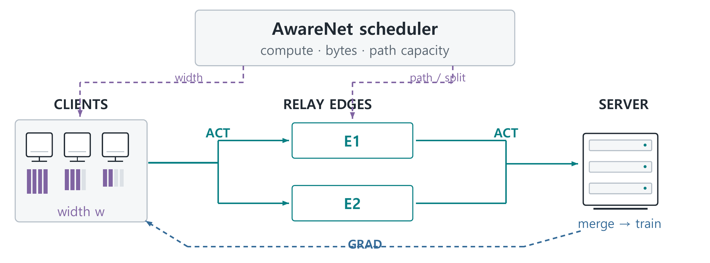
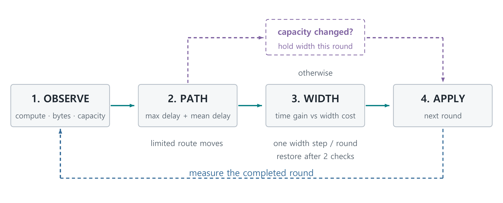
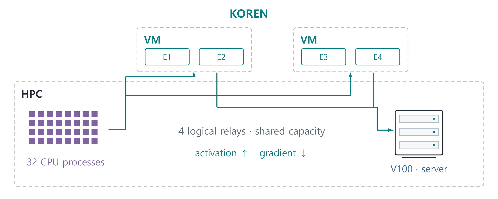
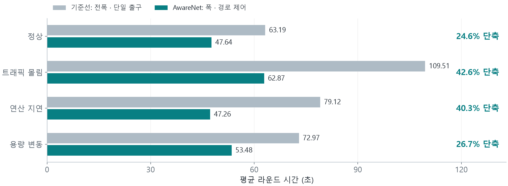
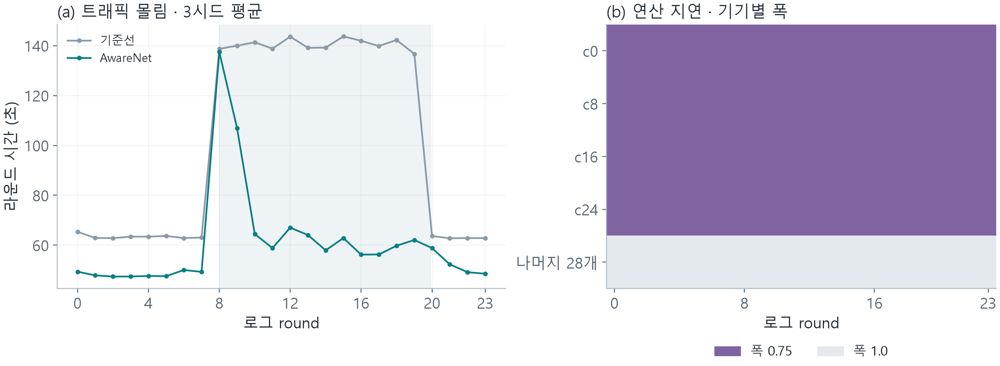
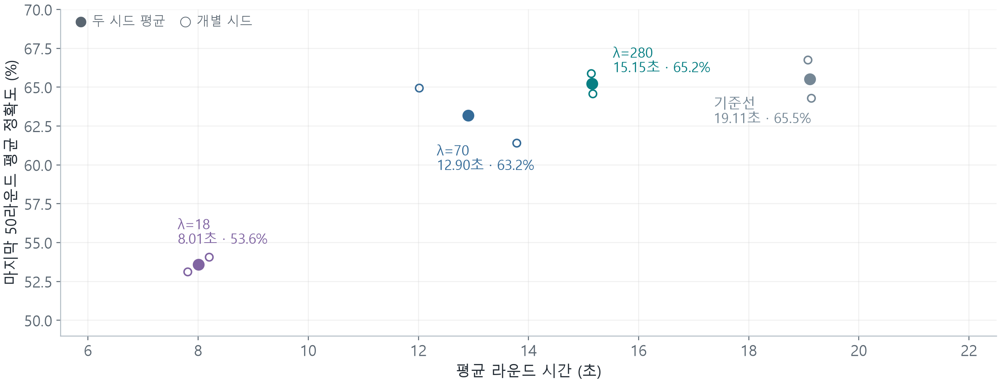

# K-디지털 챌린지 넷 챌린지 캠프 시즌13

# 최종보고서

## AwareNet

### 분할 연합학습을 위한 폭·경로 적응형 스케줄러

충남대학교 전파정보통신공학과

성시준 · 석태경

팀장 성시준 / 참가 분야: 향상된 Network

본 보고서는 모델 폭과 전송 경로를 연계하는 스케줄러의 설계, KOREN 연구망 실험, 시간·정확도 비교를 정리하였다. 2026년 9월 27일 보존된 실험 기록을 기준으로 전면 개정하였다.

한국지능정보사회진흥원장 귀하

본 연구보고서는 한국지능정보사회진흥원의 출연금으로 수행한 K-디지털 챌린지 넷 챌린지 캠프 시즌13 연구망 활용 과제의 결과이다.

<!-- page: summary -->
# 요 약 문

## 1. 제 목

AwareNet: 분할 연합학습을 위한 폭·경로 적응형 스케줄러

## 2. 아이디어 개발의 목적 및 필요성

분할 연합학습(Split Federated Learning, SFL)은 모델을 기기와 서버에 나누어 배치하여 기기의 연산·메모리 부담을 낮춘다. 대신 매 배치마다 활성값과 기울기를 주고받기 때문에, 통신이 지연되면 다음 학습 단계도 기다려야 한다. 따라서 자원이 부족한 기기의 참여를 늘리려면 계산 부담과 전송 경합을 함께 관리해야 한다.

모델 폭을 줄이면 연산량과 전송량이 감소하지만 학습에 사용하는 모델 용량도 작아진다. 경로를 바꾸면 모델을 유지한 채 혼잡을 분산할 수 있지만, 여러 경로가 공유하는 회선의 용량은 그대로다. 두 제어를 따로 적용하면 우회로 해결할 수 있는 지연에 모델 폭을 줄이거나, 계산이 느린 기기의 경로만 반복해서 바꾸는 비효율이 생긴다. AwareNet은 병목의 원인에 맞춰 경로와 폭을 순서대로 결정한다.

## 3. 아이디어 개발의 내용 및 범위

스케줄러의 입력은 기기별 계산 시간, 배치당 전송 바이트, 경로의 용량 추정값과 현재 배정이다. 먼저 현재 폭을 유지한 경로 후보들의 완료 시간을 비교한다. 이어 경로 재배정으로 확보할 수 있는 여유를 반영하고, 남은 시간 부담을 줄이는 이득이 모델 폭 축소 비용보다 클 때 폭을 조정한다. 최종 출력은 다음 라운드의 기기별 폭, 중계 엣지 배정 및 출구별 전송 비율이다.

AwareNet은 가장 늦은 기기의 완료 시간에 초점을 맞추면서 모델 폭을 보존하는 선택에도 가치를 부여한다. 라운드별 이동 수 제한과 단계적인 폭 변경으로 빈번한 재배정을 억제한다. 기기·중계 엣지·서버는 텐서 조각의 병렬 전송과 재조립으로 계획을 실행한다. 제어 대상은 운영자가 배포할 수 있는 기기 프로그램과 중계 종점이며, 층 분할 위치는 고정한다.

<!-- page: summary -->
## 4. 개 발 결 과

KOREN VM 두 대와 HPC를 연결한 32논리클라이언트 실험에서, AwareNet은 전폭·단일 출구 기준선보다 라운드 시간을 정상 24.6%, 트래픽 몰림 42.6%, 연산 지연 40.3%, 용량 변동 26.7% 줄였다. 24라운드 중 초기 4라운드를 제외한 3시드 평균이며, 실행 기록에서 혼잡에 따른 경로 이동과 지연 기기 네 개의 폭 0.75 선택을 확인하였다.

학습 품질은 8프로세스·200라운드 기록으로 평가하였다. 폭 보존 가중치 λ=280에서는 전폭을 유지하며 라운드 시간이 19.11초에서 15.15초로 줄었다. 마지막 50라운드 평균 정확도는 기준선 65.5%, AwareNet 65.2%였다. λ를 낮추면 시간과 정확도가 함께 낮아졌다.

표 1. 시간 단축과 학습 품질의 핵심 결과

| 비교 | 시간 결과 | 학습 품질 결과 |
|---|---|---|
| 32프로세스·4조건 | 24.6~42.6% 단축 | 최종 정확도: 표 4 |
| 8프로세스·λ=280 | 20.7% 단축 / 평균 폭 1.000 | 65.5% → 65.2% (-0.3%p) |
| 8프로세스·λ=70 | 32.5% 단축 / 평균 폭 0.977 | 65.5% → 63.2% (-2.3%p) |
| 8프로세스·λ=18 | 58.1% 단축 / 평균 폭 0.832 | 65.5% → 53.6% (-11.9%p) |

비교군은 출구 하나의 기준선과 두 출구의 AwareNet이다. 8프로세스 결과는 2시드이며, CIFAR-10 시험 데이터 앞 2,000개로 정확도를 평가했다. 세부 조건은 본문에 제시한다.

## 5. 기 대 효 과

본 결과는 응용의 시간·품질 요구에 따라 폭 보존 가중치를 선택하는 기준을 제공한다. Jetson 연산 측정과 KOREN LoRA 분할 실행은 기기 자원 제약과 분산 학습의 실행 가능성을 뒷받침한다.

<!-- page: contents -->
# 목 차

<!-- auto-contents -->
Ⅰ. 서론 · Ⅱ. 아이디어 개발 추진 내용과 범위 · Ⅲ. 아이디어 개발 진행 내용 및 결과 · Ⅳ. 결론 · Ⅴ. 참고문헌 · 부록. 원자료와 재현 안내

<!-- page: main -->
# Ⅰ. 서 론

## 1. 개발 목적 및 필요성

연합학습은 데이터를 기기에 보관하면서 여러 기기의 학습 결과를 모아 모델을 갱신한다. 그러나 기기마다 전체 모델을 학습시키면 메모리와 연산 능력이 작은 장비의 참여가 어렵다. 분할 연합학습은 앞부분 모델을 기기에, 뒷부분 모델을 서버에 배치하여 이 부담을 나눈다. 기기는 배치의 활성값을 보내고 서버의 기울기를 받아 역전파를 수행한다. 그 결과 기기 자원과 네트워크 상태가 함께 학습 속도를 결정한다.

이 구조에서 지연의 원인은 두 가지로 나뉜다. 첫째는 기기의 계산이 오래 걸리는 경우다. 같은 배치를 처리해도 기기 성능이나 전력 모드에 따라 실행 시간이 달라진다. 둘째는 기기가 계산을 마쳤지만 활성값이나 기울기의 전송이 지연되는 경우다. 여러 기기가 같은 중계 구간에 몰리면 경합이 커지고, 한 기기의 늦은 완료가 전체 라운드를 지연시킨다.

모델 폭 제어와 경로 제어는 이 두 원인에 서로 다르게 작용한다. 폭을 줄이면 계산량과 텐서 크기가 함께 감소하므로 기기 부담을 낮출 수 있다. 다만 학습에 사용하는 채널과 파라미터도 줄어든다. 경로 재배정은 모델을 유지하면서 중계 구간의 경합을 분산한다. 이때 대체 경로에 여유가 있는지, 같은 접속 회선을 공유하는지를 함께 살펴야 한다. 따라서 먼저 경로로 해소할 수 있는 부담을 평가한 뒤 남은 병목에 폭 제어를 적용하는 순서가 필요하다.

본 과제는 이 판단을 라운드 단위로 수행하는 AwareNet을 개발하였다. 기기별 계산 시간과 전송량, 공유 경로의 용량으로 완료 시간을 예측하고 폭과 경로 후보를 평가한다. 연구 질문은 “경로를 재배정해 모델 폭을 유지할 수 있는가, 그리고 남은 지연을 줄이기 위해 어느 기기의 폭을 얼마나 조정해야 하는가”이다. KOREN 실행 기록을 이용해 시간 변화를 확인하고, 별도의 장기 학습 기록으로 폭 보존과 정확도의 관계를 분석한다.

<!-- page: main -->
## 2. 선행연구와 본 과제의 기여

FjORD와 FedRolex는 이질적인 기기가 서로 다른 크기의 부분 모델을 학습하는 방법을 다룬다.[1,2] AdaptSFL은 분할 위치와 기기 모델 집계 주기를, SuperSFL은 이질적인 분할 깊이와 기울기 결합을 다룬다.[3,4] 통신·연산 자원과 분할 위치의 공동 최적화 역시 연구되어 왔다.[5,6] 이 연구들은 기기 자원과 학습 동작을 연결하는 토대를 제공한다.

AwareNet이 집중하는 것은 정해진 분할 위치에서 모델 폭과 중계 경로 배정을 함께 운용하는 문제다. 경로의 수보다 공유 자원 아래의 실제 처리 능력을 평가하고, 경로 재배정으로 줄일 수 있는 지연을 폭 선택에 먼저 반영한다. 표 2는 이러한 제어 대상의 차이를 정리한다.

표 2. 관련 연구와 AwareNet의 제어 대상

| 접근 | 주요 결정 변수 | 본 과제와의 연결 |
|---|---|---|
| FjORD·FedRolex [1,2] | 부분 모델의 크기·추출 | 폭 선택의 학습 측 구성 요소 |
| AdaptSFL·SuperSFL [3,4] | 분할·집계·기울기 결합 | 자원 적응형 SFL의 설계 토대 |
| 자원 공동 최적화 [5,6] | 통신·연산 자원 배분 | 완료 시간 기반 판단의 관련 접근 |
| AwareNet | 폭·중계 종점·전송 분할 | 공유 경로의 여유를 폭 선택에 반영 |

본 과제의 기여는 세 가지다. 첫째, 경로 후보를 먼저 평가하고 시간 이득과 폭 축소 비용을 비교하는 단계적 스케줄러를 구현하였다. 둘째, KOREN의 실제 텐서 전송 환경에서 네 가지 교란 조건의 라운드 시간을 측정하고 배정·폭의 변화와 연결하였다. 셋째, 폭 보존 가중치를 바꾼 200라운드 기록을 통해 시간과 정확도를 함께 선택할 수 있는 운영점을 제시하였다.

이후 Ⅱ장은 입력 지표에서 경로·폭 결정과 전송 실행으로 이어지는 구조를 설명한다. Ⅲ장은 동일한 비교군 정의 아래 시간, 통신량, 학습 품질을 순서대로 제시하고 실제 장비 기록으로 적용 배경을 보완한다.

<!-- page: main -->
# Ⅱ. 아이디어 개발 추진 내용과 범위

## 1. 시스템 구성과 완료 시간 예측

### 가. 기기·중계 엣지·서버의 역할

기기는 앞부분 모델의 순전파와 역전파를 수행하고, 학습 서버는 뒷부분 모델과 여러 기기의 갱신 집계를 맡는다. 중계 엣지는 기기와 서버 사이에서 텐서 조각을 전달한다. AwareNet 스케줄러는 완료된 라운드의 계산·전송 기록을 받아 다음 라운드의 폭과 중계 종점을 정한다. 그림 1은 학습 데이터 흐름과 제어 출력을 나타낸다.

폭은 채널·은닉 차원에서 학습에 사용하는 비율이다. 본 CNN 실험은 층 분할 위치를 2로 고정하고 폭을 0.5, 0.75, 1.0 중에서 선택한다. 경로는 기기가 연결할 중계 종점의 조합이다. 출구가 두 개인 기기는 각각의 종점을 선택하고, 한 텐서의 조각을 두 연결에 나누어 보낸다.

스케줄러는 기기 계산 시간, 전폭에서의 텐서 바이트, 접속 상한 및 중계 용량을 입력받는다. 관측된 전송 지연은 경로 용량과 예측 오차를 갱신하는 데 사용한다. 출력은 기기별 폭, 출구별 중계 종점, 조각 배분 비율이다. 이 입력과 출력의 연결이 다음 절의 비용 계산과 의사결정 절차를 구성한다.

<!-- page: main -->
### 나. 폭과 경로를 시간으로 비교하는 방법

폭을 줄였을 때의 계산 절감과 경로를 바꿨을 때의 전송 절감을 비교하려면 같은 단위가 필요하다. 기기 i의 폭을 wᵢ, 전체 경로 배정을 S라고 할 때 배치 완료 시간을 다음과 같이 예측한다.

<!-- equation: time -->
$$t_i(w_i,S)=c_iw_i^{\gamma_i}+8b_iw_i/R_i(S)+\epsilon_i$$

cᵢ는 전폭 계산 시간, γᵢ는 폭 변화에 따른 계산 시간의 지수, bᵢ는 전폭 배치의 왕복 바이트다. Rᵢ(S)는 해당 배정에서 기기에 돌아가는 유효 전송률(bit/s)이다. 같은 중계나 접속 회선을 지나는 흐름의 용량을 함께 계산하므로, 단순히 연결 수를 더해 속도를 늘리지 않는다. εᵢ는 관측과 기본 예측의 차이를 반영한다.

경로 단계에서는 현재 폭을 유지하고 최대 지연과 평균 지연의 합을 비교한다. 최대 지연은 라운드 완료를, 평균 지연은 나머지 기기의 대기를 반영한다. 코드의 경로 점수는 아래 값의 N배로 같은 순위를 만든다.

<!-- equation: path -->
$$J_P(S\mid w)=\max_i t_i+(1/N)\sum_i t_i$$

폭 단계에서는 경로 평가로 얻은 목표 배정 S*를 두고 다음 비용을 비교한다. B는 라운드당 배치 수, N은 기기 수이며 λ는 평균 폭을 한 단위 줄이는 데 부여한 시간 비용이다. λ가 클수록 넓은 폭을 선호한다.

<!-- equation: width -->
$$J_W(w\mid S^*)=\max_i Bt_i(w_i,S^*)+(\lambda/N)\sum_i(1-w_i)$$

폭 보존 항은 사용자가 모델 용량에 부여한 가중치다. 정확도 변화는 Ⅲ장의 학습 결과로 별도 확인한다. 이 두 점수를 경로 평가와 폭 선택에 각각 사용하여, 경로의 여유가 있을 때 폭을 보존하고 남은 부담에 대해 축소 여부를 판단한다.

<!-- page: main -->
## 2. 라운드별 적응형 제어

### 가. 경로 평가 후 폭을 결정하는 절차

AwareNet은 완료된 라운드의 관측을 이용해 다음 라운드를 계획한다. 먼저 현재 폭으로 허용된 중계 종점 조합을 평가한다. 기기 수가 많을 때에는 한 기기의 경로를 바꿔 전체 지연 점수를 줄이는 후보를 반복 선택한다. 32프로세스 실험에서는 한 라운드에 최대 세 기기의 배정을 변경하였다.

경로 선택 뒤에는 재배정이 정착한 목표 배정을 기준으로 폭을 평가한다. 가장 느린 기기와 그에 가까운 기기들의 폭을 한 단계 낮추어 최대 완료 시간이 얼마나 줄어드는지 계산한다. 예상 이득의 90%가 λ×평균 폭 감소량보다 크면 그 후보를 채택한다. 이번 라운드에 실행할 폭 변경은 한 단계로 제한하고, 폭을 다시 늘릴 때에는 두 번 연속 복귀 조건을 확인한다.

망 용량의 관측 변화가 설정 용량의 5%를 넘는 라운드에는 폭을 유지하면서 경로를 먼저 조정한다. 또한 경로 점수의 감소가 이동 대상 기기 시간의 10%와 전환 비용을 합한 문턱을 넘어야 이동한다. 이 규칙들은 단기 측정 변동에 대한 불필요한 폭 축소와 반복적인 경로 변경을 줄이기 위한 제어 여유다.

<!-- page: main -->
### 나. 결정 예시와 텐서 전송

혼잡한 중계를 사용하는 기기가 대체 중계로 이동했을 때 예상 완료 시간이 줄어든다면, 스케줄러는 현재 폭을 유지한 채 경로를 바꾼다. 대체 경로까지 같은 접속 회선을 공유해 더 빨라지지 않거나 기기 계산이 여전히 가장 오래 걸리면 폭 축소의 시간 이득을 평가한다. 네트워크 조정과 모델 축소가 같은 문제에 중복 대응하지 않도록 순서를 정한 것이다.

폭 결정의 수치 예로, 기기 8개에서 한 기기의 폭을 1.0에서 0.75로 줄이면 평균 폭 감소량은 0.25/8이다. λ=70일 때 비용은 약 2.19초다. 최대 라운드 시간이 3초 줄 것으로 예측하면 여유를 적용한 이득 2.7초가 비용을 넘어 후보를 채택한다. 예측 이득이 2초이면 1.8초가 비용보다 작아 폭을 유지한다. 이 예는 구현된 판단식의 계산을 보여준다.

결정된 경로에서는 출구별 예상 전송률에 비례해 조각을 배분한다. 예를 들어 두 출구의 예상 속도가 6과 2이면 약 3:1로 나누어 완료 시각을 맞춘다. 현재 구현은 설정 용량과 공유 배정으로 조각 비율을 계산하고, 관측 용량은 경로 이동 판단에 사용한다. 이 구분은 배분 비율의 변화 자체를 중계 용량 변화로 오인하는 것을 줄이기 위한 선택이다.

전송 계층은 활성값과 기울기를 조각으로 나누어 지속 TCP 연결에 보낸다. 수신 측은 배치와 텐서 식별자를 이용해 조각을 모으고, 전체 텐서가 완성되면 학습 계산에 전달한다. 빠른 조각의 도착이 곧 다음 학습 단계의 시작을 뜻하지 않으므로 스케줄러는 전체 텐서의 완료 지연을 기준으로 판단한다.

실험에서는 Linux 트래픽 제어 기능으로 중계 용량과 지연 조건을 설정하였다. 세부 명령과 계측 도구는 재현 자료에 수록하였다. 주기적인 경로·폭 계획은 비용 계산과 규칙으로 수행하며, 전송 계층은 결정된 계획을 라운드 동안 유지한다.

<!-- page: main -->
# Ⅲ. 아이디어 개발 진행 내용 및 결과

## 1. 실험 구성과 비교 방법

실험은 세 질문에 답하도록 구성하였다. 첫째, 서로 다른 병목 조건에서 라운드 시간이 얼마나 줄어드는가. 둘째, 폭·경로의 실제 선택이 병목의 변화와 어떻게 연결되는가. 셋째, 더 짧은 시간을 선택할 때 정확도는 어떻게 달라지는가. 앞의 두 질문은 32프로세스 시나리오로, 세 번째는 8프로세스의 200라운드 기록으로 평가한다.

HPC에는 CPU 클라이언트 프로세스와 V100 학습 서버를, KOREN VM 두 대에는 총 네 개의 논리 중계 종점을 배치했다. 프로세스들이 실제 원격 TCP 연결로 데이터를 교환하며, 교란은 실행 중인 회선 설정과 기기 연산 지연에 적용하였다. 기기 수 32는 이 배치에서 실행한 논리 참여자 수다.

두 계열 모두 기준선은 전폭·단일 출구·고정 배정이며, AwareNet은 두 출구와 폭·경로 제어를 사용한다. 따라서 비교의 대상은 두 시스템 구성이다. CIFAR-10 CNN, 분할 위치 2, 배치 크기 32, 라운드당 4배치, SGD 학습률 0.05를 공통으로 사용했다. 다음 표에 규모별로 달라지는 자원 조건을 정리한다.

<!-- page: main -->
### 실험 조건과 지표 정의

표 3. 시간 평가와 정확도 평가의 조건

| 구분 | 32프로세스 시간 평가 | 8프로세스 정확도 평가 |
|---|---|---|
| 기기 실행 | CPU 프로세스 32개·각 1스레드 | CPU 프로세스 8개·각 2스레드 |
| 반복 | 24라운드·3시드 | 200라운드·2시드 |
| 중계 용량 | 56Mbps × 4 | 125Mbps × 4 |
| 출구 A/B | 기기마다 5/2Mbps | 6개 50/20, 2개 20/20Mbps |
| 폭·가중치 | 0.5/0.75/1.0, λ=70 | 같은 폭 후보, λ=18/70/280 |
| 이동 상한 | 라운드당 3기기 | 라운드당 1기기 |
| 시간 지표 | 초기 4R 제외 평균 | 초기 4R 제외 평균 |
| 정확도 지표 | 최종 round 23 | round 150-199 평균 |

32프로세스의 정상 조건은 교란 없이 실행한다. 트래픽 몰림에서는 완료 라운드 수를 기준으로 8부터 중계 1의 용량을 56에서 14Mbps로 낮추고 20에 복구한다. 연산 지연에서는 c0·c8·c16·c24의 속도 계수를 0.15로 둔다. 용량 변동에서는 중계 1의 용량을 7Mbps 단위로 감소·복구한다. 원시 로그의 round 번호는 0부터 시작한다.

8프로세스의 연산 속도 계수는 c0=0.15, c1=0.25, 나머지=1.0이다. c2·c3의 출구는 20/20Mbps, 나머지는 50/20Mbps로 설정했다. 학습 정확도는 실행 중 학습한 최대 폭의 모델을 시험 데이터 앞 2,000개로 평가했다. 데이터 분할의 Dirichlet 계수는 0.5, 서버 인자의 alpha=1.2는 지연 기준선 배율이다. 각 지표는 실행별 값을 구한 뒤 시드 간 평균했다.

8프로세스 계열은 CPU·메모리 제약을 고려해 구성한 축소 실험으로 SHRiNK의 관점을 참고하였다.[9] 규모와 자원 조건을 함께 바꾸었으므로 두 계열은 각각의 질문에 대한 결과로 제시한다. 응용 전송량은 서버가 기록한 활성값·레이블·기울기 바이트의 합이며, TCP/IP 헤더·재전송·모델 집계까지 포함한 회선 사용량과 구별한다.

<!-- page: main -->
## 2. 라운드 시간과 병목별 동작

### 가. 네 조건의 시간 비교

그림 4는 기준선과 AwareNet의 평균 라운드 시간이다. 정상 조건에서는 63.19초에서 47.64초, 트래픽 몰림에서는 109.51초에서 62.87초로 줄었다. 연산 지연과 용량 변동에서도 각각 40.3%, 26.7%의 단축을 확인했다. 가장 큰 차이는 중계 구간에 교란을 준 트래픽 몰림 조건에서 나타났다.

표 4. 같은 실행에서 기록한 최종 정확도

| 조건 | 기준선 | AwareNet | 차이 |
|---|---|---|---|
| 정상 | 43.48% | 48.12% | +4.63%p |
| 트래픽 몰림 | 44.82% | 44.32% | -0.50%p |
| 연산 지연 | 45.72% | 44.52% | -1.20%p |
| 용량 변동 | 45.98% | 43.13% | -2.85%p |

표 4는 24라운드 시점의 학습 진행을 보여준다. 시간은 네 조건에서 줄었지만 정확도 차이는 조건에 따라 달랐다. 장기 학습에서 폭 보존 가중치에 따라 달라지는 시간·정확도 관계는 3절의 200라운드 결과로 확인한다.

<!-- page: main -->
### 나. 시간 변화와 실제 제어의 연결

트래픽 몰림에서는 중계 용량이 낮아진 뒤 경로 재배정이 발생하였다. 시드 1의 로그 round 9에서 세 기기가 종점을 바꾸었고, 분석 구간의 전체 평균 폭은 0.998이었다. 연산 지연에서는 세 시드 모두 c0·c8·c16·c24의 폭을 0.75로, 나머지 28개를 1.0으로 유지하였다. 그림 5는 이 두 동작을 실행 기록에서 보여준다.

표 5. 시간 단축과 응용 전송량의 변화

| 조건 | 시간 단축 | 평균 폭 | 전송량 감소 |
|---|---|---|---|
| 정상 | 24.6% | 1.000 | 약 0.0% |
| 트래픽 몰림 | 42.6% | 0.998 | 0.25% |
| 연산 지연 | 40.3% | 0.969 | 3.12% |
| 용량 변동 | 26.7% | 0.975 | 2.50% |

시간 단축률과 바이트 감소율은 서로 다른 결과다. 정상 조건은 폭과 데이터량을 유지하면서 두 출구를 활용했고, 연산 지연은 일부 기기의 폭을 줄였다. 트래픽 몰림의 큰 시간 차이와 작은 바이트 차이는 전송량뿐 아니라 경합과 완료 지연을 관찰해야 하는 이유를 보여준다.

<!-- page: main -->
## 3. 모델 성능과 폭 보존의 선택

그림 6은 8프로세스·200라운드 실험에서 가중치 λ에 따라 달라지는 시간과 정확도를 나타낸다. 채운 점은 두 시드 평균이며 빈 점은 개별 시드다. 정확도는 마지막 50라운드의 평균을 사용하였다.

표 6. 200라운드 실험의 시간과 학습 품질

| 설정 | 라운드 시간 | 평균 폭 | 정확도 |
|---|---|---|---|
| 기준선 | 19.11초 | 1.000 | 65.52% |
| AwareNet λ=280 | 15.15초 | 1.000 | 65.22% |
| AwareNet λ=70 | 12.90초 | 0.977 | 63.17% |
| AwareNet λ=18 | 8.01초 | 0.832 | 53.59% |

λ=280은 분석 구간에서 폭을 유지하면서 시간을 20.7% 줄였고 평균 정확도 차이는 -0.29%p였다. λ=70은 32.5% 단축과 -2.35%p, λ=18은 58.1% 단축과 -11.93%p를 보였다. 이 기록에서는 큰 가중치가 기준선에 가까운 정확도를, 작은 가중치가 더 빠른 실행을 제공했다. 두 시드의 관측값은 응용별 시간·품질 요구를 정하는 자료로 활용하며, 정확도 차이의 정밀 평가는 독립 반복을 늘려 수행한다.

<!-- page: main -->
## 4. 실제 장비 측정과 분할 학습 실행

### 가. 기기의 자원 제약을 확인한 측정

Jetson 측정은 폭·경로 제어가 필요한 배경인 기기 자원 차이를 확인한다. Jetson Orin Nano Super 8GB 한 대에서 Qwen2.5-0.5B의 LoRA 학습을 FP32, rank 32, 배치 1, 길이 256으로 실행했다. 초기 3스텝을 제외하고 전력 모드별 30스텝을 측정한 중앙값은 MAXN_SUPER 554.1ms, 25W 608.9ms, 15W 903.7ms였다. 같은 모델·배치에서도 전체 스텝 시간은 전력 모드에 따라 약 1.63배 차이가 났다.

KOREN VM의 모델 규모별 기록에서는 Qwen2.5-7B 전체 로컬 학습이 메모리 부족으로 종료되었다. 분할 배치에서는 기기 앞부분과 서버 뒷부분이 기울기를 교환하며 10스텝을 진행했다. 앞부분 단독 프로파일의 최대 메모리는 6.44GB, 실제 분할 실행의 기기 최대 기록은 7.94GB였다. 이 결과는 분할 배치의 필요성과 실행 시 추가 메모리 비용을 함께 보여준다.

### 나. 분할과 연합 집계의 실행

LoRA 실습은 KOREN VM 두 대의 논리클라이언트 3개와 HPC 서버에서 수행했다. Qwen2.5-0.5B를 cut 2에서 나누고 rank 16, 학습률 3×10⁻⁴로 16라운드×30스텝을 실행하였다. 기기와 서버는 활성값·기울기를 교환하고 라운드 끝에 어댑터를 집계했다. LoRA와 SplitLoRA는 이 구성의 관련 학습 기법이다.[7,8]

학습 사실의 질문 표현을 바꾼 자체 18문항에서 미학습 모델은 0개, 단독 학습은 6개, 연합 두 방식은 각각 12개를 맞혔다. 이 실습은 분할 실행과 여러 기기의 학습 내용 반영을 확인하는 보조 실험이다. CNN 스케줄러의 정확도 평가는 앞 절의 CIFAR-10 결과를 사용하며, Jetson·LoRA 측정은 장비와 모델 조건을 별도로 기록한다.

Jetson 원시 스텝·전력·환경 기록, 7B 메모리 로그, LoRA 학습·평가 파일은 공개 자료 색인 E2와 E4에서 확인할 수 있다. 실제 장비의 비용 기록과 실제 연구망의 학습 실행을 보존하여, 설계의 입력과 배치 가능성을 추적할 수 있도록 하였다.

<!-- page: main -->
## 5. KOREN 활용과 결과의 해석

KOREN은 HPC와 원격 VM 사이에서 중계 배정과 텐서 전송을 시험하는 연구망으로 활용하였다.[11] 네 조건의 교란을 같은 배치에 적용하고, 실제 전송 완료 시간과 기기별 폭·경로를 함께 기록했다. 이를 통해 라운드 시간의 변화와 스케줄러의 선택을 연결할 수 있었다. 8프로세스의 장기 실행은 장비 자원의 범위 안에서 시간·정확도 선택을 관찰하는 데 사용했다.

결과를 적용할 때 확인해야 할 조건은 세 가지다. 첫째, 주 비교에는 기준선의 단일 출구와 AwareNet의 두 출구라는 자원 차이가 포함된다. 구성 전체의 시간 효과는 현재 기록으로 평가하고, 경로 정책만의 기여는 같은 출구 수에서 분리 평가하는 것이 다음 단계다. 둘째, 200라운드 결과는 두 시드와 시험 데이터 2,000개를 사용했다. 정확도 차이를 더 정밀하게 평가하려면 반복 수와 평가 범위를 늘리고 목표 정확도 도달 시간도 함께 측정해야 한다.

셋째, 실행 가능한 제어 범위는 기기 프로그램과 운영자가 사용할 수 있는 중계 종점이다. 기관이 다른 엣지의 규칙을 바꾸려면 별도 위임·인증이 필요하다. 현재 본문 결과는 중계 연결 선택에 해당하며, OS-Ken 기반 스위치 확장은 후속 통합 대상으로 정리하였다.[10] 학습 데이터의 보호 역시 전송 인증과 위협 모델을 포함해 별도로 평가해야 한다.

이 조건들을 종합하면 현재 결과가 지지하는 설계 원칙은 분명하다. 망의 여유로 해결할 수 있는 지연을 먼저 평가하고, 남은 부담에는 폭 보존 비용을 적용한다. 동시에 시간 단축, 전송량, 정확도를 각각 측정하여 빠른 실행의 대가를 드러낸다. 이러한 평가 구조를 유지하면서 비교군의 자원 조건과 학습 목표를 더 엄격하게 맞추는 방향으로 발전시킬 수 있다.

<!-- page: main -->
# Ⅳ. 결 론

## 1. 개발 결과

AwareNet은 분할 연합학습에서 모델 폭과 중계 경로를 순서대로 결정하는 적응형 스케줄러다. 기기 계산 시간과 텐서 전송량, 공유 경로의 용량을 이용해 완료 시간을 예측한다. 현재 폭을 유지한 경로 후보를 먼저 비교하고, 경로 조정 이후의 시간 이득이 폭 축소 비용보다 클 때 모델 폭을 낮춘다. 라운드별 변경 제한과 복귀 확인은 관측 변동에 대한 과도한 반응을 줄인다.

KOREN의 32논리클라이언트 실행에서는 네 조건의 평균 라운드 시간이 기준선보다 24.6~42.6% 짧았다. 실행 기록은 트래픽 몰림에 따른 종점 재배정과 연산 지연 기기 네 개의 폭 축소를 보여주었다. 전송량 감소는 최대 약 3.12%로 시간 단축률보다 작았으며, 네트워크 경합과 완료 지연을 데이터량과 별도로 평가할 필요를 확인했다.

8프로세스의 200라운드 기록에서는 λ=280이 평균 폭 1.0을 유지하면서 시간을 20.7% 줄였고 정확도는 기준선 65.52%와 AwareNet 65.22%였다. λ를 낮추면 더 짧은 라운드와 더 큰 정확도 차이가 함께 나타났다. 이 결과는 폭과 경로를 결합하는 이유를 시간·학습 품질의 선택 관계로 보여준다.

## 2. 활용 방향

본 과제의 활용 방향은 장비와 응용의 요구에 맞는 운영점을 선택하는 것이다. 정확도 유지가 우선이면 폭 보존 가중치를 높여 망의 여유를 활용하고, 제한된 시간 안의 실행이 우선이면 허용 가능한 정확도 변화와 함께 가중치를 조정한다. Jetson의 연산 프로파일과 KOREN의 LoRA 분할 실행은 이러한 결정을 위한 장비 비용과 실행 가능성의 근거를 제공한다.

후속 평가는 같은 출구 수와 학습량을 유지한 비교, 목표 정확도 도달 시간, 독립 반복의 확대에 집중한다. AwareNet의 현재 결과는 경로 조정과 폭 축소를 함께 판단하는 시스템을 구현하고, 그 선택이 만드는 시간 이득과 학습 품질의 차이를 실제 실행 기록으로 제시한 데 있다.

<!-- page: main -->
# Ⅴ. 참 고 문 헌

[1] S. Horvath 외. “FjORD: Fair and Accurate Federated Learning under heterogeneous targets with Ordered Dropout.” arXiv:2102.13451, v5, 2022. https://arxiv.org/abs/2102.13451v5

[2] S. Alam 외. “FedRolex: Model-Heterogeneous Federated Learning with Rolling Sub-Model Extraction.” NeurIPS 2022; arXiv:2212.01548v2, 2023. https://arxiv.org/abs/2212.01548v2

[3] Z. Lin 외. “AdaptSFL: Adaptive Split Federated Learning in Resource-constrained Edge Networks.” arXiv:2403.13101v4, 2025. https://arxiv.org/abs/2403.13101v4

[4] A. Al Asif 외. “SuperSFL: Resource-Heterogeneous Federated Split Learning with Weight-Sharing Super-Networks.” arXiv:2601.02092v2, 2026. https://arxiv.org/abs/2601.02092v2

[5] Y. Liang 외. “Communication-and-Computation Efficient Split Federated Learning: Gradient Aggregation and Resource Management.” arXiv:2501.01078v1, 2025. 비교 범위는 §IV Joint CCC Strategy. https://arxiv.org/html/2501.01078v1

[6] W. Shi 외. “Joint Device Scheduling and Resource Allocation for Latency Constrained Wireless Federated Learning.” arXiv:2007.07174, 2020. https://arxiv.org/abs/2007.07174

[7] E. J. Hu 외. “LoRA: Low-Rank Adaptation of Large Language Models.” arXiv:2106.09685, 2021. https://arxiv.org/abs/2106.09685

<!-- page: main -->
### 참고문헌 계속

[8] Z. Lin 외. “SplitLoRA: A Split Parameter-Efficient Fine-Tuning Framework for Large Language Models.” arXiv:2407.00952, 2024. https://arxiv.org/abs/2407.00952

[9] R. Pan 외. “SHRiNK: A method for scaleable performance prediction and efficient network simulation.” IEEE INFOCOM, 2003. https://web.stanford.edu/~balaji/papers/03shrinkaCONF.pdf

[10] OpenStack. “Writing Your OS-Ken Application.” OS-Ken 공식 문서. https://docs.openstack.org/os-ken/latest/writing_os_ken_app.html

[11] 한국지능정보사회진흥원. “AI·네트워크 혁신 아이디어, KOREN을 통해 현실이 되다.” 2026-07-24. https://www.nia.or.kr/site/nia_kor/ex/bbs/View.do?bcIdx=29740&cbIdx=90549

[12] AwareNet. 실험 원자료 및 보고서 재집계. KOREN의 scen32 로그, 8프로세스의 r8mix_acc 로그, Jetson 연산 기록 및 LoRA 실행 기록. 지표 정의·시드별 값·SHA-256은 configs/measurements/report_metrics_revised.json에 수록하였다. 공개 원자료는 다음 색인에서 제공한다.

https://sijoon-sung.github.io/AwareNet/site/evidence.html

기존 실험 파일을 재집계하여 원고를 개정하였다. 원파일과 실행 당시의 args·profile을 함께 보존하고, 새로 계산한 통계는 별도 원장에 기록하였다. 제출 형식은 보존된 중간보고서의 요약문 및 Ⅰ~Ⅴ장 구성을 따른다.

<!-- page: main -->
# 부록. 원자료와 재현 안내

보고서의 수치와 그림은 보존된 실험 파일에서 재집계하였다. 공개 색인은 주장별 조건, 원경로, 파일 해시와 내려받기 묶음을 제공한다.

https://sijoon-sung.github.io/AwareNet/site/evidence.html

E1은 KOREN 32프로세스의 24개 시나리오 로그와 args·profile·교란 조건이다. E7은 8프로세스 축소 실행과 주입 재현 기록이다. 본문 정확도 비교에는 r8mix_acc의 200라운드 로그 8개를 사용했다. E8에는 이번 보고서의 집계 코드, 지표 정의, 시드별 값과 그림 생성 코드를 연결했다.

E2는 Jetson의 세 전력 모드별 원시 스텝·환경·전력 로그와 측정 코드다. 복구 커밋은 582b1d4e249918b2e1075d2a014acd00393ce1cb이다. E4는 LoRA 실행·평가 및 모델 규모별 메모리 로그다. E3에는 실측값 주입 재현에 사용한 KOREN 전송 기록을 보존하였다.

보조 가상망 실험의 패킷·대시보드·환경 기록은 E5, 네트워크 설정 및 구현 감사는 E6에서 제공한다. 본문에서는 이를 실험 재현의 기반 자료로 사용하며, 도구별 설정과 디버깅 이력은 해당 자료에 수록하였다.

재집계는 scripts/analysis/build_revised_report_metrics.py로 수행한다. 산출물 configs/measurements/report_metrics_revised.json은 사용한 파일 70개의 SHA-256과 지표 정의를 포함한다. 시나리오 시간은 각 실행의 초기 4라운드를 제외한 평균, 200라운드 정확도는 마지막 50라운드 평균을 구한 뒤 시드 간 평균을 계산한다.

비교 예제의 3:1 분할과 폭 축소 비용 2.19초는 Ⅱ장의 판단식을 설명하는 계산 예시다. KOREN·Jetson의 측정값, 과거 값의 주입 재현, 설명용 계산은 각각의 출처와 조건을 따른다. 등록 과제명은 “KOREN SDN 기반 AI 인지형 동적 네트워크 플랫폼”이며, 본 보고서의 기술 제목은 실제 구현인 폭·경로 적응형 스케줄러를 중심으로 정리하였다.
