# K-디지털 챌린지 넷 챌린지 캠프 시즌13

# 최종보고서

## KOREN SDN 기반 AI 인지형 동적 네트워크 플랫폼

### 폭과 허용 경로의 결합 제어를 통한 분할 연합학습 시스템

과제 수행팀은 AwareNet이며 참가 분야는 향상된 Network이다. 참여 구성원은 충남대학교 전파정보통신공학과 성시준과 석태경이며, 팀장은 성시준이다.

본 보고서는 2026년 9월 26일까지 보존된 구현과 실험 자료를 기준으로 작성하고, 9월 27일 요약·서론과 원자료 색인을 보완하였다. 중간보고서의 요약문 및 Ⅰ~Ⅴ장 구성을 유지하고, 현재 awarenet 브랜치의 분할 연합학습 설계와 검증 결과를 정리하였다.

한국지능정보사회진흥원장 귀하

본 연구보고서는 한국지능정보사회진흥원의 출연금으로 수행한 K-디지털 챌린지 넷 챌린지 캠프 시즌13의 연구망 활용 연구과제 결과이다. 본 보고서의 내용을 발표할 때에는 해당 과제의 결과임을 밝혀야 한다.

<!-- page: summary -->
# 요 약 문

## 1. 제 목

KOREN SDN 기반 AI 인지형 동적 네트워크 플랫폼: 폭과 허용 경로의 결합 제어를 통한 분할 연합학습 시스템

## 2. 아이디어 개발의 목적 및 필요성

분할 연합학습(SFL)은 모델의 앞부분을 기기에서, 뒷부분을 서버에서 학습하여 기기의 연산·메모리 부담을 낮춘다. 일반 연합학습의 주기적 모델 교환과 달리, 매 배치의 활성값 전송과 기울기 반환이 학습 진행에 직접 연결된다. 따라서 연산을 서버로 옮겨 확보한 자원 여유를 실제 학습 시간의 단축으로 연결하려면 기기 계산과 통신 경합을 함께 다뤄야 한다.

모델 폭을 줄이면 계산량과 전송량을 낮출 수 있으나 모델 용량과 파라미터의 학습 기회도 바뀐다. 경로 변경은 모델을 유지한 채 경합을 완화할 수 있지만 공유 접속 회선의 용량을 늘리지는 못한다. 본 과제는 두 제어를 독립적으로 적용할 때 생기는 불필요한 폭 축소와 효과 없는 경로 변경을 줄이는 문제에 집중한다. 적용 대상은 기기 프로그램과 중계 호스트를 운영할 수 있는 기관 환경이며, 기기와 엣지 사이의 모든 라우터에 대한 제어 권한을 가정하지 않는다.

## 3. 아이디어 개발의 내용 및 범위

AwareNet은 폭에 따른 기기 계산 시간과 왕복 텐서 바이트, 경로 배정에 따른 공유 전송률을 공통 완료 시간 모형으로 연결한다. 최대 완료 시간에 폭 축소의 대리 비용을 더해 폭·허용 종점·분할량을 평가한다. 폭은 채널·은닉 차원의 비율이며 층 분할 위치나 LoRA rank와 구별한다. 경로는 허용된 중계 종점으로의 논리 연결이다.

구현은 CNN의 폭·경로 계획, 지속 TCP 조각 전송과 재조립, 관리 호스트의 Linux tc 집행을 포함한다. 기여는 제어 권한과 공유 병목을 고려한 시스템 구성 및 원자료를 추적할 수 있는 검증에 둔다. OS-Ken 확장은 실 OVS 검증 전이며, LoRA 분할·집계는 별도 실습이다. 새로운 수렴 이론이나 모든 상황에서의 정확도 개선을 제안하는 연구는 아니다.

<!-- page: summary -->
## 4. 개 발 결 과

KOREN의 HPC·VM에서 실행한 32논리클라이언트 기록을 재집계하였다. 평균 라운드 시간은 기준선 대비 정상 조건에서 63.19초에서 47.64초, 트래픽 몰림에서 109.51초에서 62.87초로 감소했다. 연산 지연과 용량 변동 조건의 감소율은 40.3%와 26.7%였다. 24라운드 중 초기 4라운드를 제외한 시드별 평균을 3개 시드에 걸쳐 평균하였다. 출구 수·폭·배정이 함께 바뀐 시스템 비교이며 순수 경로 효과나 동일 정확도 도달 시간의 결과는 아니다.[E1]

Jetson Orin Nano Super 8GB 한 대의 LoRA 학습 스텝 90개에서 전력 모드별 중앙값은 MAXN_SUPER 554.1ms, 25W 608.9ms, 15W 903.7ms였다. 환경·원시 스텝·tegrastats 및 측정 코드를 함께 복구하였다. 이는 실제 기기의 연산 제약을 보여주지만 32개 Jetson을 연결한 실험이나 CNN 폭별 비용 측정은 아니다.[E2]

KOREN VM 두 대의 논리클라이언트 3개와 HPC 서버는 LoRA 분할·집계를 16라운드 수행했다. 자체 문답 18개에서 단독 학습은 6개, 연합 두 방식은 각각 12개를 맞혔다. 별도 7B 실험에서는 전체 로컬 학습의 OOM과 분할 10스텝의 실행을 기록하였다. 작은 실습 집합의 결과로 해석한다.[E4]

추가 Linux 가상망 실험에서는 8논리클라이언트의 본 전송 144개가 모두 원본 해시와 일치했다. 한 경로의 용량 감소 시 적응 두 경로는 고정 두 경로보다 프로브 포함 시간이 짧았으나, 공유 병목에서는 단일 경로보다 길었다. 한 번의 가상 실행으로 경로별 병목과 공통 병목의 차이를 확인하였다.[E5]

## 5. 기 대 효 과

폭과 경로를 공통 시간 기준에서 평가하면, 네트워크 개입으로 보완 가능한 부담과 기기 자체의 부담을 구분할 수 있다. 현재 자료는 구현 가능성과 조건별 시간 차이를 뒷받침한다. 동일 출구 수·학습량을 유지한 절제와 동일 정확도 도달 시간 평가는 남아 있다. 원자료 E1-E7의 조건·파일·해시는 마지막 부록과 공개 색인에서 확인할 수 있다.

<!-- page: summary -->
### 개발 결과와 검증 범위 한눈에 보기

AwareNet은 폭에 따른 연산·전송 수요와 허용 경로의 처리 능력을 공통 완료 시간 모형으로 연결한다. 아래 표는 현재 기록에서 확인한 결과를 검증 축별로 요약한다. 서로 다른 실험의 결과를 한 번의 통합 실험으로 합산하지 않는다.

표 1. 핵심 결과와 해석 범위

| 검증 축 | 대표 결과 | 해석 범위 |
|---|---|---|
| KOREN 정책 | 24.6~42.6% 감소 | 평균 라운드 시간. 32논리클라이언트·4조건·3시드. 출구 수도 다름 |
| Jetson 연산 | 554.1~903.7ms | 전체 스텝 시간 중앙값. 한 장비의 3전력 모드에서 90개 측정 |
| 대형 모델 분할 | 7B 로컬 OOM, 분할 10스텝 실행 | 앞부분 프로파일 6.44GB, 실제 분할 기기 최대 7.94GB |
| LoRA 연합 학습 | 단독 6/18 → 연합 12/18 | VM 2대·3논리클라이언트·16라운드. 자체 문답 평가 |
| SDN 집행 확장 | OS-Ken 규칙 코드 구현 | 소유 OVS 대상. 자동 연결과 실제 규칙 적용은 검증 전 |
| Linux 가상망 | 본 전송 144/144 해시 일치 | 커널·패킷·계측 확인. 공통 병목에서는 두 경로가 더 느림 |

실장비와 실회선에서 확인한 것은 자원 제약의 크기, 분할·집계의 실행 및 기존 결합 정책의 시간 효과이다. 학술적 기여는 이러한 제약 아래 폭과 허용 경로를 연결한 시스템 설계와 실증으로 정리한다. 정확도와 네트워크 효과를 함께 입증하려면 동일 학습량 및 동일 정확도 도달 시간에 대한 추가 비교가 필요하다.

<!-- page: contents -->
# 목 차

<!-- auto-contents -->
Ⅰ. 서론: 개발 목적 및 필요성, 특징과 기여 범위 · Ⅱ. 아이디어 개발 추진 내용과 범위: 목표 및 구성, 결합 모형, 구현 · Ⅲ. 아이디어 개발 진행 내용 및 결과: 실험, KOREN 활용, 개선사항 · Ⅳ. 결론 · Ⅴ. 참고문헌. PDF에는 장·절 및 그림·표의 실제 쪽수를 표시한다.

<!-- page: main -->
# Ⅰ. 서 론

## 1. 개발 목적 및 필요성

연합학습은 기기마다 데이터를 보관하면서 모델을 공동으로 학습하는 구조다. 그러나 전체 모델의 로컬 학습은 연산·메모리가 작은 기기에 부담이 된다. 분할 연합학습(SFL)은 모델의 앞부분을 기기에서, 뒷부분을 서버에서 실행하여 이 부담을 옮긴다. 이때 주기적인 모델 업데이트 교환 외에 매 배치의 활성값·기울기 왕복이 생기며, 기울기가 도착해야 기기 측 역전파를 마칠 수 있다. 자원 부족을 완화하기 위한 분할이 통신 완료를 학습의 진행 조건으로 만든다.

이 의존성 때문에 느린 학습에 대한 처방은 병목의 위치에 따라 달라야 한다. 모델 폭을 줄이면 계산량과 전송 바이트를 낮출 수 있으나 모델 용량과 파라미터별 학습 기회도 바뀐다. 반면 혼잡한 중계 구간을 피하면 모델을 유지하면서 전송 시간을 줄일 여지가 있다. 다만 두 연결이 같은 접속 회선이나 큐를 공유하면 경로 수를 늘려도 전체 용량은 늘지 않는다. 계산 병목, 중계 구간 경합, 공통 접속 병목을 구분하지 않은 제어는 학습 품질의 비용이나 전환 비용을 불필요하게 발생시킬 수 있다.

본 연구의 질문은 허용된 경로와 제한된 기기 자원 아래에서 폭 축소의 대가를 고려하면서 가장 늦은 참여자의 완료 시간을 줄일 수 있는가이다. 폭은 계산·전송 수요를, 경로 배정은 공유 자원 아래의 처리 능력을 바꾼다. AwareNet은 이 관계를 하나의 비용 모형으로 연결한다. 먼저 계산한 기기의 선전송도 전체 완료 시각을 바꿀 때에만 효과가 있으므로, 단순 송신 순서보다 배치의 완료 지연을 제어 기준으로 삼는다.

실제 배치에서는 기기와 엣지의 운영 기관이 다를 수 있다. 따라서 본 과제는 기기 프로그램과 중계 호스트를 관리하거나 권한을 위임받은 기관 환경에 한정한다. KOREN은 원격 VM과 HPC 사이의 실제 TCP 전송 및 분할 학습을 검토하는 연구망으로 활용하였다.[11] 별도의 Jetson 연산 기록과 가상망 계측은 서로 다른 제약을 검토하는 근거이며 하나의 통합 성능 실험으로 합산하지 않는다.

<!-- page: main -->
## 2. 특징 및 차별성 독창성 혁신성

### 가. 선행연구와 문제의 관계

FjORD는 Ordered Dropout으로 서로 포함 관계를 갖는 부분 모델을 구성하여 이질적인 기기가 서로 다른 크기의 모델을 학습하도록 한다.[1] FedRolex는 부분 모델의 추출 위치를 순환하여 전체 모델의 여러 파라미터가 학습될 기회를 확보한다.[2] 두 연구는 본 과제의 폭 또는 부분 모델 선택과 가까운 선행연구이다. 본 과제는 부분 모델 선택 자체의 신규성보다 해당 선택과 전송 제약의 연결을 연구 대상으로 삼는다. 본 과제에서 폭 알고리즘은 학습 품질을 보존하기 위해 선택·검증해야 할 구성 요소이며, 독자적인 발명으로 제시하지 않는다.

자원 상황에 따라 분할 학습을 조절하는 접근도 이미 존재한다. AdaptSFL은 모델 분할과 기기 측 모델 집계의 제어를 통해 통신·연산 지연과 수렴의 관계를 다룬다.[3] SuperSFL의 2026년 5월 판은 가중치를 공유하는 슈퍼네트워크, 이질적인 분할 깊이 및 기울기 결합을 제안한다. 초기 메모리와 왕복 지연을 이용한 깊이 할당도 포함한다.[4] 본 과제는 이 연구의 기울기 결합이나 장애 시 로컬 학습을 재현한 것이 아니며, 현재 검증된 CNN 실행의 분할 깊이는 고정되어 있다.

가장 직접적인 중복은 학습과 통신 자원의 결합 최적화이다. Liang 등의 연구는 분할 지점 선택과 통신·연산 자원 배분을 함께 최적화하고 기울기 집계를 이용한다.[5] 일반 연합학습에서도 Shi 등의 연구가 장치 선별과 대역폭 배분을 결합하여 제한된 학습 시간 안의 성능을 다룬다.[6] 통신·연산의 공동 최적화에는 이처럼 직접적인 선행연구가 있으므로, 결합이라는 개념 자체에 최초성을 부여하지 않는다.

LoRA는 저랭크 파라미터를 이용하는 미세조정 방법이며, SplitLoRA는 이를 분할 연합학습에 결합한 선행연구이다.[7,8] 본 과제의 LoRA 실행은 이러한 접근의 구현 가능성을 실제 배치에서 확인한 응용 실증이다. 서로 다른 논문의 정확도나 시간 수치를 본 과제와 직접 나란히 비교하지 않는다. 데이터, 모델, 자원 및 실행 조건이 다르기 때문에 우열은 동일 조건의 재현 실험으로만 판단할 수 있다.

<!-- page: main -->
### 나. 본 과제의 기여와 주장 범위

본 과제가 제안하는 설계의 초점은 운영자가 사용할 수 있는 제어 수단의 범위에 있다. 기기 측에서는 모델 폭을 선택할 수 있고, 네트워크 측에서는 허용된 중계 종단점과 소유한 VM의 전달 규칙을 선택할 수 있다. 두 선택은 별도의 제어 권한으로 실행되지만 동일한 학습 완료 시간에 영향을 준다. AwareNet은 이 두 입력을 하나의 비용 모형으로 연결하고, 경로의 공유 자원 및 변경 비용을 고려해 폭 선택에 반영하는 시스템으로 구성하였다.

표 2. 아키텍처 구성 요소별 구현과 검증 상태

| 구성 요소 | 현재 상태 | 증거 및 제한 |
|---|---|---|
| CNN 폭·경로 계획 | 기존 학습 실행 | 고정 분할 깊이. 결합 정책의 KOREN 로그 보존 |
| 다중 전송·재조립 | 구현 및 실행 | 전체 텐서 완성 후 전달. 조각별 ACK는 미완성 |
| 경로만 제어 | 로컬 검증 | 폭 고정 대조군. 새 KOREN 성능은 미측정 |
| OS-Ken·OVS | 집행 프로토타입 | 허용 포트·주소 검사. 실 OVS 연결 검증 전 |
| 가변 깊이 SFL | 계획기 프로토타입 | 학습 런타임 및 SuperSFL TPGF 미연결 |
| LoRA 분할·집계 | 별도 실망 실행 | 3논리클라이언트. 동적 폭·경로와 동시 검증 전 |

네트워크 상태가 개선되면 같은 완료 시간 목표에서 더 넓은 모델을 허용할 여지가 생기고, 경로로 해소할 수 없는 부담은 폭 제어의 대상으로 남는다. 이것이 본 시스템의 설계 가설이다. 신규성 주장은 제약된 제어 권한 아래의 시스템 설계와 실증으로 한정한다. 전역 최적해나 새로운 수렴 정리를 제안하지 않으며, 모든 정책을 같은 학습 품질로 비교한 평가는 추가로 필요하다.

<!-- page: main -->
# Ⅱ. 아이디어 개발 추진 내용과 범위

## 1. 개발 목표 및 추진 내용

### 가. 시스템 구성과 제어 권한

그림 1은 결합 제어기, 기기·중계·서버 및 활성값·기울기의 흐름을 나타낸다. 채워진 층의 크기는 모델 폭이며 점선 경계는 관리 범위다. 기기는 앞부분을, 서버는 뒷부분을 실행한다. 연결선은 논리 TCP 연결이며 물리 경로의 독립성을 뜻하지 않는다. 엣지 변경은 중계 종단점의 변경으로, 모델·옵티마이저 상태의 서버 간 이전은 포함하지 않는다.

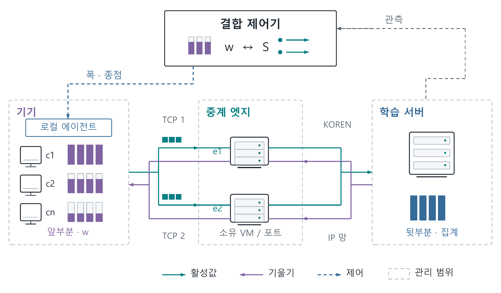

기기·엣지·서버는 서로 다른 기관에 속할 수 있다. 각 소유자가 관리 권한을 갖거나 범위를 위임한 자원에만 설정을 적용하며, 일반 단말에는 앱의 소켓 연결만 요구한다. 기관별 실행기의 승인·위임 체계는 추가 구현 대상이다. OS-Ken 규칙 생성은 구현했으나 실 OVS의 적용 확인은 검증 전이며, KOREN 코어 제어의 증거로 사용하지 않는다.[10,12]

<!-- page: main -->
### 나. 폭과 네트워크를 연결하는 비용 모형

기기 i의 정규화한 모델 폭을 wᵢ, 전체 기기의 경로 배정을 S라고 할 때, 배치당 완료 시간을 다음과 같이 근사한다. 이 식은 구현에서 사용하는 연산·전송 시간 추정의 구조를 정리한 것으로, 학습 수렴을 설명하는 이론식은 아니다.

<!-- equation: time -->
$$t_i(w_i,S)=c_i w_i^{\gamma_i}+\frac{8b_iw_i}{R_i(S)}+\epsilon_i \tag{1}$$

여기서 cᵢ는 전폭에서의 기기 연산 시간, γᵢ는 폭과 연산 시간의 관계를 나타내는 계수, bᵢ는 전폭 배치의 왕복 텐서 바이트이다. Rᵢ(S)는 경로 배정과 공유 용량을 반영한 유효 전송률이며 bit/s로 표현한다. εᵢ는 통신·실행의 잔여 오버헤드를 보정하는 항이다. 바이트를 비트로 바꾸기 위해 8을 곱한다. 현재 모형에서 bᵢwᵢ는 CNN 활성값 크기에 대한 근사이며, 모델·분할 위치에 따라 다시 계측해야 한다.

폭과 경로의 관계는 식에서 직접 드러난다. 폭은 연산 항과 전송 수요에 영향을 주며, 경로는 그 수요를 처리할 속도에 영향을 준다. 이는 두 변수가 통계적으로 독립이라는 주장이 아니다. 같은 회선을 여러 기기가 공유하면 한 기기의 경로 변경은 다른 기기의 Rᵢ에도 영향을 준다. 따라서 경로마다 측정한 최고 속도를 단순히 더하여 전체 전송률로 쓰지 않는다.

라운드당 배치 수 B가 같다고 가정하면, 완료 시간과 평균 폭 감소를 연결하는 목적을 아래와 같이 둘 수 있다. δᵢ는 연결 변경 등으로 추가되는 시간을 나타낸다.

<!-- equation: objective -->
$$\min_{w,S} J(w,S)=\max_i\left[B t_i(w_i,S)+\delta_i\right]+\frac{\lambda}{N}\sum_i(1-w_i) \tag{2}$$

λ는 평균 폭 감소 한 단위에 대응하는 시간 비용이다. 폭 감소 항은 모델 용량 보존을 위한 대리 지표이며, 정확도 손실을 실측한 함수가 아니다. 각 기기는 허용 폭 집합 안에서 선택하고 최소 폭을 지켜야 하며, 경로는 기기별 허용 목록 안에서 선택해야 한다. 각 공유 자원을 지나는 흐름의 전송률 합은 해당 용량을 넘을 수 없다. RTT, 서버 큐, 파이프라인 중첩이 큰 조건에서는 이 가산 모형의 오차도 함께 확인해야 한다.

<!-- page: main -->
## 2. 단계별 세부 구현 계획

### 가. 계측과 단계적 의사결정

클라이언트별 연산·바이트·완료 시간을 수집하고 공유 자원과 허용 경로를 함께 평가한다. 경로 후보의 전송률을 폭 계획에 전달하여, 경로 개선 후에도 남는 지연과 폭 축소 비용을 비교한다. 그림 2는 이 단계적 의사결정과 관측의 환류를 나타낸다.

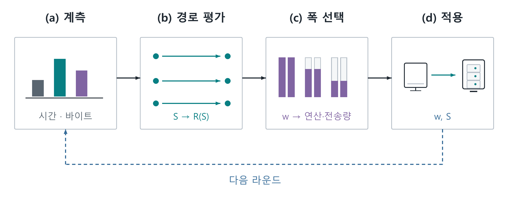

폭 단계는 전원 전폭에서 출발하여 가장 늦은 기기와 완료 시간이 비슷한 기기들의 폭을 한 단계 낮췄을 때 최대 시간이 얼마나 줄어드는지 계산한다. 시간이 거의 같은 기기가 여러 대이면 하나만 줄여도 최대값이 그대로 남을 수 있으므로 함께 검토한다. 구현에서는 예측 시간 이득에 10%의 계측 여유를 두고 폭 감소 비용보다 충분히 큰 경우에만 변경한다. 별도 마감이 지정되면 최소 폭까지 마감 충족을 우선할 수 있으나, 실행 가능한 해가 항상 존재하는 것은 아니다.

경로 변경에는 이동 횟수 제한과 개선 문턱을 적용한다. 폭 계획의 목표 배정과 실제 점진적 이동이 일시적으로 다를 수 있으며, 경로 단계와 폭 단계의 평가식도 완전히 동일하지 않다. 따라서 구현은 비용 모형에 기초한 휴리스틱이고 전역 최적해를 보장하지 않는다.

효과 분리를 위해 추가한 경로 전용 정책은 폭을 고정하고 공유 자원 및 응용 계층 수신 완료를 이용한다. 로컬 검증 상태는 표 2에 표시했으며, 과거 KOREN 결과를 이 후속 구현의 성능으로 소급하지 않는다.

<!-- page: main -->
### 나. 다중 전송과 학습 결과의 결합

텐서는 바이트 구간으로 나누어 여러 TCP 연결에 보낸다. 수신기는 길이와 구간의 중복·누락·충돌을 검사하고 전체가 완성된 뒤 텐서를 복원한다. 그림 3은 바이트 재조립, 활성값·기울기의 배치 대응, 라운드 경계의 연합 집계를 별도 단계로 나타낸다.

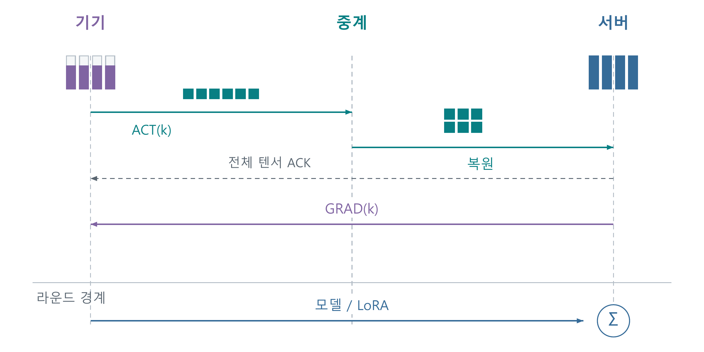

학습 계층은 배치 식별자를 유지하고 마이크로배치의 기울기를 전체 표본 수에 맞춰 가중한다. 서버 GPU의 공유 상태를 보호하는 직렬화 구간이 있으며, 다중 연결이 같은 병목을 공유하면 연결 수가 증가해도 용량은 늘지 않는다.

현재 확인은 전체 텐서의 수신 완료를 대상으로 한다. 느린 마지막 조각은 재조립을 지연시킬 수 있지만, 조각별 확인과 늦은 중복의 상태 관리가 충분하지 않아 추측 재전송은 완성된 기능으로 제시하지 않는다.

전송 계층에서는 연결을 재사용하고 연결 후 timeout을 해제하여 불필요한 재접속을 줄였다. TCP_NODELAY와 SO_SNDBUF 256KiB 요청으로 작은 메시지와 배압을 다루며, 실제 Linux 버퍼 크기는 별도 확인이 필요하다. 조각 크기는 현재 연결당 16개를 기준으로 64KiB~1MiB에서 정한다. 전체 텐서 ACK를 비동기로 검사하고 라운드 끝에 flush한다. 이는 TCP 위의 응용 전송 개선이며, 커널 slow start나 TCP ACK 규칙 자체를 수정한 성과는 아니다.[12]

<!-- page: main -->
### 다. 기관 경계와 커널 수준의 실제 집행

SDN의 적용 가능성은 기기 종류보다 관리 권한에 달려 있다. 실험팀이 관리한 HPC·VM에는 커널 설정이 가능했지만, 다른 기관의 단말과 접속망에는 그 권한이 자동으로 확장되지 않는다. 그림 4는 실제 설정 위치와 중간 망의 경계를 나타낸다.

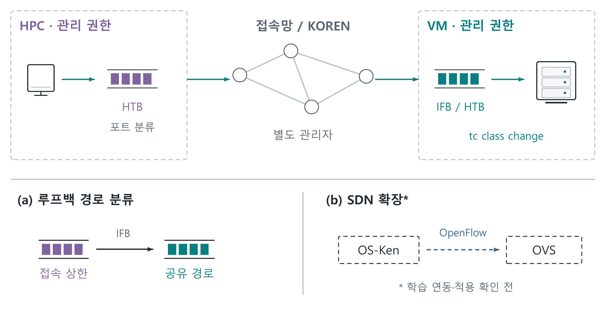

실회선 리그는 HPC의 송신 HTB/u32와 VM의 수신 IFB·송신 클래스를 설정하고, tc class change로 교란을 적용한다. 루프백 리그는 IFB 필터를 바꾸어 경로별 큐에 배정한다. 반면 KOREN의 학습 중 경로 선택은 TCP 중계 종점 변경이며, 텐서 분할 비율은 응용 계층에서 집행한다. 커널 큐 변경·중계 선택·텐서 분할의 위치를 구분해야 한다.[12]

이전 main 브랜치에는 컨테이너 tc 에이전트와 선택적 소패킷 우선 큐가 있다. ACK 보호라는 이름이지만 길이 128바이트 미만을 분류하며 기본값은 비활성이다. OVS/VXLAN 코드에는 가상 터널 포트의 셰이핑이 적용되지 않을 위험 때문에 실제 컨테이너 인터페이스로 옮긴 이력도 있다. 이들은 실제 집행 코드의 자산이며 현행 SFL·기관 간 위임의 통합 실증과는 구별한다.[12]

<!-- page: main -->
### 라. 에이전트의 고정 규칙과 적응 제어

전체 에이전트는 관측·계획·집행의 역할로 구성한다. 패킷에는 커널의 표준 알고리즘과 설치된 규칙을, 조각에는 가벼운 적응 규칙을, 라운드에는 폭·경로 비용 모형을 사용한다. 기관별 허용 범위는 고정된 제약으로 두며, 학습된 AI 제어기는 아직 사용하지 않았다.

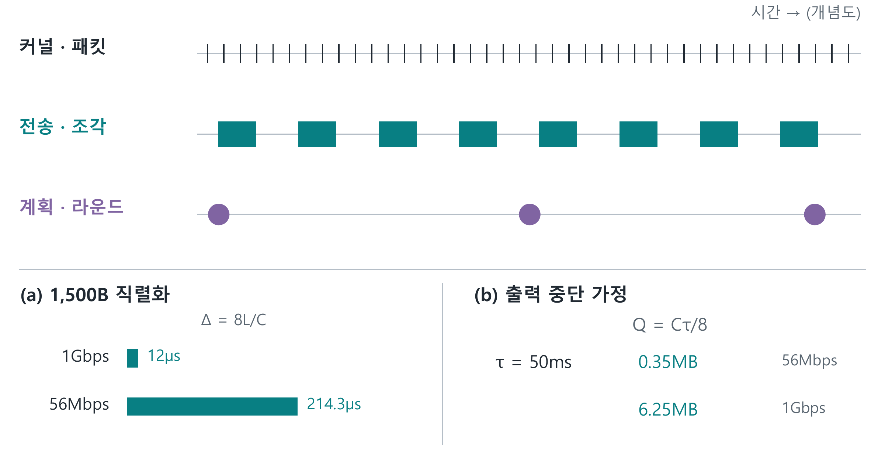

1,500바이트의 이상 직렬화 시간은 8L/C로, 56Mbps에서 214.3μs, 1Gbps에서 12μs이다. 이는 헤더 등을 제외한 계산이며 실제 도착 간격이나 모든 제어기의 마감이 아니다. 가정한 판단 50ms 동안 출력이 멈추면 각각 0.35MB와 6.25MB가 유입된다. 설치된 규칙으로 전송을 계속하는 현 구조에 이 값을 실제 큐 증가로 적용하지 않는다.

AI를 쓰지 않은 이유는 모든 AI가 느리기 때문이 아니다. 현재는 정책 학습 자료와 비교 성능, 추론·검사·규칙 적용의 지연 예산을 확보하지 못했다. 명시적 상한과 제한된 후보를 가진 현 단계에는 비용 모형을 사용했다. 라운드 계획에는 향후 예측 모델을 넣을 수 있지만, 관측부터 적용까지의 p95/p99 지연과 상태 변화 속도, 기존 정책 대비 이득을 함께 검증해야 한다.[12]

<!-- page: main -->
# Ⅲ. 아이디어 개발 진행 내용 및 결과

## 1. 개발 수행 현황 및 중간 결과물

### 가. 실험 구성과 자료 해석 원칙

본 보고서는 기존 실험을 재집계하였다. 그림 6의 scen32는 HPC 안의 클라이언트와 서버가 KOREN VM 두 대의 중계 종단점을 경유한 배치이다. 논리 엣지 4개는 각 VM의 두 포트 묶음이며, 물리 장비 네 대를 뜻하지 않는다.

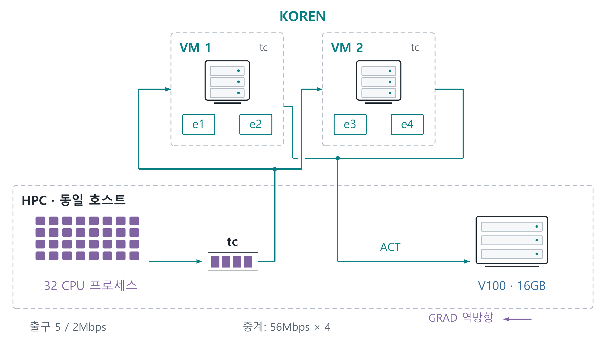

주요 시간 비교는 기존 scen32 계열의 정상, 트래픽 몰림, 연산 지연, 용량 변동 네 조건을 사용하였다. CIFAR-10 CNN을 분할 지점 2에서 나누고 배치 32를 라운드당 4회 실행했으며, SGD 학습률은 0.05, 데이터 분할은 alpha-dir 기본값 0.5를 사용했다. 서버 args의 alpha=1.2는 별도 지연 기준선 배율이다. 각 정책의 24라운드에서 초기 4라운드를 제외하고 makespan 필드의 평균을 시드마다 구한 후 3개 시드 평균을 다시 평균하였다. 요약 레코드는 제외하고 라운드를 독립 반복으로 간주하지 않는다.

Jetson은 별도 단독 측정이며 32개 프로세스에 연결된 장비가 아니다. LoRA는 기기 앞부분을 KOREN VM에 배치한 다른 실행이다. 표 1과 그림 9에 실행 위치를 구분했다.

<!-- page: main -->
### 실험 조건과 비교군

그림 7은 지정한 교란 조건, 표 3은 32개·8개 프로세스 실험의 차이를 보여준다. 교란은 완료 로그 개수를 기준으로 적용한다.

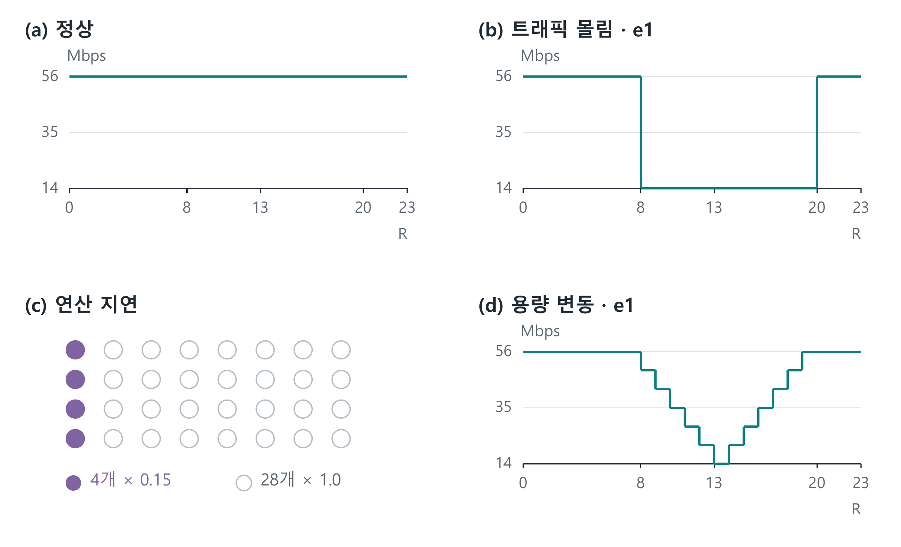

표 3. 32프로세스와 8프로세스 실험 계열의 조건

| 구분 | scen32 주 비교 | r8mix_rho1 |
|---|---|---|
| 기기·스레드 | 32개·각 1스레드 | 8개·각 2스레드 |
| 엣지 용량 | 56Mbps × 4 | 125Mbps × 4 |
| 출구 A/B | 전원 5/2Mbps | 6개 50/20, 2개 20/20Mbps |
| 연산 지연 조건 | 4개 속도 계수 0.15 | 2개 속도 계수 0.15/0.25 |
| 반복·목표 | 24R·3시드, λ=70 | 24R·3시드, D=10초 |

8개 정확도 실험은 별도로 200R·2시드·λ=18/70/280을 사용했다. SHRiNK를 참고했지만[9], 축소만으로 CPU·학습 조건의 동등성을 보장하지 않아 두 계열의 결과를 합산하지 않는다.

<!-- page: main -->
### 나. KOREN 환경의 결합 정책 결과

그림 8과 표 4는 scen32의 3시드 평균 라운드 시간이며, 초기 4라운드를 제외했다. 트래픽 몰림에서 감소율이 가장 컸다.[12]

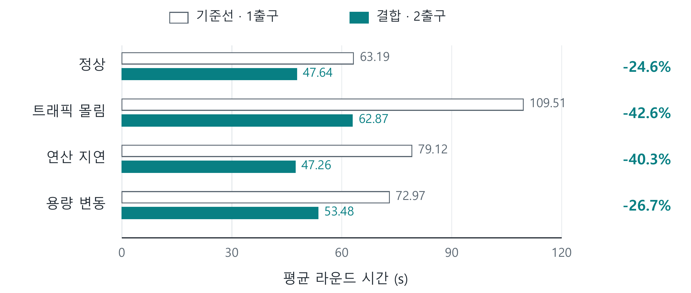

표 4. 기존 32논리클라이언트 시나리오의 평균 라운드 시간

| 조건 | 균등 기준선 | 폭·경로 결합 | 감소율 |
|---|---:|---:|---:|
| 정상 | 63.19초 | 47.64초 | 24.6% |
| 트래픽 몰림 | 109.51초 | 62.87초 | 42.6% |
| 연산 지연 | 79.12초 | 47.26초 | 40.3% |
| 용량 변동 | 72.97초 | 53.48초 | 26.7% |

기준선은 출구 하나·고정 배정·전폭, 결합 정책은 출구 두 개·폭 및 배정 변경을 사용했다. 따라서 정상 조건의 약 25%에는 추가 출구의 효과가 포함된다. 계획기는 λ=70과 라운드당 최대 3개 기기의 이동을 사용했다. 폭이 바뀌면 학습량도 달라질 수 있으므로 같은 정확도 도달 시간의 비교는 아니다.

과거 ‘폭만’ 절제의 일부 실행에는 경로도 이동하는 결함이 있어 제외했다. 정정된 동질 연산 조건에서는 폭 제어의 효과가 거의 없고 경로 전용과 결합 정책이 비슷했다. 두 제어가 항상 동시에 필요한 것은 아니며 병목별 효과의 분리가 중요하다.

<!-- page: main -->
### 다. Jetson과 모델 규모별 하드웨어 측정

Jetson 측정 원자료는 다른 브랜치에 보존된 기록에서 확인하였다. Orin Nano Super 8GB에서 Qwen2.5-0.5B를 LoRA rank 32로 학습했으며 배치 1, 시퀀스 길이 256, FP32 조건을 사용했다. 각 전력 모드에서 워밍업 이후 30스텝씩 총 90스텝을 측정하였다. 전체 학습 스텝 시간의 중앙값은 MAXN_SUPER 554.1ms, 25W 608.9ms, 15W 903.7ms였다. 이 값에는 순전파·역전파·옵티마이저 갱신이 포함되며, 분할 학습의 기기 뒷계산 시간만을 직접 측정한 값은 아니다.

별도의 KOREN VM 비용 측정에서는 CPU 8스레드, FP32, 배치 4, 길이 256, rank 16, 분할 지점 2를 사용하였다. 표 5의 앞부분 값은 해당 부분만 실행한 프로파일이며 전체 분할 학습의 종단 간 비용은 아니다. 단위는 원자료의 peak_rss_mb를 1,000으로 나눈 기록상 GB로 통일하였다.[12]

표 5. 모델 규모에 따른 VM 프로세스 최대 메모리 기록

| 모델 | 전체 로컬 실행 | 앞부분 프로파일 |
|---|---:|---:|
| Qwen2.5-0.5B | 8.27GB | 1.54GB |
| Qwen2.5-1.5B | 14.99GB | 2.55GB |
| Qwen2.5-3B | 24.52GB | 3.39GB |
| Qwen2.5-7B | 메모리 부족 | 6.44GB |

7B의 실제 분할 실행은 별도 로그에서 10스텝을 확인했으며, 기기 측 최대 메모리는 약 7.94GB였다. 처음 2스텝의 평균 손실은 약 2.01, 마지막 2스텝은 약 0.55였다. 손실 감소는 학습 실행의 진행을 보여주지만 짧은 단일 실행이므로 수렴이나 일반화의 증거로 확대하지 않는다. 이 측정의 기여는 앞부분만 실행했을 때 확보되는 메모리 여유와 그에 따라 발생하는 통신 의존성을 실제 장비에서 확인한 데 있다.

<!-- page: main -->
### 라. LoRA를 이용한 분할 연합학습의 실행

그림 9는 KOREN VM 두 대의 3논리클라이언트와 HPC 서버 사이에서 수행한 LoRA 실험이다. Qwen2.5-0.5B, cut 2, rank 16, 16라운드×30스텝을 사용했고 학습률은 3×10⁻⁴, 기울기 클리핑은 1.0이었다.

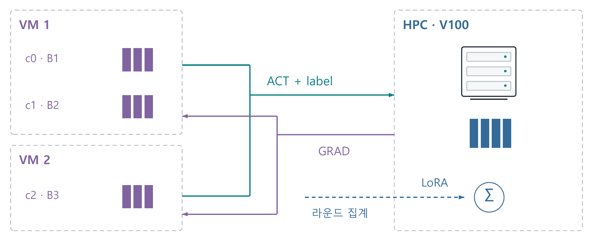

뒷부분 공유와 앞·뒷부분 인자 평균 방식의 라운드 시간 합계는 각각 581.0초와 588.8초였다. 서버는 기기를 순차 처리하며 인자 평균은 전체 가중치 변화량을 직접 평균한 것과 일반적으로 같지 않다.

표 6. 학습 사실의 표현을 바꾼 자체 18문항 평가의 정답 수

| 학습 방식 | B1 8문항 | B2 3문항 | B3 7문항 | 합계 |
|---|---:|---:|---:|---:|
| 기본 모델 | 0 | 0 | 0 | 0/18 |
| B1 단독 | 6 | 0 | 0 | 6/18 |
| 연합 및 서버 뒷부분 공유 | 6 | 2 | 4 | 12/18 |
| 연합 및 앞·뒷부분 평균 | 4 | 2 | 6 | 12/18 |

표 6은 문맥을 확인한 엄격 채점 결과이다. 알려진 사실의 표현을 바꾼 소규모 평가이며, 평균 방식에서 B1은 6개에서 4개로 줄었다. 모든 지식의 무손실 보존이나 일반화의 증거는 아니다. 모델 층을 나눈 SFL로서 특징 열을 나누는 수직 연합학습과도 구별한다.[12]

<!-- page: main -->
### 마. 반례 검토와 실측값 주입 재현

설계 검토 과정에서는 먼저 준비된 기기의 전송을 우선하는 정책과, 기울기를 받은 뒤 남은 계산이 긴 기기를 우선하는 정책을 비교하였다. 준비 순서 변경의 이득은 큐에 실제 경합이 존재하고 반환 이후의 계산이 전체 완료 시간을 결정할 때 나타난다. 도착이 드물거나 통신이 지배적인 조건에서는 이득이 작았고, 남은 계산 시간을 잘못 추정하면 오히려 악화될 수 있었다. 따라서 전송 순서 자체를 독립적인 최종 기여로 채택하지 않았다.

기존 KOREN 전송 기록과 Jetson의 90스텝을 이용한 재현 실험도 수행하였다. 이 실험은 한 장비에서 측정한 전력 모드별 시간을 논리 기기들에 배정하고, 학습 스텝 중 반환 이후 계산의 비율을 가정하여 지연으로 주입하였다. 대표 설정에서 모형 재현의 완료 시간 감소는 약 9.97%, 로컬 TCP를 이용한 대응 실행의 감소는 약 9.91%였다. 실제 소켓의 바이트 전송과 해시 일치는 확인했으나, 지연을 기다리는 동작이 학습 연산을 대신하므로 새로운 Jetson 다기기 학습 실험으로 분류하지 않는다.[12]

이는 실측 수치를 사용하는 방법에서도 출처와 가정의 경계가 필요함을 보여준다. 원본 Jetson 시간은 전체 학습 스텝이고, 반환 이후 계산 비율은 별도 가정이다. KOREN 왕복 전송 기록으로 산출한 처리 계수 역시 물리 회선의 편도 용량과 같지 않다. 따라서 이 재현 결과는 스케줄링 가설의 민감도를 검토하는 보조 자료이며 표 4의 실망 결과와 합산하지 않는다.

LoRA 결과에서도 실행 성공과 보호 보장을 분리하였다. 현재 프로토콜은 활성값과 함께 정답 토큰을 서버에 전달하며, 작은 canary 검사에서는 삽입한 가상 비밀 세 항목이 모두 출력되었다. 데이터가 기기에 있다는 사실만으로 정보 노출이 방지되었다고 볼 수 없다. CNN 폭·경로 제어와 LoRA 실험의 결합도 후속 검증 대상이다. LoRA rank를 줄이는 조작은 CNN의 폭을 줄이는 조작과 달라 활성값 차원이 같은 비율로 감소한다고 가정할 수 없다.

<!-- page: main -->
## 2. KOREN 연동 및 활용 방안

KOREN 활용의 의미는 네트워크 명칭을 실험 환경에 붙이는 데 그치지 않는다. 본 과제에서는 연구망의 VM을 기기·중계 실행 위치로 사용하고 원격 HPC와 연결하여, 로컬 메모리 제한과 원격 텐서 전송이 동시에 존재하는 학습 경로를 구성하였다. 실제 TCP 연결의 전달·재조립과 원격 역전파를 수행하면서, 기기 자원을 서버로 이전할 때 통신 의존성이 어떻게 생기는지 확인할 수 있었다. 이는 KOREN이 제공하는 시험·검증 기반을 활용한다는 과제 취지와 연결된다.[11]

다만 현재 배치는 KOREN 코어의 라우팅 정책이나 접속망의 무선 스케줄러를 바꾸지 않는다. 중계 종단점이 여러 개 있다는 사실만으로 물리적으로 분리된 다중 경로를 확보했다고 판단할 수도 없다. 본 과제의 제어 범위는 운영자 소유 자원과 오버레이 연결이며, KOREN 내 다른 이용자의 트래픽을 제어하는 권한은 가정하지 않는다. 이러한 경계를 명확히 해야 시스템을 실제 기관 환경에 이전할 수 있다.

이후 실망 검증은 대규모 재실험보다 네트워크 효과의 분리에 우선순위를 둔다. 같은 데이터 순서, 모델 폭, 배치 수 및 전송 바이트를 유지하고 고정 경로와 적응 경로를 비교하면, 폭 축소에 의존하지 않는 통신 개선을 측정할 수 있다. 이어서 고정 경로·고정 폭, 경로만, 폭만, 결합의 네 조건을 비교하여 결합의 추가 효과를 판단해야 한다. 공유 접속 회선에서는 이득이 사라지는 조건도 포함해야 제안의 적용 범위가 드러난다.

## 3. 멘토 의견에 따른 개선사항 및 향후 진행방향

기존 멘토링·설계 기록 이후의 검토를 반영하여 과제의 범위를 폭과 허용 경로의 결합으로 좁혔다. 과거 참여자 선별 설계의 수치와 현재 SFL 수치를 분리하고, 소유 자원 안에서의 제어 권한 및 실측·주입 재현의 차이를 문서화하였다. 현재의 세부 개선을 특정 멘토가 승인한 내용으로 소급하지 않는다. 남은 우선 과제는 같은 정확도 도달 시간의 비교, SDN 규칙 적용 확인과 복구, 학습 프로토콜의 인증 및 LoRA 실행과의 통합이다.

<!-- page: main -->
# Ⅳ. 결 론

## 1. 개발 중간 결과물

본 과제는 모델의 폭과 네트워크 경로를 서로 연결된 실행 변수로 다루는 AwareNet을 구현하고, KOREN과 하드웨어 기록을 바탕으로 그 적용 범위를 검토하였다. 기기 측 연산, 텐서 수요 및 공유 전송 자원으로 완료 시간을 추정하고, 허용된 경로와 모델 폭을 단계적으로 결정하도록 구성하였다. 다중 TCP 연결의 조각 전송·재조립과 배치별 기울기 대응을 구현했으며, 소유 스위치에서 사용할 OS-Ken 집행 프로토타입을 추가하였다.

기존 KOREN 시나리오에서는 결합 정책의 평균 라운드 시간이 네 조건 모두에서 기준선보다 짧았다. Jetson 측정과 모델 규모별 메모리 기록은 기기 자원 제약의 실제 크기를 보여주었으며, KOREN VM과 HPC를 이용한 LoRA 실험은 활성값·기울기 교환과 어댑터 집계가 포함된 학습을 수행했음을 확인하였다. 각 결과는 서로 다른 목적과 조건의 실험이므로, 하나의 완성된 동적 LoRA 네트워크 제어 실험으로 포장하지 않았다.

학술적으로 방어할 수 있는 현재의 기여는 제어 권한의 제약을 포함한 시스템 설계와 그 실증이다. 폭 축소, 자원 적응형 분할 학습 및 통신·연산 결합 최적화에는 직접적인 선행연구가 존재한다. 본 과제는 이들 구성 요소를 사용하는 근거와 구현 범위를 명시하고, 실제 배치에서 얻은 이득과 실패 조건을 함께 제시하였다. 기존 방법 전체보다 우수한 새 알고리즘이라는 주장은 현재 자료로 입증하지 않았다.

## 2. 기술 구현에 따른 기대 효과

폭을 줄여야 하는 정도가 네트워크 배정에 따라 달라지고, 네트워크의 자원 수요가 다시 폭에 따라 달라진다는 점을 하나의 모델로 설명한 것이 본 설계의 중심이다. 이를 통해 기기의 부담을 낮추는 제어와 전송을 원활하게 하는 제어를 같은 완료 시간 기준에서 평가할 수 있다. 경로 여유가 있는 환경에서는 모델 용량을 더 보존할 가능성이 있고, 네트워크로 해결할 수 없는 기기 부담에는 폭 제어를 사용할 수 있다.

최종적인 성능 판단에는 동일 정확도 도달 시간과 영역별 품질 평가가 필요하다. 이를 충족할 때 본 시스템은 단순히 빨리 전송하는 네트워크를 넘어, 기기 자원과 학습 품질의 제약을 함께 고려하는 분할 연합학습 기반으로 발전할 수 있다. 본 보고서는 그 가능성을 뒷받침하는 구현과 실측 근거, 그리고 아직 검증해야 할 조건을 구분하여 제시하였다.

<!-- page: main -->
# Ⅴ. 참 고 문 헌

[1] S. Horvath 외. “FjORD: Fair and Accurate Federated Learning under heterogeneous targets with Ordered Dropout.” arXiv:2102.13451, v5, 2022. https://arxiv.org/abs/2102.13451v5

[2] S. Alam 외. “FedRolex: Model-Heterogeneous Federated Learning with Rolling Sub-Model Extraction.” NeurIPS 2022; arXiv:2212.01548v2, 2023. https://arxiv.org/abs/2212.01548v2

[3] Z. Lin 외. “AdaptSFL: Adaptive Split Federated Learning in Resource-constrained Edge Networks.” arXiv:2403.13101v4, 2025. https://arxiv.org/abs/2403.13101v4

[4] A. Al Asif 외. “SuperSFL: Resource-Heterogeneous Federated Split Learning with Weight-Sharing Super-Networks.” arXiv:2601.02092v2, 2026. https://arxiv.org/abs/2601.02092v2

[5] Y. Liang 외. “Communication-and-Computation Efficient Split Federated Learning: Gradient Aggregation and Resource Management.” arXiv:2501.01078v1, 2025. 비교 범위는 §IV Joint CCC Strategy. https://arxiv.org/html/2501.01078v1

[6] W. Shi 외. “Joint Device Scheduling and Resource Allocation for Latency Constrained Wireless Federated Learning.” arXiv:2007.07174, 2020. https://arxiv.org/abs/2007.07174

[7] E. J. Hu 외. “LoRA: Low-Rank Adaptation of Large Language Models.” arXiv:2106.09685, 2021. https://arxiv.org/abs/2106.09685

<!-- page: main -->
### 참고문헌 계속

[8] Z. Lin 외. “SplitLoRA: A Split Parameter-Efficient Fine-Tuning Framework for Large Language Models.” arXiv:2407.00952, 2024. https://arxiv.org/abs/2407.00952

[9] R. Pan 외. “SHRiNK: A Method for Scalable Performance Prediction and Efficient Network Simulation.” IEEE INFOCOM, 2003. https://web.stanford.edu/~balaji/papers/03shrinkaCONF.pdf

[10] OpenStack. “Writing Your OS-Ken Application.” OS-Ken 공식 문서. 2026-09-26 확인. https://docs.openstack.org/os-ken/latest/writing_os_ken_app.html

[11] 한국지능정보사회진흥원. “AI·네트워크 혁신 아이디어, KOREN을 통해 현실이 되다.” 2026-07-24 보도자료. https://www.nia.or.kr/site/nia_kor/ex/bbs/View.do?bcIdx=29740&cbIdx=90549

[12] AwareNet. 기존 실험 원자료와 재집계 기록. 아래 자료는 저장소 내부의 실험 증거이며 학술 출판물과 구별한다. 본문 수치의 원자료 목록 및 SHA-256은 configs/measurements/final_report_evidence_2026-09-26.json에 수록하였다.

KOREN 시나리오 결과는 out/wp_scen32_*_bothmp_*.jsonl과 docs/01_제출발표/실험보고_32대_시나리오_2026-09-10.md에 대응한다. 축소 조건 및 절제 결과의 제한은 docs/02_실험/실험_절제_조건표_복원.md와 scripts/exp/conditions.json에서 추적한다.

Jetson 원자료는 커밋 582b1d4e249918b2e1075d2a014acd00393ce1cb의 jetson/results/jetson_compute_anchor.json에 있으며, 현재 작업본에는 _archive/v2/jetson/results 아래 보존되어 있다. LoRA 집계·평가 기록은 out/fed_split, 모델 규모별 기록은 out/scale_lora, 주입 재현의 조건과 결과는 docs/02_실험/실측주입_재현실험_2026-09-23.md에 있다.

작성 기준은 awarenet의 보존 로그 및 2026-09-26 작업본이다. 양식은 origin/main·origin/deploy의 중간보고서 초안에서 확인했고 공식 HWP 원본은 발견하지 못했다. 네트워크 세부 감사는 9/22 경로·아키텍처 문서 §8에, 코드 해시는 configs/measurements/network_implementation_audit_2026-09-26.json에 수록했다.

<!-- page: main -->
# 부록. 통합 계측 가상 실험

기존 현장 실험을 보완하기 위해 2026년 9월 26일 격리된 Linux 가상망에서 전송 실험을 한 번 수행하였다. QEMU TCG의 2 vCPU·1 GiB 메모리 위에 기기·엣지 2개·서버에 해당하는 네임스페이스 4개를 구성하였다. 이는 새로운 KOREN 실측이나 학습 실험이 아니다. 기기 네임스페이스의 스레드 8개가 논리 참여자이며, 각자 같은 크기의 합성 바이트열 128 KiB를 전송하였다. 폭은 1.0으로 고정하고 실험용 조각 크기는 4 KiB로 두었다.

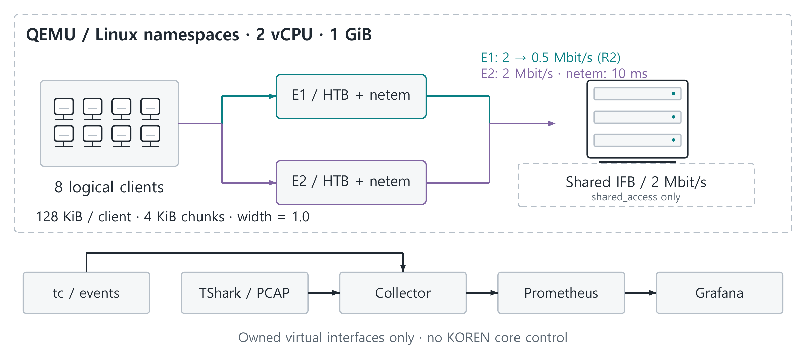

단일 경로, 같은 가중치의 두 경로, 수신 확인 처리율에 비례하는 두 경로를 비교하였다. 매 라운드 두 개의 128 KiB 프로브를 동시에 보내며 세 정책 모두 그 비용을 부담하였다. 이는 경로 분할의 검증용 정책으로, 기존 widthpath 또는 network 계획기 전체를 시험한 것은 아니다. 두 경로의 커널 라우트는 고정하고 조각 비율을 적응시켰다.

한 경로 감소 조건에서는 첫 라운드의 두 경로를 각각 2 Mbit/s로 두고, R2부터 E1의 HTB를 0.5 Mbit/s로 바꾸었다. 공유 병목 조건에서는 각 경로 2 Mbit/s와 별도로 서버의 양쪽 ingress를 하나의 IFB에 모아 합계 2 Mbit/s로 제한하였다. 각 경로에 단방향 netem 10 ms를 설정했으며 무작위 손실은 추가하지 않았다. 이 구성은 공유 용량 제약의 가상 대조군으로 실제 무선 접속을 재현하지 않는다.

<!-- page: main -->

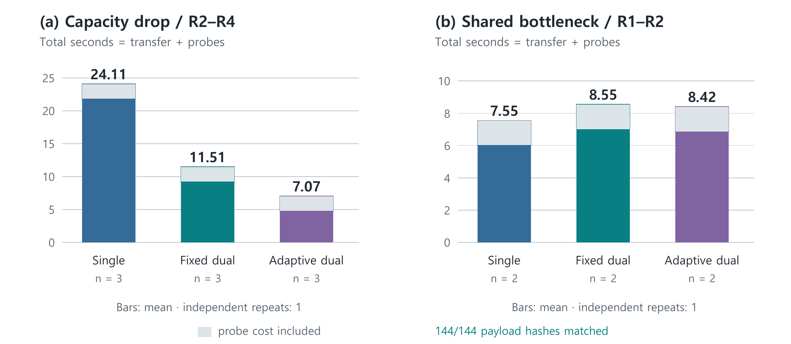

표 7. 가상 실험의 프로브 포함 평균 완료 시간

| 조건·집계 라운드 | 단일 경로 | 고정 2경로 | 적응 2경로 |
|---|---:|---:|---:|
| 경로 감소 R2-R4 | 24.11초 | 11.51초 | 7.07초 |
| 공유 병목 R1-R2 | 7.55초 | 8.55초 | 8.42초 |

경로 감소 조건에서 적응 분할은 고정 분할보다 프로브 포함 완료 시간이 38.6% 짧았고, 공유 병목에서는 단일 경로보다 11.5% 길었다. 전송 시간에는 수신 SHA-256 회신까지 포함하며 tc 적용·스냅샷·라운드 사이 대기는 제외했다. 실행 순서가 고정된 한 번의 실험이고 각 라운드는 독립 반복이 아니므로 통계적 유의성이나 실망의 성능 개선율을 주장하지 않는다.

총 18라운드의 본 전송 144개가 모두 재조립 해시 검사를 통과했다. TShark가 패킷 35,058개와 TCP 스트림 92개를 캡처하고, Lua 해석기가 6,631개 행에서 응용 전송 ID를 확인했다. Prometheus의 실제 수집 시계열을 Grafana에서 조회했다. ACK RTT는 텐서 완료 지연과 다르며 재전송 분석 플래그를 손실률로 해석하지 않는다.

iproute2 7.0의 stats.bytes 형식 차이로 최초 실시간 바이트 게이지가 0이었다. 원시 tc 스냅샷에서 재계산한 값과 수정 근거를 별도 보존하고 시간·무결성 기록은 변경하지 않았다. Grafana 플러그인은 복구 후 조회했다. 원자료·실행 소스·해시·재현 안내는 site/assets/lab에 수록했다. 결과는 커널 설정과 실제 패킷 전송의 근거이며 TCP 커널 코드 수정이나 기관 간 SDN 위임의 실증은 아니다.

<!-- page: main -->
# 부록. 주장별 원자료와 재집계

공개 색인은 다음 주소에서 E1-E7별 원파일, 실행 조건, 집계 방법과 SHA-256을 제공한다. 원자료의 바이트는 변경하지 않고 복사하였다. 해시는 파일 동일성을 확인하며 당시 장비·실행을 독립적으로 인증하지는 않는다.

https://sijoon-sung.github.io/AwareNet/site/evidence.html

E1. KOREN 정책 시간: wp_scen32 계열의 정상·트래픽·연산 지연·용량 변동별 3시드, 2정책의 로그 24개와 각각의 args·profile을 제공한다. round 0-23 중 0-3을 제외한 makespan 평균을 시드별로 구하고 다시 평균한다. 교란 스크립트와 조건 원장도 포함한다.

E2. Jetson 연산: jetson_compute_anchor.json 및 전력 모드별 lora_train_speed.json·tegrastats·환경·콘솔을 제공한다. 원시 30스텝씩의 중앙값을 다시 계산했다. 복구 커밋은 582b1d4e249918b2e1075d2a014acd00393ce1cb이며 측정 코드의 LF 정규화 해시는 환경 로그의 기록과 일치한다.

E3. KOREN 전송: n8_s1.0_tcp_batch_1788881912.json과 n8_s1.0_tcp_burst_1788881939.json은 주입 재현에 사용한 왕복 전송 입력이다. cap_mbps는 설정값이며 물리 회선 용량의 실측치로 인용하지 않는다.

E4. LoRA·메모리: eval_0913v1.json에 strict_0913v1.json의 판정을 적용한다. 서버의 두 16라운드 로그와 규모별 비용·분할 기기 로그를 함께 제공한다. 앞부분 프로파일과 실제 분할 시스템 메모리를 구분한다.

E5. 가상망 계측: virtual-20260926T142615Z의 원시 라운드, PCAP, 패킷 해석, tc 정규화 기록, Prometheus 시계열 및 실행 소스를 제공한다. E6에는 폭·경로 계획, 전송·재조립, tc 및 OS-Ken 코드와 구현 감사 해시를 연결한다.

E7. 축소·주입 재현: r8mix 계열의 로그·args·profile과 9월 23일 실측값 주입 보고서를 제공한다. 8개와 32개 프로세스 실험, 원측정과 주입 결과를 구분한다. 공개 저장소의 site/assets/evidence/verify_evidence.py로 파일 해시, KOREN 평균, Jetson 중앙값 및 LoRA 점수를 재검산할 수 있다.
