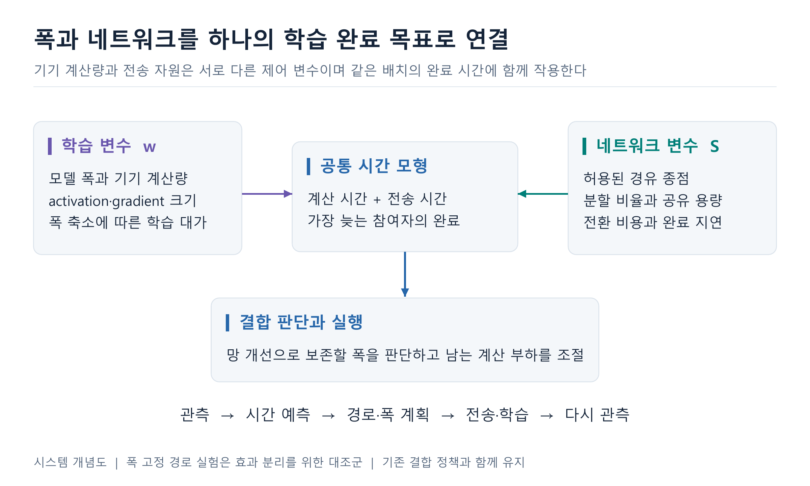
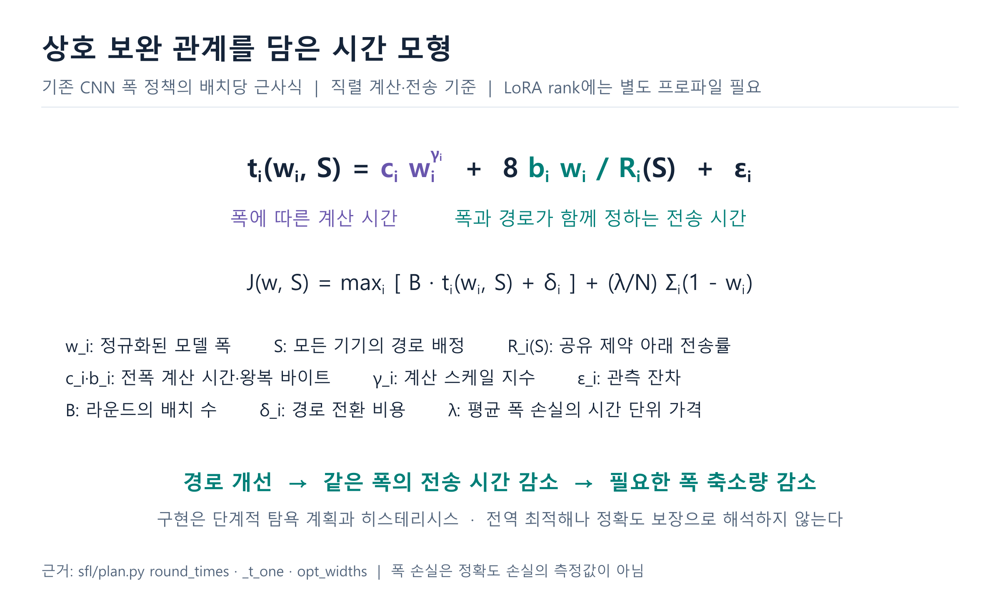
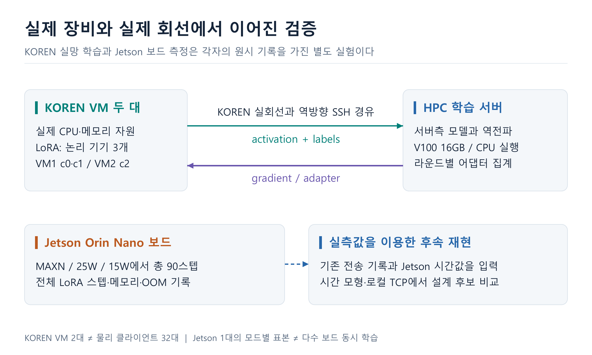
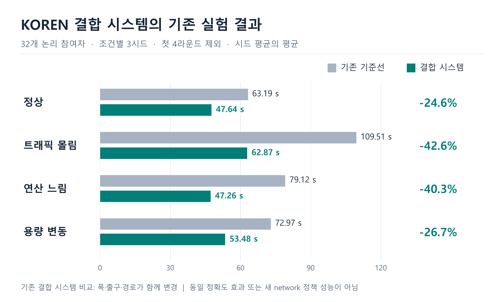
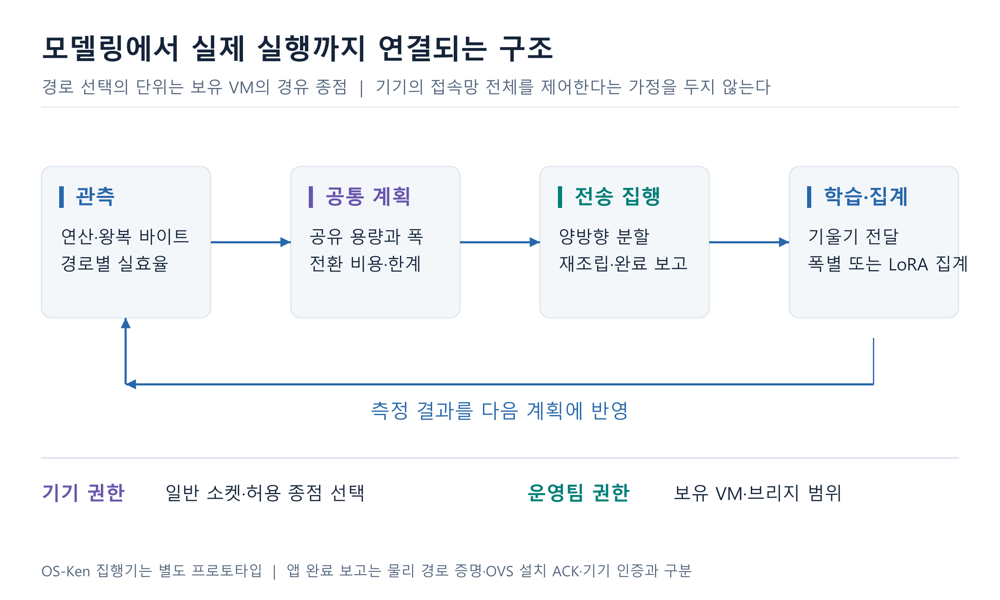
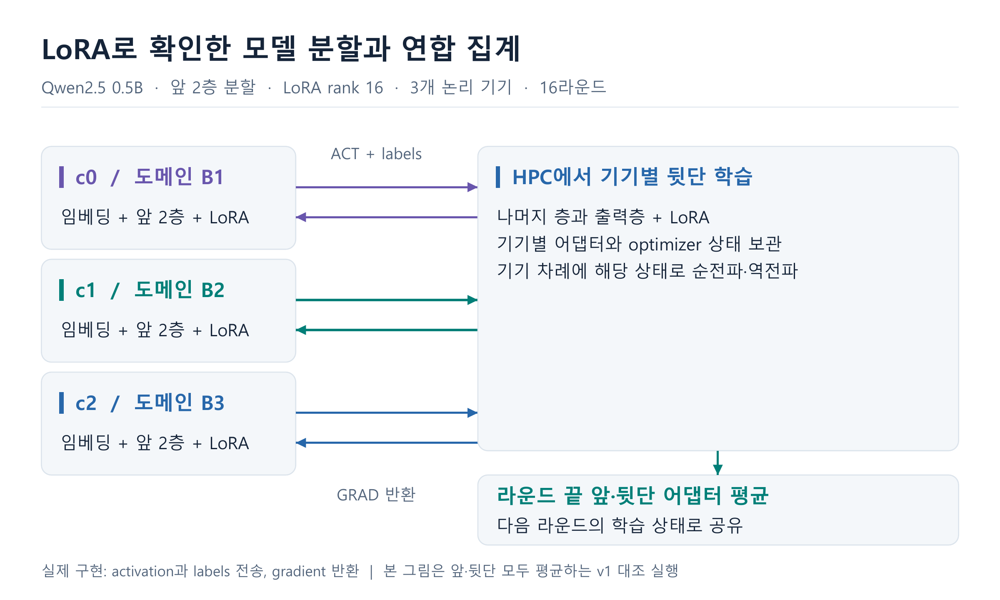
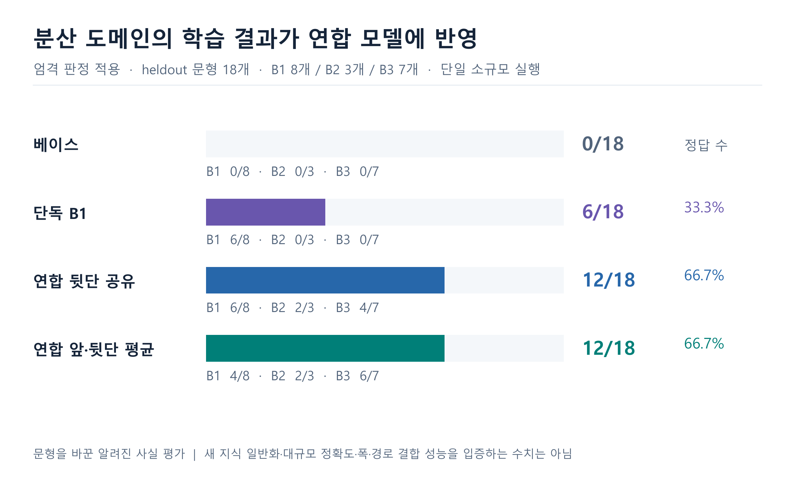
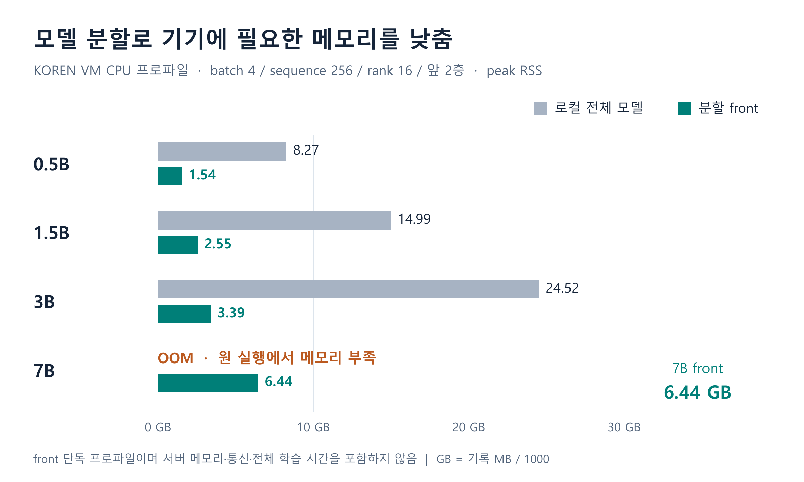
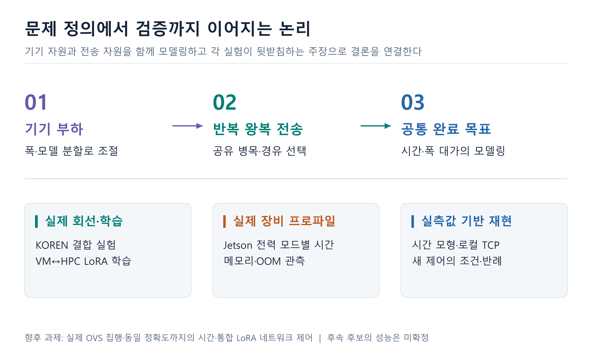

# AwareNet 폭과 네트워크 결합 시스템 종합 보고서

2026-09-26 · awarenet · 발표용 시각 자료 보조본. 현재 제출 본문은 [중간보고서 양식의 서술형 보고서](AwareNet_서술형보고서_2026-09-26.md)를 기준으로 한다.

## 확정 결론

**모델 폭과 네트워크 경로는 서로 다른 제어 변수이며, 학습 완료 시간이라는 같은 목표 안에서 상호 보완한다.** 실제 KOREN 구간의 시스템 실행, Jetson 보드 측정, VM과 HPC 사이의 LoRA 분할 연합학습을 근거로 이 구현을 설명한다.

[그림을 포함한 PDF](../../output/final_awarenet/AwareNet_종합보고서.pdf) · [이미지 갤러리](../../output/final_awarenet/index.html) · [PNG SVG 이미지 묶음](../../output/final_awarenet/AwareNet_이미지팩.zip)

## 1 폭과 네트워크를 연결한 공통 모델

기기의 계산 부담은 폭 w로, 통신 자원은 경로 집합 S와 분할 배정으로 조절한다. 기존 CNN 모델의 배치당 근사는 다음과 같다.

$$t_i(w_i,S)=c_iw_i^{\gamma_i}+\frac{8b_iw_i}{R_i(S)}+\epsilon_i$$

$$J(\mathbf{w},S)=\max_i\{B t_i(w_i,S)+\delta_i\}+\frac{\lambda}{N}\sum_i(1-w_i)$$

c_i는 전폭 계산 시간, b_i는 전폭 activation+gradient 바이트, R_i(S)는 공유 자원 제약 아래의 전송률이다. B는 배치 수, δ_i는 전환 비용, ε_i는 잔차다. γ_i는 계산 스케일 지수이며 프로파일에 없으면 코드의 기본값을 쓴다. λ는 폭 손실의 시간 단위 가격이다. 폭 손실 항은 정확도 손실을 직접 측정한 함수가 아니다.

폭을 줄이면 계산 항과 전송 바이트가 함께 바뀐다. 경로를 개선하면 같은 폭의 전송 시간이 줄어 폭을 보존할 여지가 생긴다. 구현은 경로·폭 단계의 탐욕적 개선과 히스테리시스다. 전역 공동 최적해나 정확도 보장을 주장하지 않는다. 잔차 보정·효율 보정은 코드 경로별 선택이고 직렬 시간 모형에 모든 파이프라인 중첩을 포함하지 않는다.

기존 `widthpath` 결합 정책을 시스템의 중심으로 설명한다. 새 `network`의 폭 고정은 경로 효과를 분리하는 검증 방법이다. LoRA의 rank, 분할 깊이, CNN 채널 폭은 서로 다른 변수이므로 b_i·w_i 관계를 LoRA에 그대로 적용하지 않는다. [코드](../../sfl/plan.py)

## 2 실제 하드웨어와 KOREN 회선이 제공하는 근거

KOREN VM 2대와 HPC의 실제 자원에서 경유 전송 및 학습을 실행했다. 결합 리그에는 HPC 논리 기기가 VM을 경유해 돌아오는 구성과 VM에 기기를 배치한 구성이 있다. LoRA 연합 실행은 VM1의 c0·c1, VM2의 c2와 HPC 서버를 연결했다. Jetson 보드의 전력 모드별 전체 학습 스텝 측정은 별도의 실험이다.

사진은 보유 장비를 보여 준다. 성능 수치의 근거는 원시 로그다. MAXN·25W·15W 각각 30스텝, 총 90스텝의 전체 스텝 중앙값은 554.1·608.9·903.7ms다. 이 보드 프로파일과 KOREN의 3기기 LoRA 실험을 하나의 동시 실험으로 합치지 않는다.

## 3 KOREN 결합 시스템 결과

32개 논리 참여자 조건의 3시드에서 첫 4라운드를 제외하고 재계산했다. 기존 결합 시스템의 평균 라운드 감소율은 조건별 약 24.6~42.6%다. 폭·출구·경로가 함께 바뀌므로 순수 네트워크 효과, 동일 정확도까지의 단축, 새 정책 성능으로 귀속하지 않는다.

8개·32개 조건은 물리 장비 수가 아닌 각 실행의 논리 참여자 수·회선 상한·교란 조건으로 설명한다. CPU·OOM 제약 아래의 축소 설계는 보존하되, SHRiNK식 부하 비율 보존만으로 계산과 학습까지 동등하다고 가정하지 않는다. [기존 실측 근거](기존성과_근거보고서_및_비판검토_2026-09-19.md)

## 4 시스템 실행과 권한 경계

공통 관측을 바탕으로 폭과 경로를 계획하고, 양방향 분할 전송·재조립·학습·집계를 수행한다. 현재 엣지 변경은 경유 종점 변경이며 모델·optimizer 상태를 다른 서버로 옮기는 기능은 아니다. 기기에는 일반 소켓 권한을 사용하고 운영팀 보유 VM·브리지에만 집행 권한을 둔다. OS-Ken/OVS 실배포, 자동 정책 연결, 기기 인증·암호화는 후속이다. 앱 완료 보고는 물리 경로 또는 OpenFlow 설치 확인과 구분한다.

## 5 LoRA 기반 분할 연합학습의 실제 실행

Qwen2.5-0.5B 모델 앞 2층을 기기에 두고 rank 16 LoRA를 학습했다. 세 논리 기기는 B1·B2·B3의 서로 다른 사실을 가지고 VM과 HPC 사이에서 activation·labels 및 gradient를 주고받았다. 라운드 끝에 앞단 어댑터를 평균하는 실행과, 기기별 뒷단 어댑터까지 따로 학습한 후 앞·뒷단을 모두 평균하는 대조 실행이 있다. 뒤의 실행은 16라운드, 기록된 라운드 시간 합 588.8초다.

이는 **모델 층 분할을 이용한 분할 연합학습 SFL**의 기능 검증이다. 같은 샘플의 특징이 기관별로 나뉜 수직 연합학습 VFL과는 정의가 다르다. [SplitLoRA](https://arxiv.org/abs/2407.00952), [VFL 용어](https://arxiv.org/abs/2211.12814)

| 모델 | B1 | B2 | B3 | 총 정답 |
|---|---|---|---|---|
| 베이스 | 0/8 | 0/3 | 0/7 | 0/18 |
| 단독(B1) | 6/8 | 0/3 | 0/7 | 6/18 |
| 연합(B1+B2+B3) | 6/8 | 2/3 | 4/7 | 12/18 |
| 연합·뒷단도 평균(v1) | 4/8 | 2/3 | 6/7 | 12/18 |

저장된 엄격 판정을 적용했다. 원 키워드 판정에서 단독 모델의 B2 1문항은 숫자만 우연히 맞아 오답으로 정정되어 있다. 18개 문항은 학습 사실의 새로운 문형이며 대규모 일반화 평가가 아니다. 도메인 간 간섭과 B1 성능 저하도 남아 있다. 원문 문답의 통신 수치는 학습 코퍼스 내용으로, 별도의 실제 회선 수치로 인용하지 않는다.

activation과 토큰 labels가 서버로 전달되며, 가짜 비밀을 심은 카나리아 3문항은 연합 모델에서도 노출됐다. 프라이버시 보장을 주장하지 않는다. CNN 폭·경로 최적화와 LoRA 실행은 구현 트랙이 다르므로, 두 기능의 동시 자동 제어까지 실증했다고 표현하지 않는다.

## 6 실제 자원 제약과 모델 분할의 효과

VM CPU의 동일 프로파일 조건에서 7B 로컬 LoRA는 OOM을 기록했고 front는 6.44GB RSS로 실행됐다. 그림은 front 단독 비용이므로 서버 자원과 통신을 포함한 전체 비용 절감률이 아니다. 별도 7B 실회선 분할 학습 10스텝은 기기 RSS 약 7.94GB에서 실행됐고, 처음·마지막 2스텝 평균 손실은 2.01→0.55였다. 이는 짧은 학습 갱신의 성립을 뒷받침한다.

분할로 줄인 기기 부담은 서버 계산과 반복 통신으로 옮겨진다. 이 점이 기기 측 제어와 네트워크 측 제어를 함께 모델링해야 하는 직접적인 이유다.

## 7 생각의 연결과 확정 범위

초기 폭 제어 → 공유 병목·경로 모델링 → 실제 분할 전송 → KOREN 결합 실험으로 시스템을 연결했다. 별도로 LoRA 분할 연합학습과 Jetson 프로파일이 학습 기능 및 실제 기기 자원의 근거를 보탰다. 폭 고정 실험은 네트워크 효과를 분리하는 방법이며 전체 시스템의 결합 목표를 폐기하는 결정이 아니다.

후속 기울기 순서 제어는 실측값 주입 대표 조건에서 시간 모형 9.97%, 로컬 TCP 9.91%의 구간 단축을 보였고 회선 계수 0.1배에서는 1.60%였다. 전체 학습 시간 절반을 이후 계산으로 놓은 가정에 의존하며 새 KOREN·Jetson 현장 학습 결과가 아니다. [재현 보고서](../02_실험/실측주입_재현실험_2026-09-23.md)

## 제출용 결론

AwareNet은 기기의 모델 폭과 네트워크 경로를 공통 시간 모형으로 결합한 분할 연합학습 시스템이다. 실제 KOREN 구간에서 기존 결합 시스템을 실행하고, Jetson 보드의 계산 특성을 측정했으며, KOREN VM과 HPC 사이의 LoRA 기반 모델 분할·연합 집계를 확인했다. 모델링, 양방향 전송 구현, 실제 장비 측정, 학습 기능 검증을 연결한 시스템 구현이 이번 과제의 기여다. 동일 정확도까지의 시간, 실제 SDN 집행, LoRA와 동적 네트워크 제어의 통합은 남은 검증 범위다.

## 원근거와 재생성

- [이번 보고서 입력과 해시](../../configs/measurements/final_report_evidence_2026-09-26.json)
- [원 실험 기록](../02_실험/데이터_기록_2026-09-07.md)
- [연합 분할 LoRA 사전등록과 결과](../02_실험/실험_연합분할LoRA_문답증명_사전등록_2026-09-13.md)
- [대형 모델 분할 LoRA 사전등록과 결과](../02_실험/실험_대형모델_분할LoRA_사전등록_2026-09-13.md)
- [9/26 추가 후보 판정과 한계](기여_판정과_최종정리_2026-09-26.md)
- [LoRA 원논문](https://arxiv.org/abs/2106.09685)
- [재생성 스크립트](../../scripts/analysis/build_final_visual_report.py): `python scripts/analysis/build_final_visual_report.py --refresh-evidence --render`

원본 `out/` 자료가 없는 환경에서는 정규화된 입력 JSON을 사용해 `--refresh-evidence` 없이 그림과 보고서를 재생성한다. 원 로그를 다시 읽고 싶을 때만 이 옵션을 사용한다. 새로운 성능 실험을 실행하지 않는다.
