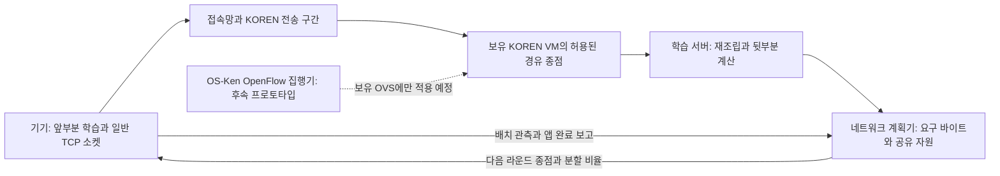

# AwareNet: 추가 기여 판정과 최종 정리

2026-09-26 · 기준 브랜치 `awarenet` · 추가 후보·검증 한계의 판단 기록

> **확정 제출 서사:** [폭·네트워크 결합과 하드웨어·LoRA 통합 보고서](AwareNet_통합보고서_2026-09-26.md)를 먼저 읽는다. 폭과 경로는 공통 시간 모형에서 상호 보완하며, 아래의 폭 고정 문제는 네트워크 효과 분리 검증에 해당한다. 추가 후보 보류와 검증 한계에 대한 판단은 유지한다.

## 1. 결정

**현재 결과를 묶어 마무리하는 것을 권고한다.** 추가 후보 중에서는 ‘학습 재개를 막는 마지막 조각의 제한적 재전송’이 가장 구체적이다. 그러나 현재 기록으로 효과를 검증할 수 없고 전송 규약 변경이 필요해 이번 구현 범위에서는 보류한다. 조사한 선행연구와 비교할 때, 지금 추가해 독립적인 신규 알고리즘으로 주장할 만한 후보는 확인하지 못했다. 이는 모든 관련 연구에 대한 신규성 부재 증명은 아니다.

현재 성과는 **공유 병목과 운영 권한을 반영한 SFL 전송 시스템, 기존 KOREN 실험의 근거 복원, 실측값을 이용한 설계 검증**으로 제시한다. 새로운 전송 순서 제어는 조건부 효과와 실패 조건까지 보고하는 연구 프로토타입이다. 이 문서는 제출에 사용할 기술 범위를 확정하며, 현장 배포와 학습 성능의 미검증 항목을 완료로 바꾸지 않는다.

## 2. 풀 문제를 하나로 좁히기

### 제안 제목

**AwareNet — 공유 병목과 제어 권한을 고려한 분할 연합학습 전송 제어**

### 문제 정의

작은 기기의 계산 부담을 줄이려고 모델을 나누면, 기기는 배치마다 중간 결과인 activation을 보내고 gradient를 받아야 한다. 이 전송이 늦어지면 다음 계산도 기다린다. 그러나 기기는 일반 인터넷·무선 접속망의 경로를 직접 바꿀 권한이 없고, 서로 다른 엣지 주소가 같은 업링크를 공유할 수도 있다. 따라서 엣지 수나 연결 수를 늘리는 것만으로 학습 대기가 줄어들지는 않는다.

질문은 **“주어진 모델 폭·학습량에서, 실제로 선택할 수 있는 경유 종점과 공유 자원을 이용해 전송 완료 대기를 줄일 수 있는가?”**다. 여기서 엣지 변경은 현재 구현상 **경유 종점 변경**이다. 학습 서버의 모델·optimizer 상태를 다른 엣지로 옮기는 기능은 구현하지 않았다.

이 문제의 직접 대상은 배치 중간에 통신 의존성이 반복되는 SFL이다. 전체 모델 업데이트를 라운드 끝에 모으는 일반 FL에도 모든 결과가 그대로 적용된다고 주장하지 않는다. 폭 선택은 기기의 계산 부담을 조절하는 학습 모듈의 입력으로 유지한다. 네트워크 효과를 비교할 때 모델·폭·데이터·학습 스텝 수를 맞춘다. 이 통제만으로 동일 정확도가 보장되지는 않으며, 서버 업데이트 순서와 실제 학습 결과도 별도로 확인해야 한다.

## 3. 최종 구조와 제어 범위



실측 리그에서는 논리 기기와 학습 서버가 HPC에 함께 있고 KOREN VM을 경유해 돌아오는 구성이 포함된다. 위 그림의 역할 분리는 물리 기기가 모두 다른 장소에 있다는 뜻이 아니다.

| 구성 | 현재 역할·상태 | 설명할 때 지킬 경계 |
|---|---|---|
| 학습 모듈 | 폭·요구 바이트 제공, 앞/뒷부분 학습 | FjORD/FedRolex 교체를 네트워크 기여로 세지 않음 |
| `network_control.py`, `NetworkOnly` | 공유 업링크·접속 상한·허용 종점·전환 비용을 고려한 경유 선택. 실제 소켓 학습 검사 통과 | 대칭 용량 모형, RTT·서버 큐·계산 제외. 탐욕적 개선이며 전역 최적해 아님 |
| `mpsend.py`, `chunker.py` | 양방향 분할 전송·재조립·중복 충돌 검사 | 복수 TCP 연결이 독립적인 물리 경로라는 보장은 없음 |
| `barrier_schedule.py`, `trace_replay.py` | 준비된 gradient 반환 순서와 이후 계산의 겹침을 별도 실험 | 학습 런타임에 연결되지 않은 후보. 모형 밖 지연 급변에서 무악화 보장 없음 |
| `sfl/sdn/` | OS-Ken 기반 보유 OVS 규칙 생성·전송 프로토타입 | 자동 계획 연동·실 OVS 배포·Barrier ACK 확인은 미완료 |
| 완료 관측 | epoch·요청 종점과 앱 보고 대조 | 경유 물리 경로 증명, OpenFlow 설치 확인, 기기 신원 인증의 증거가 아님 |

기기에는 라우터 관리자 권한을 요구하지 않는다. 운영팀이 가진 VM·브리지에만 제어 범위를 한정한다. 이는 권한 가정의 문제를 줄이는 설계다. **기기 인증, 암호화, 위조 보고 차단은 별도의 미완료 항목**이므로 ‘SDN 권한·보안 문제를 전부 해결했다’고 표현하지 않는다.

KOREN의 역할은 실제 원격 전송 구간과 보유 VM에서 경유·트래픽 조건을 실험하는 것이다. 기존 역방향 SSH 경유 실험은 그 활용 증거다. KOREN 코어 라우터를 제어하거나 운영자의 망 정책을 변경했다는 증거는 아니다.

## 4. 추가 후보를 비판적으로 비교

| 후보 | 풀 수 있는 문제 | 선행연구·기존 구현과의 관계 | 이번 판정 |
|---|---|---|---|
| **학습을 막는 마지막 조각만 다른 경로로 재전송** | 대부분 받은 tensor의 소수 지연 조각 때문에 계산 전체가 대기 | 중복 요청, MPTCP 재주입과 겹침. 학습 의존성·추가 바이트 예산을 함께 판단하는 부분을 비교 검증해야 함 | 후속 후보 1개로 보존, 이번 성과에는 미포함 |
| 지연 상관으로 공유 병목을 자동 추정 | 엣지 주소가 달라도 같은 병목이면 다중화 이득이 없음 | 공유 병목 탐지는 이미 알려진 문제. 현재는 명시적 토폴로지 입력까지 구현 | 기존 토폴로지 제약 유지. 자동 탐지 신규성 주장 보류 |
| 기기 메모리·수신 속도에 따른 전송 창 조절 | activation 적체와 메모리 부족 | 현재 `micro-window`에 고정 상한 존재. 적응 제어는 계산 그래프 수명·메모리 관측이 더 필요 | 안정성 개선 후보, 이번 핵심 기여로 확대하지 않음 |
| 모델 상태를 보존하는 엣지 이동 | 경로 전환 중 중복 학습·상태 불일치 | 현재 엣지는 중계 역할. 실제 학습 서버 이동은 다른 수준의 상태 관리 문제 | 전체 구조 변경이 필요해 제외 |

선행연구 대조:

- [BLEST 원논문](https://olivier.mehani.name/publications/2016ferlin_blest_blocking_estimation_mptcp_scheduler.pdf)은 느린 subflow의 blocking을 예상해 사용을 제한하며 기존 MPTCP의 재주입도 설명한다. 따라서 ‘느린 길을 피한다’, ‘다른 길로 재전송한다’만으로 새 기법을 주장하기 어렵다.
- [The Tail at Scale 원논문](https://cs.brown.edu/courses/csci2950-u/s18/papers/p74-dean.pdf)은 지연된 요청에 제한적으로 중복 요청을 보내는 접근을 다룬다. tensor 조각에 적용하려면 학습 진행과 네트워크 비용을 함께 비교해야 한다.
- [RFC 8382](https://www.rfc-editor.org/rfc/rfc8382)는 손실·지연 통계로 공유 병목을 추정하는 방법과 오분류 문제를 다룬다. 이 문서는 RTP용 실험적 기법이며 현재 AwareNet에 구현됐다는 뜻이 아니다.
- [TicTac](https://proceedings.mlsys.org/paper_files/paper/2019/hash/94cb28874a503f34b3c4a41bddcea2bd-Abstract.html)은 계산이 데이터를 소비하는 순서에 맞춘 전송 스케줄링을 제시한다. ‘학습 의존성을 고려한 전송 순서’ 자체도 선행연구와 비교해야 한다.

### 남겨 둘 후보의 구체적 설계

예를 들어 gradient의 대부분이 도착했지만 마지막 조각이 늦어 기기 역전파가 멈춘 상황을 대상으로 한다. 아래는 설계 제안이며 실행 결과가 아니다.

1. 수신자가 `session, epoch, batch, tensor, chunk` 단위의 수신 진행을 보고한다. 송신 함수의 반환 시각을 수신 완료 시각으로 사용하지 않는다.
2. 해당 tensor가 지금 학습을 막고 있고, 다른 허용 경로의 완료 예상 시각이 충분히 빠를 때만 미도착 조각을 재전송한다.
3. 공유 병목을 함께 쓰거나 상태가 불확실하면 개입을 보류한다. 추가 바이트 예산과 전송별 재시도 횟수를 제한한다. 이미 커널에 들어간 원본 바이트는 취소됐다고 가정하지 않는다.
4. 수신자는 먼저 완성된 tensor를 한 번만 학습에 전달한다. 늦게 오는 원본·중복 조각은 완료 ID 기록으로 버린다. 기록의 수명·메모리 상한·세션 변경도 규약으로 정한다.

판정 목표는 조각 하나의 도착 시간과 구분한다. 후속 통신이 없는 한 번의 동기화 구간에서 `C_i`를 tensor 완료 시각, `q_i`를 이후 기기 계산 시간이라고 하면 목표는 `max_i(C_i + q_i)`다. 후보 행동 후에는 재전송의 공유 자원 부하를 포함해 **모든 기기의** 완료 시각을 다시 평가해야 한다. 비임계 기기의 조각만 빨라지고 전체 완료가 같으면 이득으로 세지 않는다. 이 식은 설계 목표이며 현재 WAN에서 온라인으로 추정·보장하는 기능은 아니다.

**지금 추가하면 안 되는 구체적인 이유:** 현재 `ChunkPeer.send`는 조각을 소켓에 넘긴 뒤 전체 전송의 FIN/ACK를 사용한다. 조각별 수신 ACK가 없다. `Reassembler.pop`은 완료 상태를 지우므로, 완료 후 늦게 온 중복을 차단할 별도 기록도 필요하다. 현재의 재조립 중 중복 제거만으로 위 규약이 완성되지 않는다. KOREN 집계 속도와 Jetson 전체 스텝 시간으로는 조각 손실·도착 꼬리·두 경로의 지연 상관을 복원할 수 없다.

후속 검증은 같은 바이트·모델·데이터로 단일 경로, 현재 다중화, 단순 지연 기반 재전송, 학습 의존성 기반 재전송을 비교한다. 독립/공유 병목, 한 경로 정체, 손실, 순서 뒤바뀜, 연결 종료 후 지연 중복을 포함한다. 완료 시간·추가 바이트·다른 기기의 지연·중복 학습·메모리 점유를 함께 측정한다. 현재 자료에서 이 후보의 개선율은 산출하지 않는다.

## 5. 지금 제시할 수 있는 기여와 수치

### 기여 1 — 현실적인 제어 범위를 가진 SFL 전송 구조

학습 폭을 고정한 요구량 계약, 공유 자원 제약, 허용 종점 선택, 분할 전송, 앱 완료 보고를 연결했다. 기기 접속망 전체를 제어한다는 전제를 줄였다. 이는 구현된 시스템 기여다. 각 구성 알고리즘의 최초 발명이나 실망 성능 우위는 별도 주장이다.

### 기여 2 — 실제 기록을 복원하고 혼동되는 효과를 구분한 평가

| 증거 | 확인한 결과 | 적용 범위 |
|---|---|---|
| 기존 KOREN 결합 실험 | 32개 논리 참여자·3시드·앞 4라운드 제외 평균에서 조건별 라운드 시간 24.6~42.6% 감소 | 폭·출구·경로가 함께 바뀜. 새 `network` 정책 효과·동일 정확도 효과로 귀속 불가 |
| Jetson 원시 기록 | 전력 모드별 30스텝, 총 90개. 전체 스텝 중앙값 MAXN 554.1ms / 25W 608.9ms / 15W 903.7ms | 한 장비의 Qwen LoRA 전체 스텝. SFL 분할 이후 역전파 시간 자체가 아님 |
| 실측값 주입 시간 모형 | 480개 짝 비교 사례. 대표 조건 1.745→1.571초, 9.97% 감소 | 전체 스텝의 절반을 이후 계산으로 가정한 전송·계산 구간. 전체 학습 라운드 아님 |
| 로컬 TCP 시간 주입 | 5쌍×3정책=15회, 대표 조건 1.753→1.579초, 9.91% 감소. 33,600,000바이트·수신 해시 일치 | 실제 TCP, 계산은 대기 시간 주입. 새 KOREN/Jetson 학습 실측 아님 |
| 속도 계수 0.1배 민감도 | 같은 대표 모형에서 감소율 1.60% | 강한 통신 병목에서 순서 제어의 상대 효과가 줄어듦. 32→8 축소 동등성 증거 아님 |

원근거: [기존 실측 근거보고서](기존성과_근거보고서_및_비판검토_2026-09-19.md), [실측값 주입 보고서](../02_실험/실측주입_재현실험_2026-09-23.md), [결과 JSON](../02_실험/measured_replay_2026-09-23.json).

### 기여 3 — 제어가 도움이 되는 조건과 반례

준비된 gradient가 함께 대기하고 이후 계산 시간이 다르면 전송 순서를 바꿔 계산을 겹칠 여지가 생긴다. 도착이 드물게 겹치거나 모든 기기가 비슷하면 그 여지가 작다. 강한 통신 병목에서는 이번 대표 효과가 약 1.6%까지 감소했다. 이전 급변 실험에서는 과거 관측 기반 제어도 손해를 보았다. 따라서 전송 순서 제어는 **효과 조건을 검토한 후보**로 제시한다. 보편적인 성능 향상이나 무악화 보장을 주장하지 않는다. [설계→실험 반복과 반례](../04_설계기록/핵심기여_설계실험_반복검토_2026-09-22.md).

8개 논리 기기의 재현 입력은 한 Jetson의 전력 모드 기록을 반복 사용한 것이다. 기기 계산과 KOREN 전송 기록은 서로 다른 실행에서 나왔으므로 동시 측정된 결합 분포도 아니다. 원 실험의 8개·32개 논리 참여자와 물리 장비 수는 실행 조건별로 구분한다.

## 6. 보고서에 바로 사용할 요약문

> AwareNet은 자원이 제한된 기기의 분할 연합학습에서 전송 지연이 계산 재개를 늦추는 문제를 다룬다. 모델 폭과 학습 요구량을 입력으로 받아, 공유 접속 자원과 운영 권한 범위 안에서 엣지 경유 종점 및 분할 비율을 선택하는 전송 구조를 구현했다. 기존 KOREN 실험의 결합 효과와 새 제어의 효과를 구분하고, Jetson과 KOREN의 과거 원시 기록을 이용해 전송 순서 후보를 검토했다. 대표 로컬 TCP 주입 조건에서 평가 구간 완료 시간은 9.91% 감소했으나, 이는 가정에 따른 재현 결과이며 신규 현장 학습 성능을 뜻하지 않는다. 연구는 제어가 유효한 조건과 실패 조건을 함께 제시하며, 실제 SDN 집행 및 동일 정확도까지의 시간 검증은 후속 과제로 남긴다.

## 7. 이번 마무리 검사와 재현 방법

2026-09-26 Windows 프로젝트 `.venv`에서 아래 **53개 테스트를 실행해 모두 통과**했다. 경로 선택·공유 제약·SDN 정책 검증·재현 단위 검사, 마이크로배치 기울기 정합, 실제 로컬 소켓을 통한 2라운드 학습 및 폭 복귀 상태 동기화를 포함한다. 테스트 중 출력된 합성 데이터 정확도는 학습 성능 실험의 근거로 사용하지 않는다. 전체 Linux 리그·OVS·KOREN 현장 게이트를 실행했다는 뜻도 아니다.

이 문서의 로컬 링크 7개와 원자료·재현 코드·기존 결과의 SHA-256 12개도 확인했다. 기존 9/23 실행 파일은 다시 생성하거나 덮어쓰지 않았다.

```powershell
.\.venv\Scripts\python.exe -m unittest tests.test_device_budget tests.test_network_control tests.test_barrier_schedule tests.test_trace_replay tests.test_measured_replay tests.test_supersfl_net tests.test_sdn_policy tests.test_micro_e2e tests.test_network_runtime tests.test_aggregate_width_sync
```

재현 입력은 [`configs/measurements/koren_jetson_2026-09-23.json`](../../configs/measurements/koren_jetson_2026-09-23.json), 가정은 [`configs/measured_replay.json`](../../configs/measured_replay.json)에 있다. 저장된 입력으로 재실행하는 명령은 다음과 같다. 재실행하면 `out/measured_replay/`의 같은 이름 결과 파일이 갱신되므로 9/23 원시 실행 파일을 보존하려면 먼저 다른 위치에 복사한다. 문서의 9/23 결과 스냅샷은 별도다.

```powershell
.\.venv\Scripts\python.exe scripts/analysis/measured_replay.py study
.\.venv\Scripts\python.exe scripts/analysis/measured_replay.py socket --repeats 5
```

`build`/`all`은 원본 아카이브·기존 `out/` 자료·원본 Git 커밋이 필요하다. 이들은 새 clone에서 전부 제공된다고 가정하지 않는다. 정규화된 입력을 이용하는 `study`/`socket`은 그 원본 디렉터리를 다시 읽지 않는다. 로컬 TCP 시간은 실행 환경에 따라 달라질 수 있다.

### 마무리 상태

- **이번 정리 완료:** 기여·후속 후보 판정, 제출용 요약, 구현/실측/재현의 대응표, 53개 테스트 확인, 문서 진입점 갱신.
- **현재 증거로 미완료:** 실제 OVS 집행 확인, 기기 인증·암호화, 새 정책의 KOREN 실행, 동일 정확도까지 걸리는 시간 비교. 이 항목은 발표에서 완료 실적으로 세지 않는다.
- **다음 연구로 보류:** 조각 재전송 후보, 자동 공유 병목 탐지, 적응형 메모리 전송 창, 학습 상태의 엣지 간 이동.

기존 [8/28 제출 양식 원고](최종보고서_AwareNet.md)는 이력과 행정 양식 참조용으로 보존한다. 현재 기술 주장과 수치는 이 문서 및 연결된 원근거를 우선한다. 기존 PDF/PPT는 이번 문서 변경으로 자동 갱신되지 않는다.
