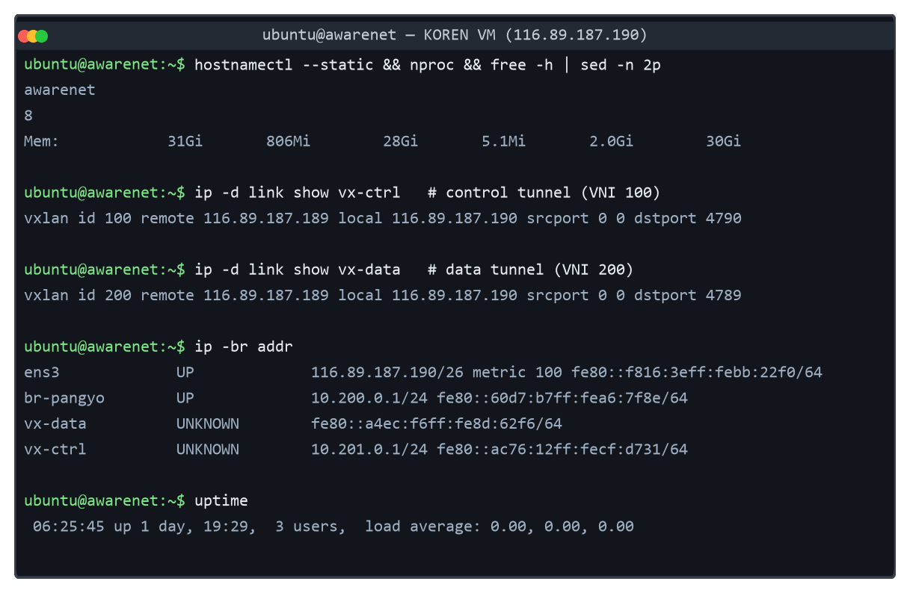
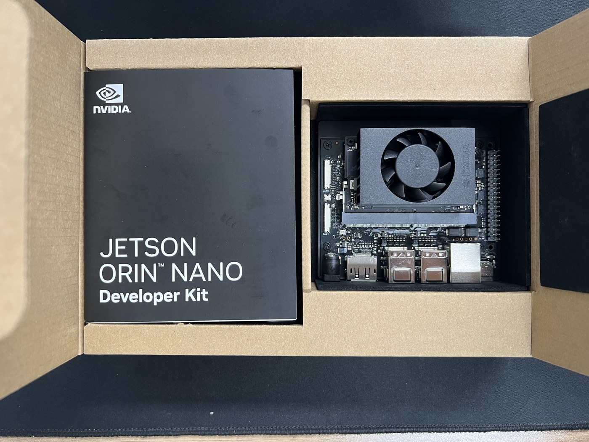

# K-디지털 챌린지: 넷 챌린지 캠프 시즌13 중간보고서 (읽는판)

**AwareNet · 충남대학교**

> 이 판은 8/17 제출본과 내용·수치가 동일하며, 문장만 다시 쓴 것이다.
> 수리 기준: ① 조사·연결어 복원 ② 실측/가정/주장/인용의 문장 구분
> ③ 용어 첫 등장 시 풀이 ④ 표의 의미 칸은 결론 문장.

---

| | |
|---|---|
| **과 제 제 목** | KOREN SDN 기반 AI 인지형 동적 네트워크 플랫폼 |
| **팀 명** | AwareNet |
| **참가 분야** | 향상된 Network |
| **참여 구성원** | 성시준 (충남대학교 전파정보통신공학과 학사) — 팀장 석태경 (충남대학교 전파정보통신공학과 학사) |
| **제 출 일** | 2026년 8월 17일 |

본 보고서를 K-디지털 챌린지: 넷 챌린지 캠프 시즌13의 중간 보고서로 제출합니다.

**한국지능정보사회진흥원장 귀하**

> **안 내 사 항**
> 1. 본 연구보고서는 한국지능정보사회진흥원의 출연금으로 수행한 K-디지털 챌린지: 넷 챌린지 캠프 시즌13의 연구망 활용 연구과제 결과입니다.
> 2. 본 연구보고서의 내용을 발표할 때에는 반드시 한국지능정보사회진흥원 K-디지털 챌린지: 넷 챌린지 캠프 시즌13의 연구망 활용 연구과제 결과임을 밝혀야 합니다.

---

# 요 약 문

## 1. 제 목

KOREN SDN 기반 AI 인지형 동적 네트워크 플랫폼 — 학습 가치를 반영한 2계층 대역폭 배분으로 배제 없는 연합학습 실현

## 2. 아이디어 개발의 목적 및 필요성

연합학습은 여러 기관이 데이터를 서로 넘기지 않은 채 AI 모델을 함께 키우는 방법이다. 데이터 대신 학습된 모델을 주고받는데[4], 이 모델이 수십에서 수백 MB로 무겁다. 게다가 한 번의 공동 학습 주기(이하 "라운드")가 끝날 때마다, 수십에서 수백 대의 참여 기기가 같은 순간에 같은 회선으로 이 무거운 파일을 서버에 올린다.

여기서 문제가 생긴다. 회선이 한꺼번에 붐비기 때문에 업로드가 밀리고, 실제로 참여 기기의 68%는 계산이 아니라 올려보내는 데서 발이 묶인다. 서버는 정해진 시각까지 도착한 결과만 받아 주므로, 늦게 도착한 기기의 학습 결과는 그 라운드에서 버려진다.

문제의 핵심은 버려진다는 사실 자체가 아니라, 누가 버려질지를 아무도 설계하지 않았다는 데 있다. 기존의 참여자 선발 알고리즘들은 회선 상황을 바꿀 수 없는 상수로 취급한다. 그래서 누가 마감 안에 도착하는지는 결국 그 순간의 회선 경합이, 다시 말해 운이 정한다.

그리고 우리가 직접 재 보니, 그 운은 데이터의 가치와 아무 상관이 없었다.

| 측정한 것 | 값 | 이 값이 뜻하는 것 |
|---|---|---|
| 연산 시간과 업링크 대역폭의 상관 | +0.002 (사실상 0) | 회선이 느린 기기와 가치 있는 데이터를 가진 기기는 서로 다른 집단이다. 회선으로 거르면 데이터를 무작위로 버리는 셈이 된다 |
| 같은 크기를 같은 시각에 출발시킨 13개 전송의 완료 시간 | 4.8~12.7초 (2.6배 차이) | 조건이 같아도 경합 때문에 승패가 갈린다. 탈락은 실력이 아니라 추첨이다 |

버려진 기기의 데이터는 학습에 한 번도 반영되지 못한다. 특히 그 기기에만 있던 희귀한 데이터는 완성된 모델이 영영 배우지 못한다. 그래서 본 과제의 주 지표는 정확도가 아니다. 정확도는 어떤 정책을 쓰든 결국 비슷한 수준으로 수렴하지만, 누구의 데이터로 수렴했는가는 끝까지 남기 때문이다. 대신 두 가지를 잰다. 하나는 **참여 지니**로, 소득 불평등을 재는 지니계수를 참여 횟수에 적용한 값이다(0이면 완전 평등). 다른 하나는 **0회 선발 노드 수**, 곧 끝까지 한 번도 참여하지 못한 기기의 수다.

이 문제는 우리만의 가설이 아니다. 구글은 자사 연합학습 시스템이 "모든 기기가 같은 확률로 참여한다"는 전제를 지키지 못해 편향이 생길 수 있다고 공식 문서에 적었고[2], 메타는 데이터를 많이 가진 기기일수록 느려서 학습 품질이 최대 50%까지 떨어진다고 보고했다[3]. 우리가 대표적 선발 알고리즘인 Oort를 원 논문 조건대로 재현해 보니, 100대 중 78대가 15라운드 내내 단 한 번도 뽑히지 않았다.

본 과제는 이 비어 있는 결정 지점을 메우는 계층을 설계·구현하고, KOREN 실망(실제 운영 중인 연구망)에서 실증했다.

## 3. 아이디어 개발의 내용 및 범위

접근의 원칙은 이렇다: 회선 총량과 마감 규칙은 그대로 두고, 배분의 기준만 재정렬한다. 핵심 설계는 2계층 분리인데, 그 근거가 위에서 잰 상관 +0.002다. 연산이 느린 기기와 회선이 느린 기기가 서로 다른 집단이므로, 하나의 규칙으로 두 병목을 동시에 다룰 수 없다고 판단했다.

| 구간 | 병목 | 지렛대 | 방법 |
|---|---|---|---|
| ① 클라이언트 → 엣지 | 계산 시간 | **선별층** — 누구를 뽑을 것인가 | 커버리지 보장 + 가치÷비용 |
| ② 엣지 → 서버 | 대역폭 | **배분층** — 회선을 얼마씩 줄 것인가 | 마감 워터필링 (총량 보존) |

**선별층**은 일정 기간(커버리지 창) 안에 모든 기기를 최소 1회 반영하도록 강제하고, 남는 자리는 데이터 가치를 비용으로 나눈 효율 순으로 채운다. **배분층**은 엣지(거점의 중간 집계 서버)마다 준비되는 시각이 다르다는 점을 이용해, 모두가 거의 같은 시각에 끝나도록 회선 몫을 재배분한다. 이때 총량은 절대 넘기지 않는다.

적용에 필요한 조건은 하나뿐이다 — 엣지에서 서버로 나가는 구간의 큐(전송 대기열)에 QoS 정책을 걸 수 있어야 한다. 엣지는 참여 기관이 직접 운영하는 장비이므로 이 조건은 확보되며, 경로 중간의 망 장비를 소유할 필요는 없다.

**범위 밖으로 둔 것.** 통신량 자체를 줄이는 기법과 비동기 방식으로의 전환은 다루지 않는다. 또한 링크 용량이 마감이 요구하는 속도에 물리적으로 못 미치는 기기는 어떤 배분으로도 구제할 수 없는데(본 실험 조건에서는 100대 중 52대), 이는 정책이 아니라 물리의 한계다.

## 4. 개 발 결 과

**만든 것.** 클라이언트 100대 — 엣지 5개 — 서버로 이어지는 3단 구조를 KOREN VM 위에 올렸다. 두 VM 사이에는 오버레이 터널을 열되, 제어용과 데이터용을 별도 터널로 갈랐다. 모델 업로드가 몰릴 때 배분 명령까지 같이 밀리면 시스템이 자기모순에 빠지기 때문이다. 각 엣지의 송신 인터페이스에는 계층 큐를 두었고, 컨트롤러가 매 라운드 계산한 몫을 큐 가중치로 한 번에 내려보낸 뒤, 적용이 확인된 다음에야 학습을 지시한다. 이 모든 것이 가입자 측 커널 기능만으로 구성되므로, 망 사업자의 추가 설정은 필요 없다.

**실험 조건.** EMNIST 62클래스를 100개 노드에 Non-IID로 분할하고(엣지 5개), 15라운드를 3개 시드로 반복했으며, 백본은 45Mbps로 고정했다. 학습은 실제로 수행했으므로 아래 지표는 모두 실측이다.

| 지표 | FedAvg | 본 과제 | 개선 |
|---|---|---|---|
| **참여 지니** | 0.404 | **0.198** | **−51%** |
| **0회 선발 노드** | 19.7대 | **0대** | — |
| 전체 정확도 | 78.70% | **81.00%** | +2.30%p |
| 희귀 클래스 정확도 | 36.61% | **40.23%** | +3.62%p |
| **목표 정확도 65% 도달** | 160s | **135s** | **−16%** |

통상 공정성과 속도는 교환 관계로 알려져 있는데, 본 과제는 그 교환을 피했다. 2×2 절개 실험(두 층을 각각 켜고 꺼 본 것)에서 배분층이 속도를, 선별층이 공정성을 만들어 두 층의 기여가 겹치지 않았기 때문이다. 라운드 시간도 13.5% 줄었으나, 이 값은 전송 시간을 모형으로 계산한 것이므로 그 조건을 Ⅲ장에 밝혔다.

**메커니즘은 실장비로 확인했다.** KOREN VM의 45Mbps 병목에 흐름 3개를 동시에 경합시키고 큐 비율을 8 : 1 : 1로 지정하자, 처리량이 7.93 : 1.01 : 1.00으로 실현되었고 총합은 상한 이하로 유지되었다. 어떤 흐름에도 개별 상한을 걸지 않았으므로, 큐 정책이 곧 대역폭 배분임이 확인된 것이다.

## 5. 기 대 효 과

버려지던 데이터가 학습에 들어오고(0회 선발 19.7대 → 0대), 그 효과는 평균이 가리는 꼬리 쪽에서 크다(희귀 클래스 +3.62%p). 표준 QoS 기능만 쓰므로 기존 시스템 위에 그대로 얹히고, 경합이 없으면 스스로 균등 배분으로 복귀하므로 최악의 경우에도 현행과 동일하게 동작한다.

적용 자리는 소수 기관에만 있는 데이터가 존재하면서 상향 구간에 경합이 있는 곳 — 다기관 의료 연합학습[18], 제조·로봇 등 피지컬 AI[20] — 이다. 설계상의 기여는, 응용의 학습 상태를 망 자원 배분의 근거로 내려보내되 그 개입 범위와 철회 조건을 명시했다는 점[17]이다.

# 목 차

**Ⅰ. 서 론** — 1. 개발 목적 및 필요성 / 2. 특징(차별성·독창성·혁신성)
**Ⅱ. 아이디어 개발 추진 내용과 범위** — 1. 개발 목표 및 추진 내용 / 2. 단계별 세부 구현 계획
**Ⅲ. 아이디어 개발 진행 내용 및 결과** — 1. 개발 수행 현황 및 중간 결과물 / 2. KOREN 연동 및 활용 방안 / 3. 멘토 의견에 따른 개선사항 및 향후 진행방향
**Ⅳ. 결 론** — 1. 개발 중간 결과물 / 2. 기술 구현에 따른 기대 효과
**Ⅴ. 참고문헌**
**부록 A.** 시행착오 — 검증한 가설과 조치  ·  **부록 B.** 세부 측정 자료

**그림 목차** — 1. 단말 업링크 대역폭 분포 / 2. 라운드 경계 버스트 시 제어 채널 지연 / 3. 큐 비율에 따른 대역폭 배분 / 4. 선행 연구 배치 / 5. 2계층 시스템 구조 및 제어 사슬 / 6. 참여 히트맵 / 7. 라운드별 엣지 대역폭 배분 / 8. 2×2 절개 / 9. FedAvg 대비 중간 결과  ·  **부록 그림** A-1, B-1, B-2

**표 목차** — 1. 두 배치 형태와 개입 가능성 / 2. 단말 이질성 / 3. 클라이언트 선택 연구 / 4. 대역폭 배분 연구 / 5. 본 과제가 변경하는 것과 변경하지 않는 것 / 6. 정량 목표와 달성 현황 / 7. 가치식의 두 항과 근거 / 8. 참여구성원의 역할 / 9. 수행계획서 대비 이행 현황 / 10. 계획 대비 조정 사항 / 11. 하드웨어 구성과 산출물 / 12. Jetson 실기기 연산 시간 / 13. 소프트웨어 구성과 산출물 / 14. 실증 결과의 두 묶음 / 15. 큐 비율 → 처리량 비율 / 16. 대역폭 집행 정확도 / 17. 실험 조건 / 18. 종합 성능 비교 / 19. 2×2 절개 / 20. KOREN 제약과 본 과제의 대응 / 21. KOREN 테스트베드 이용 내역 / 22. 멘토 의견에 따른 개선사항 / 23. 실기기 계측값의 실험 주입 계획 / 24. 현재 결과가 성립하는 제약 조건 / 25. 구현 난이도 / 26. 증명 범위  ·  **부록 표** A-1, A-2, A-3, B-1, B-2

심사 기준별로 어디를 보면 되는지 먼저 안내한다.

| 심사 부문 | 배점 | 본 보고서 위치 | 핵심 근거 |
|---|---|---|---|
| 일정계획 준수 | 10 | Ⅱ-2 | 표 9 — 9·10월 항목을 8월 중 완료 (진도 선행) |
| 팀원 참여·협업 | 10 | Ⅱ-1-다 | 표 8 — 제어 평면 / 학습 평면 2인 분담, 통합 시험은 공동 |
| 멘토링 개선 | 10 | Ⅲ-3-가 | 표 22 — 지적 3건을 시스템 구조로 흡수 (부록 A) |
| **개발구현 정도** | **30** | **Ⅲ-1** | 표 15·16·18, 그림 6~8 — 큐 집행 실증 + 2×2 절개 |
| **KOREN 활용도** | **20** | **Ⅲ-2** | 표 21 — 이용 내역과 향후 활용 방안 |
| 구현 난이도·기대효과 | 20 | Ⅳ-2 | 두 평면 동시 제어의 난이도와 적용 도메인 |

---

# Ⅰ. 서 론

## 1. 개발 목적 및 필요성

### 가. 배경 — 연합학습의 병목은 연산에서 통신으로 옮겨갔다

가치 있는 데이터일수록 한곳에 모을 수 없기 때문에 연합학습[1]이 쓰인다. 그런데 그 안에서 병목이 한 번 더 이동했다. NPU 가속과 양자화 덕분에 각 기기의 로컬 연산은 수 초 수준으로 줄어든 반면, 주고받는 모델 가중치는 여전히 수십~수백 MB이고, 수십~수백 대가 라운드 경계에 동시에 올린다. 그 결과 기기의 68%가 통신에 묶이게 되었다.

우리가 개입할 수 있는 지점은 여러 거점이 함께 쓰는 상향 구간이다. 필요한 조건은 그 구간의 큐에 QoS 정책을 걸 수 있다는 것 하나뿐인데, 엣지 서버는 참여 기관이 직접 운영하므로 이 조건이 확보된다. 즉 경로 중간의 망 장비를 소유할 필요가 없다. 반대로 개인 단말이 통신사 망에 직접 붙는 배치에는 이런 개입 지점 자체가 존재하지 않는다.

**표 1. 두 배치 형태와 개입 가능성**

| 구분 | 개인 단말 다수 (cross-device) | **거점 단위 (cross-silo · 본 과제 대상)** |
|---|---|---|
| 참여자 | 수십만~수백만 개인 단말 | **2~100개 기관·거점** |
| 집계 구조 | 단말이 서버에 직결 | **거점마다 엣지에서 1차 집계** |
| 라운드당 참여 | 전체의 극히 일부 | 상당 비율 — 한 곳의 이탈 비중이 큼 |
| **QoS 개입 지점** | **없음** | **엣지 → 서버 구간에 존재** |

### 나. 문제 정의 — 폐기는 있는데 폐기 기준이 없다

동기식 연합학습에서는 선발된 기기들이 동시에 업로드하므로, 시스템이 매 라운드 스스로 통신 경합을 만든다. 마감을 넘긴 갱신은 폐기된다. 우리가 문제로 보는 것은 폐기 자체가 아니다. 선발은 설계되어 있는데 도착은 설계되어 있지 않아서, 폐기 대상이 경합의 우연으로 정해진다는 점이다.

구글도 같은 취지를 적었다 — "FedAvg는 모든 기기가 동등한 확률로 참여하고 각 라운드를 완료한다고 가정하는데, 실제로 우리 시스템은 편향을 유발할 수 있다"[2]. 다만 선발 알고리즘은 이 문제의 앞쪽 절반, 곧 참여만 건드린다. 메타는 그 대가를 측정해 보고했는데, 품질 저하가 표본이 많은 클라이언트에 집중되었고 그 이유는 느린 기기일수록 데이터를 더 많이 갖고 있었기 때문이었다[3][21].

그래서 본 과제는 뒤쪽 절반을 다룬다. 마감 폐기라는 규칙은 그대로 두고, 누가 폐기되는지를 바꾼다.

**측정 ① — 회선 속도는 데이터 가치를 예측하지 못한다.** 공개 벤치마크 FedScale[6]의 단말 50만 대 기록을 재계산해 보았다.

**그림 1. 단말 업링크 대역폭 분포** (FedScale 50만 대, 본 팀 재계산)

**표 2. 단말 이질성 — 연산과 통신 (N=500,000, 자체 계산)**

| 항목 | P5 | P50 | P95 | P95/P5 |
|---|---|---|---|---|
| 연산 시간 (ms/배치) | 19.0 | 41.0 | 190.0 | **10.0배** |
| 업링크 대역폭 (kbps) | 1,393 | 6,075 | 51,663 | **37.1배** |

재 보니 연산과 통신의 상관은 ρ = +0.0024로 사실상 독립이었다. 이는 회선으로 기기를 거르는 것이 데이터를 무작위로 버리는 것과 같다는 뜻이고, 동시에 두 병목이 독립이므로 하나의 규칙으로 둘을 다룰 수 없다는 뜻이다 — 우리가 두 층으로 나눈 근거가 이것이다.

**측정 ② — 같은 조건인데 승패가 갈린다.** 같은 크기의 파일을 같은 시각에 출발시킨 13개 흐름의 완료 시간이 2.6배까지 벌어졌다. 마감 안에 들어가느냐는 회선 품질이 아니라 그 순간의 경합이 정한다는 뜻이다.

**측정 ③ — 안정적인 망에서도 버스트가 나면 밀린다.** KOREN의 평시 지연은 안정적이다. 그런데 30대가 동시에 올리는 동안에는 제어 채널의 꼬리 지연이 32배로 튀었고, 업로드가 끝나자 즉시 평시로 돌아왔다. 회선이 나빠서가 아니라 라운드 경계의 경합 때문이라는 증거다.

**그림 2. 라운드 경계 버스트 시 제어 채널 지연** — KOREN VM, 동시 업로드 30대, 세로축 로그.

물리 회선의 속도는 우리가 바꿀 수 없다. 우리가 바꿀 수 있는 것은 큐잉 정책이다.

**그림 3. 큐 비율에 따른 대역폭 배분** — KOREN VM, 45Mbps 병목에 흐름 3개를 동시에 경합시키고 큐 비율만 바꿨다.

**그렇다면 무엇을 지표로 볼 것인가.** 선행 연구들에 따르면 참여가 불평등하면 모델이 수렴하는 지점 자체가 달라진다[15][14][8]. 게다가 회선 기반 탈락은 같은 기기가 반복해서 걸리므로 저절로 회복되지 않는다.

> 그래서 주 지표는 정확도가 아니라 **참여 지니**와 **0회 선발 노드 수**다. 정확도는 어떤 정책이든 수렴하지만, 누구의 데이터로 수렴했는가는 끝까지 남기 때문이다.

마지막으로, 이 계층을 만드는 데 필요한 재료는 이미 있다. 학습 손실은 프로토콜상 매 라운드 서버로 올라오고, 큐 정책은 거점 장비에 있다. 둘을 잇는 계층 하나만 만들면 된다.

## 2. 특징 (차별성 / 독창성 / 혁신성)

> 응용 계층의 선택만으로는 물리 대역폭의 한계를 넘을 수 없다. 그래서 응용이 알고 있는 데이터 가치를 네트워크 계층으로 내려보내야 한다는 것이 본 과제의 명제다.

이것이 Cross-Layer(계층 교차) 설계다. 선행 연구를 두 축으로 배치해 보면 본 과제의 자리가 드러난다.

**그림 4. 선행 연구 배치**

왼쪽 위의 클라이언트 선택 계열은 학습 손실을 활용하지만 완료 시간을 상수로 받기 때문에, 느린 기기에 대해서는 버리는 것 말고 선택지가 없다. 오른쪽 아래의 대역폭 제어 계열은 회선을 나눌 수 있지만 무엇이 중요한 데이터인지 알 길이 없다. 두 한계는 정확히 서로를 메우는데, 정작 그 교차점인 오른쪽 위가 비어 있다.

### 가. 차별성 — 두 계열과의 비교

클라이언트 선택 계열은 느린 기기를 어떻게 다루는가에서 갈린다.

**표 3. 클라이언트 선택 연구 — 느린 노드를 어떻게 다루는가**

| 연구 | 선택 기준 | 느린 노드 | 참여 보장 | 망 개입 |
|---|---|---|---|---|
| **FedAvg**[1] | 균등 무작위 | 확률적 방치 | 없음 (20.6대 0회) | 없음 |
| **Oort**[5] | 효용 **×** 속도 페널티 | **구조적 배제** | ε-greedy 탐색뿐 | 없음 |
| **본 과제** | 커버리지 + 가치 **÷** 비용 | **버리지 않음** | **하드 보장 (0대)** | **엣지 큐 배분** |

주목할 점은 위 연구 전부가 네트워크를 상수로 둔다는 것이다.

대역폭 제어 계열은 무슨 기준으로 나눴는가에서 갈린다.

**표 4. 대역폭 배분 연구 — 무슨 기준으로 나눴는가**

| 계보 | 조절 대상 | 배분 기준 |
|---|---|---|
| 공정 큐잉 · B4[10]·BwE[11] · 5G 슬라이싱[13] | 큐 가중치 · 경로 · 무선 자원 | 트래픽 클래스 · 사업 우선순위 · SLA |
| Coflow · **ByteScheduler**[12] | 전송 순서와 분할 | **작업 완료 시간 · 계산 의존 관계** |
| **본 과제** | **엣지별 송신 속도** | **노드별 학습 손실 + 커버리지 마감** |

가장 가까운 선행은 ByteScheduler와 Coflow 계열이다. "총량은 그대로 두고 순서만 바꿔 이득을 얻는다"는 이들의 발상을, 본 과제가 연합학습이라는 워크로드로 옮긴 것이다.

두 계열이 지금까지 교차하지 않은 이유는 서로 다른 망을 가정했기 때문이라고 본다. 연합학습 연구는 배분 수단이 없는 cross-device를, 대역폭 제어 연구는 연합학습을 워크로드로 두지 않는 데이터센터·사내망을 전제했다. 두 전제가 동시에 성립하는 곳이 cross-silo이고, 본 과제가 선 자리가 바로 여기다.

**표 5. 본 과제가 변경하는 것과 변경하지 않는 것**

| | 변경하지 않음 (현행 표준 그대로) | 변경함 |
|---|---|---|
| 학습 알고리즘 | FedAvg 집계식, 동기식 라운드 구조 | — |
| 마감 규칙 | 마감 초과 갱신 폐기 (130% 초과선발) | — |
| 회선 총량 | 상향 총량 C_B 고정 | — |
| 클라이언트 | 코드 수정 없음 | — |
| **선발 기준** | ~~무작위 또는 속도 곱셈 감점~~ | **커버리지 보장 + 가치 ÷ 비용** |
| **배분 기준** | ~~TCP 경쟁(우연)~~ | **마감 워터필링 (학습 가치 반영)** |

### 나. 독창성 — 커버리지 보장의 비용을 엣지 LAN 안에 가둔다

"공정성은 속도를 내주고 산다"는 것이 통념이고, 실제로 표 3의 선행 연구들은 속도를 얻기 위해 배제를 택했다. 본 과제는 이 교환을 2계층 구조로 피했다. 느린 기기를 챙기는 비용이 엣지 LAN 안에 갇히고, 백본에는 엣지당 부분집계 1개만 올라가므로, 그 비용이 공유 회선으로 전파되지 않기 때문이다. 그 결과가 지니와 라운드 시간의 동시 개선이며, 우리가 아는 한 선행 연구 중 두 지표가 함께 좋아진 사례는 없다.

### 다. 혁신성 — 계층 독립이라는 원칙을 의도적으로 깬다

TCP/IP의 근본 원칙은 계층 간 독립이다[16]. 본 과제는 이 원칙을 의도적으로 위반한다 — 응용 계층의 학습 손실을 네트워크 계층으로 내려보내 자원 배분의 근거로 쓰기 때문이다.

물론 무분별한 계층 교차 설계는 "스파게티 설계"를 낳는다는 경고가 있다[17]. 그래서 개입을 선발과 배분 두 곳으로만 한정했고, 경합이 없거나 가치 신호가 불안정해지면 시스템이 스스로 균등 배분으로 복귀하도록 했다. 최악의 경우에도 거동이 현행 표준과 같도록 보장한 것이, 그 경고에 대한 우리의 답변이다.

---

# Ⅱ. 아이디어 개발 추진 내용과 범위

## 1. 개발 목표 및 추진 내용

### 가. 개발 목표

> 경합이 실제로 발생하는 관리형 망의 연합학습에서, 마감 탈락의 순서를 회선의 우연이 아니라 학습 가치가 결정하도록 만든다. 단, 총량을 늘리지 않고, 표준 QoS 기능만 쓰며, 최악의 경우에도 균등 분배보다 나빠지지 않아야 한다.

**표 6. 정량 목표와 달성 현황**

| 정량 목표 | 달성 |
|---|---|
| 큐 제어의 실현성 | **달성** — 8:1:1 지정 → 실측 **7.93:1.01:1.00** |
| 총량 보존 | **달성** — 매 라운드 상한 이하 |
| 참여 배제 제거 | **달성** — 0회 선발 **19.7 → 0대** |
| 속도 비퇴행 | **달성** — 라운드 시간 **−13.5%** |
| 학습 품질 | **달성** — 희귀 클래스 **+3.62%p** |

### 나. 세부 추진 내용 및 범위

**그림 5. 2계층 시스템 구조 및 제어 사슬**

핵심은 두 층이 서로 다른 물리 구간에 놓였다는 점이다. 학습 손실은 선별층의 기준이 되고, 선별 결과가 각 엣지의 준비 시각 $r_e$를 바꾸어 배분층의 입력이 된다. 바뀐 도착 순서는 다시 다음 라운드의 학습 신호가 되므로, 응용과 망이 폐루프로 맞물린다. 엣지 경계 밖으로 나가는 신호는 $r_e$, $P$, $C_B$ 셋뿐이다.

**(1) 가치 평가.** 서버는 각 기기의 데이터를 직접 볼 수 없다. 그래서 이미 프로토콜상 서버로 올라오는 손실값을 재료로 쓴다(Oort[5]의 통계적 효용 규격을 따랐다).

$$v_i \;=\; L_i \sqrt{n_i}$$

**표 7. 가치식의 두 항과 근거**

| 항 | 의미 | 왜 필요한가 |
|---|---|---|
| $L_i$ | 로컬 손실 RMS — 전역 모델이 이 기기 데이터에서 얼마나 틀리는가 | 아직 못 배운 것을 가진 기기일수록 크다 |
| $\sqrt{n_i}$ | 표본 수의 제곱근 | 표본이 많을수록 기여가 크되, 선형으로 크지는 않다 |

제곱근을 쓰는 이유는 표본 평균의 표준오차가 $1/\sqrt{n}$로 줄기 때문이다. 손실은 기기의 자기 보고값이므로 상위 5% 분위 클램핑과 지수이동평균으로 방어한다. 가치가 아무리 높아도 회선이 느리면 마감에 못 들어오므로, 최종 순위는 이 값을 비용으로 나눈 효율로 매긴다. 한 가지 주의할 점을 밝혀 둔다: 높은 손실은 "아직 못 배웠다"는 뜻이지 "희귀 데이터를 가졌다"는 뜻이 아니다. 그래서 희귀 데이터의 보호는 가치식이 아니라 커버리지 보장이 담당한다.

**(2) 선별층.** 각 엣지 $e$는 관할 기기 $M_e$ 중에서 $K_A$명을 두 단계로 고른다. 첫째는 커버리지 마감(강제 선발)이다. $\ell_i$를 기기 $i$가 마지막으로 반영된 라운드라 할 때, 마감이 지난 기기의 집합은

$$U_r \;=\; \bigl\{\, i \in M_e \;:\; r - \ell_i \;\ge\; W \,\bigr\}$$

이고, 이 집합에 든 기기는 무조건 선발한다. "아무도 $W$ 라운드 이상 방치되지 않는다"는 보장이 여기서 나온다.

둘째, 남은 자리는 가치 나누기 비용의 효율 순으로 채운다.

$$\text{score}_i \;=\; \frac{v_i}{c_i}, \qquad c_i \;=\; t^{\text{comp}}_i + \frac{P}{b_i}$$

여기서 $c_i$는 그 기기가 물리적으로 가능한 최소 완료 시각이다. 셋째, 아직 관측되지 않은 기기는 가치를 관측 최댓값으로 두는 낙관 초기화를 적용해, 초기에 전 기기가 1회씩 방문되도록 한다. 넷째, 커버리지 보장은 $W \cdot K_A \ge |M_e|$일 때만 수학적으로 성립하므로 이 조건을 지켰다(본 실험에서는 $W=12$).

**(3) 배분층 — 마감 워터필링.** 라운드 시간은 가장 늦은 엣지에 묶인다. 그래서 균등 분할은 최악의 엣지를 방치하는 셈이 된다. 대신 우리는 완료 시각을 맞춘다. 마감 $T$까지 엣지 $e$가 전송을 끝내는 데 필요한 대역폭은

$$\mathrm{need}_e(T) \;=\; \frac{P}{T - r_e}$$

이고, 총량 제약을 만족하는 최소 마감 $T^{*}$를 이분탐색으로 구한다.

$$T^{*} = \min\Bigl\{ T : \sum_{e} \frac{P}{T - r_e} \le C_B,\; T > \max_e r_e \Bigr\} \quad\Rightarrow\quad a_e = \frac{P}{T^{*} - r_e}$$

이렇게 하면 일찍 준비된 엣지는 적은 몫으로 마감을 맞추고, 아낀 대역이 늦은 엣지로 가서 모두가 거의 동시에 끝난다. 잘 알려진 max-min fair가 전송률을 맞추는 방식이라면, 이것은 완료 시각을 맞추는 방식이다.

**(4) 집행.** 배치 트랜잭션 1회로 전체 회선 설정을 갱신하고, 적용이 확인된 뒤에야 학습을 지시한다(그래야 총량 초과가 원천 차단된다). 물리 상한은 $a_i = \min(a_i, b_i)$로 강제한다. 우리가 바꾸는 것은 회선의 속도가 아니라, 병목 큐에서 나갈 차례의 비율(HTB[9] 가중치)이다.

### 다. 참여구성원의 역할

**표 8. 참여구성원의 역할**

| 성 명 | 담당 축 | 주요 역할 |
|---|---|---|
| **성시준** (팀장) | 제어 평면 · 네트워크 | 배분층 · KOREN 인프라 · 망 실측 · 총괄 |
| **석태경** | 데이터 평면 · 학습 | 선별층 · FL 파이프라인 · 실험 설계·분석 · 배포 자동화 |

세부적으로 성시준은 배분층 구현, KOREN VM·OVS·이중 VXLAN 구축과 엣지 큐 집행, 망 실측을 맡았고, 석태경은 선별층과 가치 평가식, 연합학습 파이프라인, 실험 설계·분석(5비교군 2×2 절개, 다중 시드), 100노드 배포 자동화를 맡았다.

## 2. 단계별 세부 구현 계획

수행계획서의 월별 계획과 실제 결과를 대조한다.

**표 9. 수행계획서 대비 이행 현황**

| 계획 시기 | 수행계획서상 내용 | 이행 결과 |
|---|---|---|
| **7월~8월 초** | KOREN VM 개통, 오버레이 터널, 데이터셋 구축 | **부분 완료** — 터널 완료, 광역 분리 이월 |
| **8월** (Part A) | Flower 연동, Oort + OVS 큐 제어 1차 실증 | **완료 · 내용 변경** — 큐 제어 실증, 배분 규칙 교체 |
| **9월** (Part B) | Docker 논리 거점 확장, 다노드 실증 | **조기 완료** — 8월 중 100노드×16R |
| **10월** (Part B) | Ablation 매트릭스 전체 실험 | **조기 완료** — 2×2 절개 3시드 |
| **11월** | 데이터 정제, 시연 고도화, 최종 보고서 | 예정 |

진도는 계획보다 앞서 있다. 9·10월 항목이던 다노드 확장과 절개 실험을 8월 중에 끝냈기 때문이다. 다만 두 VM이 동일 사이트에 배정되는 바람에 광역 구간 분리가 이월되었고, 배분 규칙도 마감 워터필링으로 교체했다. 남은 핵심 과제는 광역 구간 실증과 물리 엣지 연동이다.

**표 10. 계획 대비 조정 사항**

| 항목 | 사유 | 조치 → 결과 |
|---|---|---|
| **설계 전환** (단일→2계층) | ρ=+0.0024 — 두 병목이 독립임을 확인 | 두 층을 다른 구간에 배치 → 기여가 서로 다른 구간에서 나옴을 확인 |
| **배분 규칙 교체** (Softmax→워터필링) | 총량 보존과 마감 충족이 보장되지 않았음 | 마감 제약 하 이분 탐색 → 상한 아래에서 마감 직격 |
| **이전 실험 전면 재실행** | 시간 모형에 네트워크 항이 없었음 | 모형 수정 후 재실행 → 속도 주장 재산출 |
| 데이터셋 변경 (GTSRB→EMNIST) | 클래스별 표본 불균형 | 시드·농도 고정 → 정책 간 통제 비교 성립 |

---

# Ⅲ. 아이디어 개발 진행 내용 및 결과

## 1. 개발 수행 현황 및 중간 결과물

### 가. 하드웨어 부분

**표 11. 하드웨어 구성과 산출물**

| 구성 | 사양 | 이것으로 뽑은 결과 |
|---|---|---|
| **KOREN VM 2대** | 32GB / 8코어 ×2 (15GB에서 OOM 실측 후 증설) | 표 15·16, 그림 2 |
| **게이트웨이 2식** | 커널 VXLAN 이중 터널(제어 VNI 100 / 데이터 VNI 200) + tc HTB 계층 큐 | 그림 2·3 |
| **로컬 GPU** RTX 4060 | 실데이터 학습 (KOREN GPU 배정 지연으로 분리 수행) | 표 18, 그림 6~8 |
| **Jetson Orin Nano Super 8GB** | R39.2.1 · CUDA 13.2 · torch 2.12 | 표 12 |

**사진 1. KOREN VM 구성 확인** — 32GB/8코어 증설과 제어·데이터 이중 VXLAN 터널.

**사진 2. NVIDIA Jetson Orin Nano Super** — 물리 엣지 노드. 전력 모드별로 연산 시간을 계측했다.

**표 12. Jetson 실기기 연산 시간** `실장비 · 설계 무관` — Qwen2.5-0.5B / LoRA r=32 / fp32 / batch 1 / seq 256, 워밍업 3회 제외 30스텝

| 전력 모드 | 스텝 시간 중앙값 | 처리량 | 평균 소비전력 | 최대 온도 |
|---|---|---|---|---|
| **MAXN SUPER** | **554.1 ms** | 460 tok/s | 11.97 W | 50.9 °C |
| 25W | 608.9 ms | 420 tok/s | 10.99 W | 49.3 °C |
| **15W** | **903.7 ms** | 283 tok/s | 8.85 W | 46.8 °C |

전력 모드만 바꿔도 연산 시간이 60% 넘게 벌어진다. 지금까지 분포에서 추출해 쓰던 연산 이질성이 실제 기기에서 재현된 것이다.

### 나. 소프트웨어 부분

**표 13. 소프트웨어 구성과 산출물**

| 구성 | 무엇을 하는가 | 이것으로 뽑은 결과 |
|---|---|---|
| **선별층** | 커버리지 보장 + 가치÷비용 + 낙관 초기화 | 지니 0.404 → **0.198**, 0회 19.7 → **0대** |
| **배분층** | 마감 워터필링 — $T^{*}$ 이분탐색, 총량 보존, 클램프 | 백본 7.8 → **2.8초(−64%)**, 총량 보존 45/45 |
| **무해성 장치** | 자기상관 감시 · ρ 판정 · 균등 폴백 | 무작위 가치 주입 시 **균등 복귀 확인** |

### 다. 중간 실증 결과

실증 중 일부는 이전 설계 시기의 것이다. 그래서 어느 결과가 무엇을 증명하는지 섞이지 않도록 두 묶음으로 나누어 제시한다.

**표 14. 실증 결과의 두 묶음 — 무엇이 무엇을 증명하는가**

| 묶음 | 무엇을 증명하는가 | 설계 변경의 영향 |
|---|---|---|
| **A. 메커니즘·인프라** | 큐 정책의 실현성 · 100노드 구동 · 총량 보존 | **없음** — 배분 정책과 무관한 실장비 성질 |
| **B. 현재 알고리즘** | 커버리지 보장 + 마감 워터필링이 무엇을 개선하는가 | 현재 설계로 새로 측정 |

---

#### A-1. 큐 비율이 곧 대역폭 배분임을 KOREN에서 증명  `실장비 · 설계 무관`

45Mbps 병목에 3개 흐름을 동시에 경합시키고 큐 비율만 바꾸어 보았다.

**표 15. 큐 비율 → 처리량 비율 (KOREN VM 실측, 흐름당 10초)** `실측`

| 의도한 비율 | 흐름1 | 흐름2 | 흐름3 | **실현된 비율** | 합계 |
|---|---|---|---|---|---|
| 1 : 1 : 1 | 14.25M | 14.36M | 14.32M | **1.00 : 1.01 : 1.00** | 42.93M |
| 2 : 1 : 1 | 21.47M | 10.75M | 10.75M | **2.00 : 1.00 : 1.00** | 42.97M |
| 8 : 1 : 1 | 34.42M | 4.37M | 4.34M | **7.93 : 1.01 : 1.00** | 43.13M |

모든 자식 클래스의 `ceil`(상한)을 총량과 같게 둔 work-conserving 구성이다. 다시 말해 누군가를 미리 조여 놓고 우리 차례에만 풀어주는 방식이 아니라, 남는 대역은 누구든 쓸 수 있게 두고 경합 시의 비율만 지정한 것이다.

**표 16. 대역폭 집행 정확도 (단일 흐름, 목표값 대비 실측 goodput)** `실측`

| 목표(Mbps) | 0.23 | 0.54 | 1.00 | 3.00 | 6.93 | 12.0 | 18.5 | 25.0 | 35.85 |
|---|---|---|---|---|---|---|---|---|---|
| 달성률 | 96.4% | 97.6% | 95.9% | 102.9% | 97.2% | 99.2% | 100.2% | 100.4% | 100.0% |

비율(표 15)과 절대값(표 16)이 모두 들어맞으므로, 컨트롤러가 계산한 몫을 그대로 큐에 내려도 된다는 결론을 얻었다.

컨테이너 100노드도 전 라운드를 완주했고 총량이 매 라운드 보존되었다. 다만 이 실행은 이전 설계 시기의 것이므로 인프라 검증으로만 읽는다(부록 B).

#### B-1. 현재 알고리즘 검증 — 배제 없이 목표 도달이 빨라진다  `현재 설계`

**표 17. 실험 조건**

| 항목 | 값 |
|---|---|
| 데이터 | EMNIST[7] byclass 62클래스 5만 장, Dirichlet(α=0.5) 분할 |
| 규모 | 100노드 · 엣지 5개(엣지당 20) · 엣지당 선발 $K_A$=2 |
| 라운드 | 15R · 로컬 5에폭 · 학습률 0.01 · 커버리지 창 W=12 |
| 용량 | 페이로드 P=8.79MB · LAN $C_A$=53.8Mbps · **백본 $C_B$=45Mbps 고정** |
| 통제 | 희귀 클래스 = 표본 수 하위 12개 · **전 전략이 동일 초기 가중치와 노드 성능 세계를 공유** · 3시드 평균 |

정확도·지니·선발 이력은 실측이고, 전송 시간만 $t = t_{\text{comp}} + P/a$ 모형으로 계산했다. 이 모형이 실장비에서 성립한다는 근거는 표 15·16에 별도로 확보해 두었다.

**표 18. 종합 성능 비교 (2×2 절개)** `정확도·지니·0회 = 실측(로컬 GPU) · 시간 열 = 모형` · 3시드

| 비교군 | 선별층 | 배분층 | 정확도 | 희귀 | 라운드 | └LAN | └백본 | 지니 | 0회 | TTA≥65% |
|---|---|---|---|---|---|---|---|---|---|---|
| FedAvg | 무작위 | 균등 | 78.70±1.61% | 36.61% | 40.7s | 32.8s | 7.8s | 0.404 | 19.7대 | 160s |
| Oort | 효용 기반 | 균등 | 80.66±0.91% | 40.11% | 38.2s | 30.4s | 7.8s | 0.216 | 0대 | 158s |
| Oort (배제형) | 효용 기반 | 균등 | 78.22% | — | **33.1s** | — | — | **0.847** | **78대** | — |
| 선별층만 | 본 과제 | 균등 | 80.41±1.22% | 38.40% | 40.4s | 32.6s | 7.8s | 0.200 | 0대 | 169s |
| 배분층만 | 무작위 | 본 과제 | 77.91±2.10% | 37.71% | 35.7s | 32.8s | **2.8s** | 0.404 | 19.7대 | 139s |
| **본 과제** | **본 과제** | **본 과제** | **81.00±0.38%** | **40.23%** | **35.2s** | 32.3s | **2.9s** | **0.198** | **0대** | **135s** |

주 지표에서 본 과제가 앞선다 — 참여 지니는 0.216에서 0.198로, 목표 정확도 도달 시간은 158초에서 135초로 좋아졌다. 0회 선발은 Oort와 같은 0대이지만 성격이 다르다. Oort의 0대는 ε-greedy 탐색이 우연히 만들어 준 확률적 결과인 반면, 본 과제의 0대는 $W \cdot K_A \ge |M_e|$가 성립하는 한 라운드 수와 무관하게 성립하는 하드 보장이다. 한편 전체 정확도는 표준편차 구간이 겹치므로 우위를 주장하지 않는다.

**그림 6. 참여 히트맵**

파란 점이 선발을 뜻하고, 붉은 선 아래는 끝까지 한 번도 안 뽑힌 기기다. 본 과제만 붉은 선이 없다. 참고로 FedAvg의 공백은 구현 오류가 아니라 균등 무작위 추출의 산술적 귀결이다(부록 B에서 계산으로 보인다).

**그림 7. 라운드별 엣지 대역폭 배분**

왼쪽이 균등 분할, 오른쪽이 마감 워터필링이다. 몫은 라운드마다 크게 바뀌지만, 막대의 총 높이는 45회 전부 상한 아래에 있다 — 배분을 바꿔도 총량은 늘지 않는다는 뜻이다.

**그림 8. 2×2 절개** — 선별층·배분층을 각각 켜고 끈 네 조합

**표 19. 2×2 절개 — 비교군별 절감과 공정성 지표**

| 비교군 | LAN 절감 | 백본 절감 | 지니 | 0회 |
|---|---|---|---|---|
| 선별층 단독 | 0.2s | 0.0s | 0.404 → **0.200** | 19.7 → **0** |
| 배분층 단독 | 0.0s | **5.0s** | 0.404 | 19.7대 |
| 둘 다 | 0.5s | 4.9s | **0.198** | **0대** |

정리하면 배분층이 속도를 만들고, 선별층이 공정성을 만든다. 두 층의 기여가 서로 다른 구간에서 나온 것인데, 이는 설계의 근거였던 "두 병목의 독립성"이 결과로 나타난 것이라고 해석한다. 다만 LAN 절감분은 가법적이지 않으므로 두 효과를 단순 합으로 읽어서는 안 된다.

구제 가능한 기기는 48개다(나머지 52개는 물리 상한이 모자라 어떤 배분으로도 불가능하다). 본 과제는 이 48개를 전부 구제했고, 비교한 다른 정책들은 0개였다.

## 2. KOREN 연동 및 활용 방안

### 가. KOREN 연동 계획

KOREN이어야 하는 이유는 두 가지, 제어권과 실제 광역 구간이다. 본 과제의 개입 지점이 게이트웨이 QoS인데 상용 클라우드는 타인의 인프라라서 만질 수 없고, 그림 2에서 본 경합 동역학은 tc/netem 에뮬레이션으로는 재현되지 않는 실제 백본의 성질이기 때문이다.

**(1) 현재 활용 방식.** KOREN IP(L3) 위에 고정 IP쌍으로 VXLAN 오버레이를 개통하고, 제어(VNI 100)와 데이터(VNI 200)를 분리했다. 각 엣지 송신 인터페이스의 HTB 클래스 `rate`에 매 라운드 배분값을 내린다. 가입자 측 커널 기능만으로 구성되므로 망 사업자의 추가 설정이 필요 없다. NOC의 지원으로 자원 증설(15→32GB, 4→8코어), VM 간 통신 개방(TCP·UDP·ICMP), 포트 운영 협의(모니터링 9100 충돌 → 9110 이설)를 받았고, 이 증설 덕분에 100노드 완주가 가능해졌다.

**(2) 제약 위에서의 설계와 확장 경로.** KOREN은 물리 사설선(L2VPN) 개통과 T-SDN OpenAPI를 제공하지 않는다. 본 과제는 처음부터 그 제약을 전제로, 가입자 측 커널 기능만으로 집행이 완결되도록 설계했다. 집행기는 추상화되어 있어서 컨트롤러는 몫을 계산할 뿐이고, 그 몫을 어디에 어떻게 거는지는 구현체가 정한다. 현재는 `TcAgentBandwidthExecutor`를 쓰고, L2VPN·T-SDN이 제공되는 망에서는 설정 한 줄만 바꾸면 해당 구현체로 전환된다(`KorenApiBandwidthExecutor` 호출부 구현 완료).

**표 20. KOREN 제약과 본 과제의 대응**

| 항목 | 본 과제에서 쓰는 방법 |
|---|---|
| **판교 HPC 배정** | 배정이 지연되어 현재 두 VM 모두 대전 사이트에 있고, 그래서 광역 구간이 빠져 있다. 배정되면 마감 $T^{*}$를 실제 RTT로 재산정하고 전 실험을 재실행한다 |
| **L2VPN 구간** | 원안은 L2 구간 자체에 QoS를 거는 것이었으나 KOREN이 미제공 — 오버레이 VXLAN으로 우회해 설계했다 |
| **T-SDN OpenAPI** | 원안은 배분 해 $a_e$를 거점 간 회선 대역으로 직접 프로비저닝하는 것이었으나 KOREN이 미제공 — 호출부는 구현해 두었고, 제공되는 망에서 그대로 쓴다 |
| **거점 3개 이상** | 엣지 수를 늘려 이득이 나타나는 임계점 곡선을 그린다. 현 구성은 엣지 5개가 한 VM 안에 있다 |
| **장기 점유 슬롯** | 24시간 연속 백본 안정성과 시간대별 경합 변동을 측정해 마감 산정의 입력으로 쓴다 |

### 나. 테스트베드

**표 21. KOREN 테스트베드 이용 내역** — 이용분과 이용 예정분을 모두 기재한다.

| 이용 날짜 | 이용 장소 | 테스트 내용 |
|---|---|---|
| 2026.08.10 | KOREN VM (원격) | 접속 환경 구축, 링크 프로파일 측정(RTT·처리량), 라운드 경계 버스트 실측 |
| 2026.08.11 | KOREN VM (원격) | 100노드 자원 검증 및 증설 근거 확보, 100노드×16라운드 전체 사슬 실증 |
| 2026.08.12 | KOREN VM (원격) | 대역폭 집행 정확도 측정, 혼잡 스윕 |
| 2026.08.13 | KOREN VM (원격) | 큐 비율 → 처리량 비율 실증(표 15), 2계층 알고리즘 CPU 재현, 동시 업로드 수 스윕 |
| 2026.09 (예정) | 판교 HPC 배정 | 실전송 통합 — 100노드 → 서버 실 gRPC + HTB 집행, 사이트 분리 후 마감 재산정 |
| 2026.10 (예정) | 판교 HPC 배정 | Jetson 물리 엣지 연동, 24시간 백본 안정성, 엣지 수·경합 강도 스윕 |

## 3. 멘토 의견에 따른 개선사항 및 향후 진행방향

### 가. 멘토 의견에 따른 개선사항

멘토링은 설계 전환의 직접적인 계기였다. 지적을 우회하지 않고 시스템 구조로 흡수했다.

**표 22. 멘토 의견에 따른 개선사항**

| 날 짜 | 멘토링 의견 | 보완 및 수정사항 | 멘토 |
|---|---|---|---|
| 2026.07.12 | ① 행동 계획이 서술뿐 ② "선택 안 된 노드가 정말 쓸모없나" | ① 계산 가능한 수식으로 구체화 (7개 항목) ② 탈락형 설계 폐기 → 커버리지 보장 (0대) | 충남대 최향창 교수님 |
| 2026.07.30 | ① 혼잡제어와 경계 불분명 ② 시뮬레이션만으론 부족 | ① 계층 경계 명문화 (표 5) ② 실증망 전환 + 집행 정확도 측정 | 충남대 양희철 교수님 |
| 2026.08.06 | ① 가치가 다음 라운드에도 유지되나 ② LoRA·LLM 서술이 초점 흐림 | ① 전제를 런타임 측정으로 전환 ② 비전으로 한정 | 충남대 양희철 교수님 |

각 지적을 어떻게 소화했는지 부연한다. 첫째, "혼잡제어와 무엇이 다른가"라는 지적에는 경계를 명문화하는 것으로 답했다. 혼잡제어는 전송률의 공정성을 다루고, 본 과제는 마감 내 도착 순서를 다루며, 총량·마감·집계 규칙은 불변으로 고정했다. 둘째, "시뮬레이션만으로는 부족하다"는 지적을 받고 코드베이스를 전수 감사했는데, 그 과정에서 불일치 11건과 실험 결함 6건을 발견해 고쳤다. 특히 시간 모형에 네트워크 항이 아예 없던 결함이 나와서, 기존의 속도 주장을 폐기하고 전 실험을 다시 돌렸다. 셋째, "가치가 유지된다고 확신할 수 있는가"라는 지적에는 전제를 가정에서 런타임 측정으로 바꾸는 것으로 답했다 — 매 라운드 자기상관을 계산해서 낮으면 균등 배분으로 복귀한다.

### 나. Jetson 물리 엣지를 통한 정밀 실측 계획

1차 측정은 완료했다(표 12). 남은 일은 이 계측값을 실험의 입력으로 넣는 것이다.

**표 23. 실기기 계측값의 실험 주입 계획**

| 주입할 변수 | 방법 | 무엇을 확정하는가 |
|---|---|---|
| **연산 시간** $t_{\text{comp}}$ | 전력 모드·배치 크기 단계 변경 (**1차 완료**) | 분포 추출값을 실기기 계측값으로 대체 |
| **회선 용량** $b_i$ | 0.23~35.85Mbps 단계 부여 | 집행 정확도를 실기기 종단에서 재확인 |
| **경합 강도** | 배경 트래픽 0~85% 단계 주입 | 이득 임계점 곡선(현 추정 약 40%)의 실측 확정 |

Jetson 계측값을 넣고 전송을 실제 gRPC로 바꾸면 시간 모형 전체가 실측으로 대체된다. 이기종 라운드(Jetson과 컨테이너 혼합)에서도 커버리지 보장이 그대로 성립하는지를 이때 함께 확인한다.

### 다. 중간평가 이후 진행 방향

지금까지의 결과가 어떤 제약 아래에서 얻어진 것인지 먼저 밝힌다.

**표 24. 현재 결과가 성립하는 제약 조건**

| 제약 | 그래서 현재는 | 무엇이 아직 안 보이는가 |
|---|---|---|
| **GPU·HPC 자원 배정 지연** | 실데이터 학습은 로컬 GPU(RTX 4060)에서 수행하고, KOREN VM에서는 난수 데이터로 재현해 순서 일치만 확인 | 실데이터 × 실장비 × 100노드가 한 실행 안에서 돌아간 결과 |
| **두 VM이 동일 사이트 배정** | 왕복 지연 약 1ms. 링크 이질성은 실측 프로파일에서 주입 | 실제 광역 지연·지터 아래에서의 마감 재산정 |
| **전송이 모형** | `t = t_comp + P/a`. 모형의 실장비 성립 근거는 표 15·표 16에 별도 확보 | 실제 gRPC 전송 위에서의 동일 결과 |

이 제약들 때문에 결론이 흔들리지는 않는다고 판단한다. 링크 프로파일, 경합 동역학, 배분 집행이라는 세 기둥은 모두 실장비에서 확인했기 때문이다. 남은 일은 "모형으로 이어 붙인 구간"을 실측으로 대체하는 것이다.

- **1단계 (9~10월) — 모형을 실측으로.** 판교 HPC 배정으로 사이트 분리를 확보한 뒤, 판교 100노드에서 대전 서버로 실제 gRPC 전송에 HTB 집행을 걸어 전 실험을 재실행한다. Jetson 계측값을 주입하고, 이득 임계점 곡선을 확정하며, 컨트롤러를 완전 통합한다.

- **2단계 (10~11월) — 배분이 모델에 미치는 영향.** 희귀 노드 비율을 스윕 축으로 두고 과적합을 측정한다(설계는 Ⅳ-2-라). 네트워크 제어가 모델 품질에 미치는 영향을 정량화하는 것 자체가 학술적 기여가 된다고 본다.

- **3단계 (최종평가 이후) — 계층 확장.** 거점이 늘면 중앙 집중식 워터필링은 확장되지 않으므로, P2P 집계와 그래프 기반 배분을 검토한다. 핵심 질문은 커버리지 보장을 국소 정보만으로 지킬 수 있는가이다.

---

# Ⅳ. 결 론

## 1. 개발 중간 결과물

본 과제는 연합학습의 마감 탈락을 우연이 아니라 정책이 정하게 만드는 2계층 배분 계층을 설계·구현하고 KOREN에서 실증했다. 회선 총량·마감·집계식은 그대로 둔 채, 선발과 배분이라는 두 지점만 바꾼다.

**그림 9. FedAvg 대비 중간 결과** — 3시드 평균. 지표마다 단위가 달라 막대는 행 안에서만 비교한다.

지금까지 증명한 것은 셋이다. 첫째, 도착 순서를 결정론적으로 제어할 수 있다(표 15·16). 둘째, 아무도 배제하지 않으면서 동시에 빨라질 수 있다(표 18). 셋째, 두 층의 기여가 겹치지 않는다(그림 8) — 설계의 근거였던 두 병목의 독립성이 구조로 실현된 것이다.

아직 증명하지 않은 것은 실제 gRPC 전송 위에서의 동일한 결과다.

중간 결과물은 재실행 가능한 시스템과 실행 기록으로 제출한다 — 2계층 배분 계층 소스, 100노드×16R JSONL 로그, 측정 스크립트, 5비교군×3시드 실험 파이프라인, 재현 자동화 스크립트를 공개 저장소로 배포한다.

## 2. 기술 구현에 따른 기대 효과

### 가. 구현 난이도

이 과제의 난이도는 응용과 망을 동시에 만져야 한다는 데 있다. 학습 쪽만 보면 왜 느린지 알 수 없고, 망 쪽만 보면 무엇이 중요한지 알 수 없다. 실제로 한 평면만 봐서는 원인을 특정할 수 없는 결함이 반복해서 나왔다.

**표 25. 구현 난이도 — 넘어야 했던 것과 해결**

| 넘어야 했던 것 | 어떻게 풀었나 |
|---|---|
| 총량을 넘지 않으면서 매 라운드 몫 바꾸기 | 마감 $T^{*}$ 이분탐색 + 집행 시점 클램프. HTB 부모 상한이 자동 집행되지 않는다는 것을 실측으로 확인하고, 컨트롤러 측 총량 클램프를 따로 넣었다 |
| 배분 명령이 데이터 폭주에 밀리는 자기모순 | 제어·데이터 이중 VXLAN 분리 |
| 100노드를 실장비에서 완주시키기 | 15GB에서 OOM을 실측해 증설 근거를 만들고 32GB/8코어를 확보했다 |
| "가치가 유지된다"는 가정의 불확실성 | 가정을 버리고 매 라운드 자기상관을 측정해, 낮으면 균등 배분으로 복귀하게 했다 |

가장 큰 비용은 검증이었다. 세운 가설 11건 중 10건이 기각되었고 1건은 유해로 판정되어, 그때마다 설계를 고치고 전 실험을 다시 돌렸다(부록 A).

### 나. 무엇이 나아지는가

측정값은 그림 9에 모았다. 첫째, 버려지던 데이터가 들어온다 — 강제 선발이 확률이 아니라 하드 보장이기 때문이다. 둘째, 효과가 꼬리에서 크다 — 새로 들어온 것이 소수 기기에만 있던 데이터이기 때문이다. 셋째, 그 대가로 느려지지 않는다 — 배분층이 백본 시간을 줄여 상쇄하기 때문이다(시간은 모형값).

셋째가 핵심이다. 선행 연구들이 속도를 위해 택했던 배제를, 2계층 분리로 피했다.

### 다. 어디서 값을 갖는가

소수 기기에만 있는 데이터가 존재하고, 상향 구간에 경합이 있는 곳이다.

**다기관 의료.** 희귀 질환 데이터는 반출이 불가능하므로, 그 기관을 빼면 얻을 경로가 없다. 진단 보조에서는 가장 못 배운 클래스의 정확도가 임상적 위험을 좌우하는데, 본 과제의 개선이 정확히 그 지점에서 크다. 정부의 책임의료기관 72곳 연결 계획[18]이 본 계층이 상정한 배치와 같은 모양이다.

**제조·로봇 등 피지컬 AI.** 결함 사례는 그 사업장에만 존재하므로, 드문 사례를 가진 기기를 배제하지 않는 것이 곧 성능이다[19]. 망 장비가 AI 연산을 갖는 흐름[20] 가운데 본 과제가 서는 자리는 기지국이 아니라, 기관이 직접 운영하는 엣지 서버와 구내 AP다.

### 라. 남은 과제

증명한 범위를 정확히 긋는다.

**표 26. 증명 범위 — 아직 못 보인 것**

| 아직 못 보인 것 | 지금 상태 | 무엇으로 채우는가 |
|---|---|---|
| **현재 알고리즘 × 실전송 × 100노드** | 실전송 실증은 이전 설계의 것이고, 현재 설계는 전송이 모형 | 판교 HPC 배정 후 100노드 → 대전 서버 실 gRPC + 큐 집행 |
| **광역 구간에서의 재현** | 두 VM이 동일 사이트 | 사이트 분리 후 마감 재산정, 전 실험 재실행 |
| **연산 시간의 실기기 근거** | 분포 추출값 (Jetson 1차 측정 완료) | 계측값을 실험 입력으로 주입 |
| **이득 임계점 곡선** | 단일 조건 관측 | 엣지 수·경합 강도 스윕 |
| **도메인 실증** | 논리적 대응까지만 | 각 도메인 데이터로 별도 검증 (범위 밖) |

**적용 조건도 분명히 한다.** 본 계층은 경합이 실재하고 구제 가능한 기기가 있을 때 작동한다. 전원이 마감 안에 도착하는 환경이라면 균등 배분과 같아진다. 링크 용량이 마감 요구 속도에 못 미치는 기기는 어떤 배분으로도 구제할 수 없다 — 이것은 정책이 아니라 물리의 한계다.

**다음 연구 주제는 배분과 반영의 분리다.** 커버리지 보장은 새로운 문제를 만든다. 희귀 기기의 비율이 커지면 강제 선발이 자리를 잠식하고, 표본이 적은 기기가 반복 반영되면서 과적합될 위험이 생긴다. 여기서 우리는 "참여를 보장하는 것"과 "반영 비중을 정하는 것"이 서로 다른 문제라는 것을 알게 되었는데, 현재 설계는 이 둘을 구분하지 않는다. 응용의 정규화만으로는 누가 도착하는지를 못 바꾸고, 망의 배분만으로는 얼마나 반영할지를 못 정한다. 그래서 도착은 커버리지 보장이 맡고 반영은 집계 가중이 맡는 두 손잡이 구조를 검토한다. 커버리지 창 $W$를 희귀 비중의 함수로 두는 방향이며, 계층 구조는 그대로 두고 무엇을 흘려보낼지만 바꾸는 확장이다.

# 부록 A. 시행착오 — 무엇을 검증했고 무엇을 바꿔 다시 실험했나

가설을 세우고, 검증하고, 틀리면 조건을 바꿔 다시 돌린 이력을 그대로 싣는다. 11건 중 10건이 기각되었고 1건은 유해로 판정되어 설계를 고쳤다.

**표 A-1. 설계 가설을 검증하고 뒤집은 기록**

| # | 세운 가설 | 검증과 결과 | 바꾼 것 → 재실험 |
|---|---|---|---|
| 1 | 손실이 높은 노드가 **희귀 데이터**를 가질 것이다 | 가치식에 손실항을 넣고 뺀 두 조건을 비교해 보니 **기각** — 희귀 커버리지가 20.8%에서 16.4%로 오히려 악화됐다. 손실은 "희귀"가 아니라 "아직 못 배움"을 가리키고, 데이터가 많고 클래스가 다양한 노드는 √n 항까지 커서 우선순위를 가져갔다 | 손실로 희귀를 찾는 접근을 버리고 **커버리지 보장**으로 전환 |
| 2 | 느린 노드를 **잘라내거나 미루면** 라운드가 빨라질 것이다 | 마감 캡(τ)과 지연 태우기를 각각 구현해 스윕해 보니 **둘 다 유해** — 회선 용량이 라운드마다 고정이라 타이밍 조정으로 얻을 것이 없었다 | 두 옵션 모두 **설계에서 제외** |
| 3 | 희귀 데이터 보유 노드는 **대체로 느릴** 것이다 | 보유 여부와 완료 시각의 상관을 재 보니 **기각** — 18.0s 대 21.8s, 상관 −0.084 | 표적 구제가 아니라 **전수 커버리지**로 확정 |
| 4 | 극단적 Non-IID(α=0.1)면 **희귀 클래스가 존재**할 것이다 | 클래스별 보유 노드 수를 집계해 보니 **기각** — 보유처 2곳 이하인 클래스가 0개였고, 무작위 10노드가 47클래스 중 46.9개를 덮었다. 정책 차이가 원리적으로 나타날 수 없는 조건이었다 | 분할을 **클래스별 보유 노드 수로 사전 검사**하도록 바꾸고 재실험 |
| 5 | 학습이 안 된 것은 **파이프라인 오류** 때문일 것이다 | 동일 전처리·모델로 중앙집중 대조를 돌려 보니 **기각** — 8,000표본 2에폭에서 53.9%가 나왔다(학습 전 1.4%). 원인은 코드가 아니라 **학습량 부족**이었다 | 표본 600→3,000, 1→2에폭, 12→30라운드로 **유효 학습량 10배** 상향 후 재실행 |
| 6 | 배분값을 올리면 **느린 노드가 구제**될 것이다 | 배분값과 물리 상한을 대조해 보니 **부분 기각** — 상한이 필요 속도에 못 미치는 52개는 전 대역을 받아도 불가능했다. 초기 코드가 이를 검사하지 않아 불가능한 구제를 성과로 집계하고 있었다 | 집행 시점 **min 클램프 강제**, 구제 범위를 48/100으로 재정의한 뒤 전수 재계산 |

**표 A-2. 실험 자체의 신뢰성을 의심한 항목들**

| # | 세운 가설 | 검증과 결과 | 바꾼 것 → 재실험 |
|---|---|---|---|
| 7 | 이전 실험의 "FedAvg보다 빠르다"가 **우리 기법의 성과**일 것이다 | 시간 산출 코드를 역추적하고 기댓값을 검산해 보니 **기각** — 시간 모형에 네트워크 항이 없어 배분의 기여가 정확히 0이었다. 연산이 3s/15s 이분법이라 결과가 동전던지기였고, 검산 0.330×3 + 0.670×15 = 11.0초가 실측 165s/15R와 소수점까지 일치했다 | 모형을 `t = 계산 + P/할당대역폭`으로 고치고 **전 실험 재실행**, 속도 주장 폐기·재산출 |
| 8 | Oort 기준선이 **제대로 재현**되었을 것이다 | 선발 분포와 지니를 문헌값과 대조해 보니 **기각 2건** — ① ε-greedy 자리 계산이 `max(1,·)`라 K=2에서 실질 탐색률이 50%였고 ② 목표마감이 고정이라 페널티가 포화되어 배제가 일어나지 않았다 | 기댓값이 ε·k가 되도록 확률 처리하고, 목표마감을 관측 중앙값으로 자동 조정 — **둘 다 기준선에 유리해지는 수정**이다 |
| 9 | 희귀 클래스 배치는 **중립적**일 것이다 | 배치 시드를 바꿔 민감도를 확인해 보니 **기각** — 희귀 클래스가 우연히 느린 노드에 몰린 설정이었고, 무작위 배치로 교정하자 1.54배 우세가 0.48배 열세로 반전됐다 | 배치 변수를 **스윕 축으로 공개**하고, 희귀 데이터를 특정 노드에 두지 않는 원칙을 세웠다 |
| 10 | HTB 부모 상한이 **자동 집행**될 것이다 | 자식 rate 합을 부모 상한 초과로 두고 재 보니 **기각** — 경고만 하고 집행하지 않았다(요구 100Mbps에 측정 95.4Mbps) | **컨트롤러 측 총량 클램프**를 추가하고, 매 라운드 총량 보존을 로그로 기록 |
| 11 | 5G 데이터셋이 **기관 간 이질성**의 근거가 될 것이다 | 원 데이터셋 레코드를 확인해 보니 **기각** — 100개 기관의 회선이 아니라 단일 테스트베드의 설정 스윕이었다 | 인용을 철회하고 **FedScale 50만 대 자체 계산**으로 교체 |

실장비 배포에서만 드러난 결함 6건도 함께 싣는다 — 분산 평가 비율 하드코딩(자원 폭증), 최소 가용 노드 조건(교착), 마감·워치독 혼용(파라미터 충돌), 라이브러리 결합 임포트(문서와 다른 모델로 실험), Non-IID 설정 누락(가치 미구별), CRLF 줄바꿈(셰이핑 미적용).

**표 A-3. 설계 변경 이력**

| 구분 | v1 | v2 | v3 | **v4 (현재)** |
|---|---|---|---|---|
| 문제 정의 | 누구를 부를 것인가 | 부른 노드를 어떻게 도착시킬 것인가 | 좌동 + **언제 개입하지 않을 것인가** | 좌동 + **두 병목을 어느 층에서 다룰 것인가** |
| 구조 | 단일 선발기 | 선발 + 배분 (동일 구간) | 좌동 + 런타임 감시 | **2계층 분리** |
| 배분 방식 | 상위 K개 우선 | 초과선발 + 마감 기반 | 좌동 + 물리 상한 클램프 | **마감 워터필링** |
| 선발 로직 | 5개 장치 | 좌동 | 2항 단일 점수식(파라미터 5→2) | **커버리지 보장 + 가치÷비용** |
| 실증 근거 | 시뮬레이션 | 컨테이너 실측 | + 집행 정확도 98.9% | **+ 큐 비율 실증 + 2×2 절개 + 3시드** |
| 전환 계기 | — | 회의록 1 (역할 중복 발견) | 2차 멘토링 | **FedScale 재계산 ρ=+0.0024** + 시간 모형 결함 발견 |

선발 장치를 5개에서 2개로 줄인 이유는, 설명할 수 없는 항을 남기면 근거로 쓸 수 없다고 판단했기 때문이다. 각 전환의 근거는 별첨 『설계 전환 회의록』 3건에 있다.

**그림 A-1. 설계 진화 v1 → v4** — 각 단계의 문제 정의와 다음 단계로 넘어간 계기. 스스로 폐기한 항목은 표 A-1·A-2에 있다.

정리하면, 각 전환은 기능을 더한 것이 아니라 문제 정의를 바꾸거나 설명할 수 없는 장치를 덜어낸 것이었다.

---

# 부록 B. 세부 측정 자료

본문에는 결론만 실었고, 여기에 그 근거가 된 개별 측정을 싣는다. 측정 시점과 당시 설계가 서로 다르므로, 각 자료가 무엇을 뒷받침하고 무엇을 뒷받침하지 못하는지를 먼저 밝힌다.

**표 B-1. 부록 자료의 출처와 유효 범위** (원자료 소재는 [22])

| 자료 | 측정 시점 | 당시 설계 | 뒷받침하는 것 | 뒷받침하지 **못하는** 것 |
|---|---|---|---|---|
| 링크 벤치마크 | 8/10 | — (링크 측정) | 회선의 지연·지터·처리량 특성 | 배분 정책의 성능 |
| **B-4. 100노드 전체 사슬** | **8/11** | **이전 설계 (가치 비례 배분)** | **100노드 규모에서 제어 사슬이 끊기지 않음, 총량 보존 집행** | **현재 배분 정책(마감 워터필링)의 성능·공정성** |
| B-5. 클래스별 정확도 | 8/13 | 현재 설계 (2계층) | 희귀 클래스에서의 개선 폭 | 실전송 위에서의 동일 결과 |

---

**링크 벤치마크 `설계 무관 · 실측`** — 자택망에서 KOREN VM까지의 접속 구간을 재 보니, TCP 핸드셰이크 RTT가 P50 19.6ms에 표준편차 ±17.7ms로 흔들렸다. 반면 VM에서 인접 상위망까지의 기저 지연은 3.771ms에 편차 0.173ms로 거의 흔들리지 않았다. 변동 폭이 약 100배 차이인 것이다. 이는 관측되는 지터가 액세스 구간의 소관이고, VM 쪽 망은 "관측된 차이 = 시스템 효과"로 귀속시켜도 될 만큼 안정적이라는 뜻이다 — 실험을 KOREN VM 측에서 수행한 근거가 이것이다. 다만 두 VM이 동일 사이트에 있으므로 광역 백본 구간 자체를 잰 값은 아니며, 그 측정은 사이트 분리 이후로 남아 있다.

**(1) FedAvg의 0회 선발 20.6대 — 산술적 귀결** `해석적 산출`

FedAvg는 매 라운드 독립 추출이고 과거 참여 이력을 기억하지 않는다. 엣지당 20명 중 2명을 뽑으므로 라운드당 선발 확률은 $p=0.1$이고, 15라운드 내내 한 번도 안 뽑힐 확률은

$$(1-p)^{R} = 0.9^{15} = 0.2059 \;\Rightarrow\; 100 \times 0.2059 = \mathbf{20.6대}$$

이다. 같은 조건으로 몬테카를로 2,000회를 돌려 보니 평균 20.5대, 5~95% 구간 15~26대로 일치했다(그림 6의 22대는 이 분포의 한가운데이고, 표 18의 19.7대는 3시드 평균이다). 라운드를 늘리면 비율은 줄지만($0.9^{30}=4.2\%$) 그만큼 시간을 더 쓰는 것이고, 폐기 마감이 있는 동기식 라운드에서는 뽑혀도 도착하지 못하면 마찬가지로 반영되지 않는다.

**(2) 구제 가능 범위와 물리 한계 — 전수 계산** `해석적 산출`

100개 노드를 하나씩 희귀 데이터 보유자로 놓고 전수 계산했다(배치 자유도를 제거하기 위해서다). 물리 상한 $b_i$는 0.23~35.85Mbps로 게이트웨이 배분과 무관하고, 필요 속도는 r\* = P×8/(τ−t_comp) ≈ 7.90Mbps이며, 실효 속도는 min(b_i, 배분 몫)이다. 따라서 $b_i$ < r\*인 노드는 전 대역을 받아도 마감을 지킬 수 없다 — 본 조건에서 52개이고, 이는 정책이 아니라 물리의 한계다. 나머지 48개가 정책이 승부를 볼 수 있는 구간인데, 본 과제는 48개 전부를 구제했고 비교 정책들은 0개였다. 참고로 통신량 절감 기법으로 페이로드를 1/10로 줄이면 r*≈0.79Mbps가 되어 구제 가능 범위가 48개에서 85개로 넓어진다.

**(3) GPU 없는 KOREN VM에서의 재현** `현재 설계`

동일한 코드를 난수 데이터로 돌렸다(프로토타입 주변 가우시안이며, 중앙집중 도달 정확도가 79.5%가 되도록 분리도를 보정했다 — EMNIST의 78~81%와 맞춘 것이다. 보정 전에는 전 정책이 100%로 포화되어 비교가 불가능했다).

| 비교군 | 정확도 | 라운드 | 지니 | 0회 | TTA≥40% |
|---|---|---|---|---|---|
| FedAvg | 47.93±0.73% | 40.7s | 0.404 | 19.7대 | 513s |
| Oort | 43.88±6.41% | 39.8s | 0.230 | 0 | 미달 |
| 선별층만 | **50.13±2.90%** | 38.8s | **0.187** | **0** | 428s |
| 배분층만 | 48.88±1.90% | 35.7s | 0.404 | 19.7대 | 451s |
| **본 과제** | **50.13±2.90%** | **34.2s** | **0.187** | **0** | **377s** |

GPU가 없는 환경에서 난수 데이터로 돌려도 시간 축의 순서는 그대로 재현되었다(34.2 < 35.7 < 38.8 < 39.8 < 40.7초). 정확도 순위는 데이터가 다르므로 재현되지 않는데, 애초에 이 실험이 뒷받침하려는 것은 2×2 절개의 시간 축 주장이다. 눈여겨볼 것은 선별층만과 본 과제의 라운드별 정확도가 비트 단위로 일치한다는 점이다(13.70/18.65/20.20/24.30/18.93/27.80…). 즉 배분층은 정확도를 1비트도 바꾸지 않은 채 시간만 38.8초에서 34.2초로 줄였다.

**부록 표 B-2. TTA 전 구간 (초, 2라운드 연속 유지 기준)** — 전 비교군이 도달하는 상한은 77.9%(배분층만)이므로 그 이하만 유효하다.

| 비교군 | ≥50% | ≥60% | ≥65% | ≥70% | ≥75% | ≥78% |
|---|---|---|---|---|---|---|
| FedAvg | 120 | 120 | 160 | 199 | 274 | 439 |
| Oort | 125 | 125 | 158 | 189 | 261 | 387 |
| 선별층만 | 126 | 126 | 169 | 181 | 309 | 470 |
| 배분층만 | **105** | 116 | 139 | **149** | **207** | **385** |
| **본 과제** | 110 | **110** | **135** | 158 | 270 | 413 |

**부록 그림 B-1. 100노드 16라운드 전체 사슬  `이전 설계 시기 · 실장비`** — 컨테이너 100노드가 KOREN VM에서 16라운드를 완주했고, 총량이 매 라운드 100.0Mbps로 보존되었다.

이 자료를 어디까지 쓸 수 있는지 분명히 한다. 실행 로그의 필드(`target_k`, `dropped_late`, `utilities_used`)가 보여주듯, 이 실행은 초과 선발과 가치 비례 배분이라는 당시 설계의 것이고 조건도 현재와 다르다.

| | 부록 그림 B-1 (8/11) | 현재 설계 (표 18, 8/13) |
|---|---|---|
| 구조 | 단일 계층 — 선발과 배분이 같은 구간 | **2계층** — 선별층 / 배분층 분리 |
| 배분 규칙 | 가치 비례 가중 | **마감 워터필링** ($T^{*}$ 이분탐색) |
| 선발 규칙 | 초과 선발 후 마감 초과분 폐기 | **커버리지 보장 + 가치÷비용** |
| 총량 · 마감 | 100Mbps · τ=10초 고정 | 백본 45Mbps · $T^{*}$를 매 라운드 산출 |
| 라운드 | 16 | 15 (3시드) |

따라서 이 그림은 배분 정책의 성능 근거가 아니다. 여기서 읽어야 할 것은 두 가지다. 첫째, 컨테이너 100노드 규모에서 서버–컨트롤러–엣지 큐 집행으로 이어지는 제어 사슬이 16라운드 동안 끊기지 않았다는 인프라 검증. 둘째, 매 라운드 총량이 상한을 넘지 않도록 집행되었다는 점이다. 둘째는 배분 규칙이 바뀌어도 유지되는 집행 계층의 성질이므로 현재 설계에도 그대로 해당한다(현재 설계의 총량 보존은 그림 7에서 별도로 확인했다). 배분값이 워밍업 후 1종에서 최대 11종으로 분화하는 거동은 당시 설계의 것이므로 인용하지 않는다.

**부록 그림 B-2. 클래스별 정확도  `현재 설계`** — EMNIST 62클래스를 정확도 오름차순으로 정렬해 정책별로 겹쳐 그렸다.

표본이 가장 적은 12개 클래스에서 격차가 난다 — 평균 36.61±2.10%에서 40.23±4.58%로. 그림은 62클래스를 정확도 오름차순으로 겹쳐 그린 것인데, 희귀 클래스는 정확도 순위 전반에 흩어져 있으므로 "정확도 하위 12개"와 같은 집합이 아니라는 점을 밝혀 둔다. 또한 3시드 중 1시드에서는 FedAvg가 앞섰으므로, 이 결과는 방향성 관찰로만 읽는다.

---

# Ⅴ. 참 고 문 헌

1. B. McMahan et al., "Communication-Efficient Learning of Deep Networks from Decentralized Data," *AISTATS*, 2017.
2. K. Bonawitz et al., "Towards Federated Learning at Scale: System Design," *MLSys*, 2019 (arXiv:1902.01046) — §7 초과 선발 130%와 "무시할 낙오자 수", §11 Future Work "Bias"의 가정 위반 서술.
3. D. Huba et al., "PAPAYA: Practical, Private, and Scalable Federated Learning," *MLSys*, 2022 (arXiv:2111.04877) — §7.4·Table 1.
4. P. Kairouz et al., "Advances and Open Problems in Federated Learning," *FnT ML*, 2021.
5. F. Lai et al., "Oort: Efficient Federated Learning via Guided Participant Selection," *OSDI*, 2021.
6. F. Lai et al., "FedScale: Benchmarking Model and System Performance of Federated Learning at Scale," *ICML*, 2022 — 표 2·그림 1은 본 팀 자체 재계산(N=500,000).
7. G. Cohen et al., "EMNIST: Extending MNIST to handwritten letters," *IJCNN*, 2017.
8. J. Wang et al., "Tackling the Objective Inconsistency Problem in Heterogeneous Federated Optimization (FedNova)," *NeurIPS*, 2020.
9. Linux Traffic Control — HTB (Hierarchy Token Bucket) manual.
10. S. Jain et al., "B4: Experience with a Globally-Deployed Software Defined WAN," *SIGCOMM*, 2013.
11. A. Kumar et al., "BwE: Flexible, Hierarchical Bandwidth Allocation for WAN Distributed Computing," *SIGCOMM*, 2015.
12. Y. Peng et al., "A Generic Communication Scheduler for Distributed DNN Training Acceleration (ByteScheduler)," *SOSP*, 2019.
13. EdgeRIC: Real-time RAN Intelligent Controller, *NSDI*, 2024.
14. Y. J. Cho, J. Wang, G. Joshi, "Client Selection in Federated Learning: Convergence Analysis and Power-of-Choice Selection Strategies," 2020.
15. X. Li et al., "On the Convergence of FedAvg on Non-IID Data," *ICLR*, 2020.
16. J. H. Saltzer, D. P. Reed, D. D. Clark, "End-to-End Arguments in System Design," *ACM Transactions on Computer Systems*, 1984.
17. V. Kawadia, P. R. Kumar, "A Cautionary Perspective on Cross-Layer Design," *IEEE Wireless Communications*, Feb. 2005 — 무분별한 cross-layer 설계가 의도치 않은 계층 간 상호작용과 "스파게티 설계"를 낳아 후속 혁신을 저해한다는 경고.
18. 「보건소부터 공공병원까지 AI로 연결…'한국형 소버린 의료AI'도 개발」, 전자신문, 2026.08.06 — 국가 GPU 기반 '공공의료 AI 고속도로', 전국 책임의료기관 72개소에 고대역폭 전용망 설치 (2026년 9개소 시범 → 2027년 30개소 → 2029년 72개소). https://www.etnews.com/20260806000250
19. Rockwell Automation, "State of Smart Manufacturing Report," 2025 — 제조업체 50%가 품질관리에 AI/ML 활용 계획, 다수 시범 프로젝트가 데이터 준비 단계에서 정체.
20. 「SKT·KT·LG유플러스, 엔비디아와 'AI 기지국' 협력…6G 시장 선점 나선다」, 블로터 — 통신 3사·엔비디아 AI-RAN 공동 연구개발 협약. https://www.bloter.net/news/articleView.html?idxno=646694
21. "Mitigating Participation Imbalance Bias in Asynchronous Federated Learning," arXiv:2511.19066, 2025 — heterogeneity amplification 정의.
22. 본 팀 산출물: 『AwareNet 연구 경과 검토 자료 v3』, 『실험보고서 v7』, 실측 원자료(`out/queue_ratio.json`, `out/link_profile/*.json`) — 전 수치 재현 스크립트 포함.

