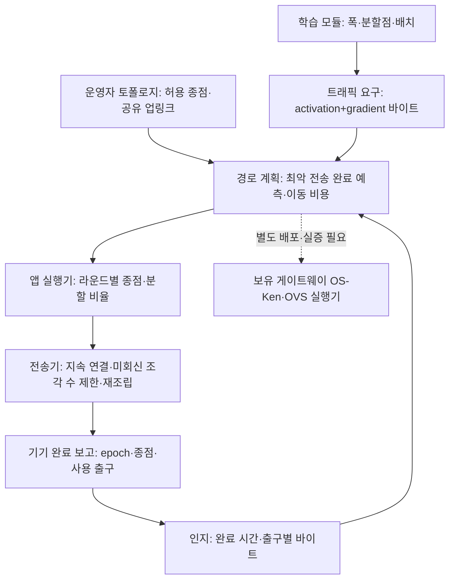

# AwareNet: 네트워크 중심 문제 정의와 아키텍처 개선

> 후속 연구 판단: [핵심 기여 설계→실험 4차 검토](핵심기여_설계실험_반복검토_2026-09-22.md). 아래 구현은 경로 기준선으로 유지하며, 경로 선택만으로 연구 기여가 충분한지는 별도로 재검토했다.

2026-09-22 · `awarenet` · 후속 요청 반영: **폭 알고리즘은 교체 가능한 학습 모듈로 두고, 경로 제어의 필요성과 효과를 주된 검증 대상으로 한다.**

상태: 네트워크 정책·공유 병목 모형·실행 완료 보고·전송 창 제어 구현. PyTorch/CUDA 및 실제 소켓 학습 검사 통과. 새 정책의 KOREN 성능과 실제 OVS 집행은 검증 전.

## 1. 경로 변경을 어떻게 주장할 것인가

**중심 문제:** 여러 기기의 SFL activation/gradient 왕복이 일부 엣지 경유 구간에 집중되면, 그 구간의 대기 때문에 학습 라운드 완료가 늦어진다. 기기와 모델을 그대로 둔 채, 운영자가 제공한 대체 경유 구간으로 학습 트래픽을 배정해 통신 완료의 긴 꼬리를 줄일 수 있는지 검증한다.

제안 제목: **“공유 병목을 고려한 분할 연합학습의 엣지 경유 경로 제어”**.

```text
동일 모델 폭·분할점·배치·데이터·이용 가능한 회선
 → 일부 경유 구간 혼잡 → activation/gradient 완료 지연
 → 가장 늦은 참여자를 기다리는 라운드 지연
 → 허용된 다른 경유 구간으로 배정 → 전송·라운드 완료 지연 변화 측정
```

**성립 조건:** 피할 수 있는 혼잡 구간과 여유 있는 대체 경유 구간이 있어야 한다. 첫 접속망이나 공통 업링크 하나가 전체 병목이면 경로 변경만으로 해결되지 않는다. 이 조건도 같은 비중으로 실험한다.

학습 특화의 후보는 앞으로 보낼 activation/gradient 양과, 양방향 완료가 다음 계산을 막는다는 정보를 쓰는 것이다. 현재 새 정책은 왕복 데이터량과 최악 전송 완료 예측을 사용한다. 배치별 준비 시각·RTT·서버 큐를 포함하는 스케줄러는 아직 구현하지 않았다. 일반 부하 분산보다 항상 낫다고 주장할 근거는 없다.

폭 알고리즘은 데이터량을 결정하는 입력이다. FjORD·FedRolex 등으로 교체해도 네트워크 대조 실험에서는 같은 폭 일정과 학습량을 제공한다. 폭을 더 줄여 빨라진 차이를 경로 성능으로 세지 않는다.

## 2. 개선한 아키텍처



| 책임 | 코드·계약 | 이번 상태 |
|---|---|---|
| 학습 선택 | `c.plan`, `--oracle-plan` | network 정책은 전달받은 폭을 유지. 기본 전폭, 고정 기기별 폭 지정 가능 |
| 트래픽 요구 | `profile.bytes × width × batches` | 관측 바이트를 폭으로 환산한 예측. 비선형 통신량은 보정 대상 |
| 공유 자원 | [network_control.flow_rates](../../sfl/network_control.py) | 경로 용량·기기 접속 상한·공통 업링크를 동시에 제한 |
| 경로 계획 | `plan_routes` | 최악 전송 완료 예측 우선, 동률이면 합계. 5% 이동 문턱·전환 비용·이동 수 상한 |
| 런타임 연결 | [policies.NetworkOnly](../../sfl/policies.py) | `--policy network`를 학습 정책과 별도로 등록 |
| 종점 실행 | `endpoints_for`, `fed_client._set_dp` | TCP 종점 재접속. 서버 모델이나 GPU 작업의 엣지 간 이동은 아님 |
| 완료 검증 | `verify_receipts`, `route_receipts` | 계획 epoch와 기기 보고 종점 대조. 불일치 시 다음 network 결정을 중단 |
| 조각 선전송 | `fed_client._batch_micro` | 미회신 조각 수 제한, 서버의 표본 가중 기울기를 그대로 사용 |
| 무결성 | [chunker.Reassembler](../../sfl/chunker.py) | 겹치는 범위·다른 전체 길이·충돌하는 재전송·미완성 pop 거부 |

이전 [기기 연산 예산 정책](문제정의_기기연산예산_SFL_2026-09-22.md)은 폭 선택 대조군으로 보존한다. 현재 주 실험은 network 정책에 전폭 또는 고정 폭을 넣는다. 외부 동적 폭 알고리즘 전체를 연결한 상태는 아니다.

논리 엣지 1·2가 VM1 업링크를 공유하면 경로마다 100Mbps라 해도 총 200Mbps를 사용할 수 있다고 계산하면 안 된다. 새 모형은 공통 자원 제약을 둔다. 기기 한 대의 소켓 두 개가 동일 접속망을 쓰는 경우도 합산 상한을 적용한다.

[토폴로지 예시](../../configs/network_topology.example.json)는 **형식 예시**이며 실제 KOREN 수치·경로 독립성의 증거가 아니다. 운영자가 확인한 공유 구간·용량으로 작성한다. 파일 생략은 공유 업링크 정보가 없는 모형이지 독립성이 입증된 상태가 아니다.

현재 모형은 대칭 유효 전송률을 가정하며 RTT·상하향 비대칭·손실·TCP 혼잡 윈도·서버 큐를 포함하지 않는다. `predicted_network_s`는 전체 라운드 예측이 아니다. 탐욕 탐색으로 전역 최적해를 보장하지 않는다.

## 3. SDN·권한 주장의 범위

기기 앱은 허용된 소켓 종점을 선택한다. Wi-Fi·셀룰러·ISP·KOREN 백본의 규칙을 기기가 바꾼다고 가정하지 않는다. SDN 권한은 **운영자 소유 OVS 게이트웨이 내부**에 둔다.

현재 실회선 실행기는 SSH 터널·종점 변경이고, [OS-Ken/OVS 코드](../../sfl/sdn/README.md)는 별도 프로토타입이다. network 정책 실행을 OpenFlow 실증이라고 부르지 않는다. OS-Ken은 흐름 변경 요청을 생성하는 SDN 라이브러리이며 OVS가 규칙을 적용한다. [OS-Ken 공식 문서](https://docs.openstack.org/os-ken/latest/writing_os_ken_app.html), [OVS OpenFlow 문서](https://docs.openvswitch.org/en/latest/faq/openflow/)

SDN 실증에는 ① 실제 OVS ingress를 통과하는 배치도, ② 양방향 flow와 패킷·바이트 카운터, ③ 오류·barrier 응답과 전환 시간, ④ 관리 채널 접근 제어·클라이언트 매핑이 필요하다.

`route_receipts=round_completed`는 **해당 종점을 보고한 기기가 라운드를 완료한 앱 수준 증거**다. 물리 경로 독립성이나 스위치 ACK가 아니다. HELLO ID 인증·암호화는 아직 제공하지 않는다. 완료 확인 실패 시 중단하며 자동 무중단 복구를 구현한 것은 아니다.

## 4. 먼저 계산한 조각을 보내는 기능

| 항목 | 기대할 수 있는 변화 | 보장되지 않는 것 |
|---|---|---|
| 조각 선전송 | 첫 activation을 일찍 보내 다음 계산과 겹칠 가능성 | 전체 라운드 단축 |
| 미회신 조각 수 제한 | 동시에 밀어 넣는 작업 수·보유 그래프 제한 | 엄밀한 패킷 버스트 상한·링크 속도 제한 |
| 메시지 분할 | 파이프라인에 일찍 작업 공급 | 총 데이터 감소. 헤더·호출 비용은 증가 가능 |
| 다중 경로 | 다른 가용 자원 사용 | 공통 병목에서의 용량 증가 |

기본은 `micro=1`이다. 선전송은 같은 학습량을 보내는 선택 가능한 전송 방식으로 둔다. 통신 부하를 인위적으로 늘려 유리한 상황만 만들면 일반화가 약해진다. 실제 SFL의 메시지 크기·준비 패턴을 사용하고, 작은 메시지·공통 병목처럼 이득이 없는 조건도 포함한다.

### 발견·수정한 학습 오류

기존 서버는 손실을 `1/m`로 나눈 뒤 activation 기울기를 반환했고, 클라이언트는 이를 다시 `1/m`로 나눴다. 이중 축소를 제거했다. 서로 다른 크기의 조각에도 맞도록 서버는 `조각 표본 수 / 전체 배치 표본 수`로 가중한다.

실제 클라이언트·서버 배치 메서드를 소켓으로 연결해 일반 SGD 한 번과 비교했다. 같은/다른 크기의 조각, 전송 창 1·2·4에서 앞·뒷부분 파라미터와 손실이 오차 범위 안에서 일치했다. **BN 없는 작은 모델·단일 클라이언트 조건**이며 다중 클라이언트의 서버 갱신이나 최종 정확도까지 보장하지 않는다. 새 network 모드의 마이크로배치 비교에는 서버·기기 모두 GN을 사용한다.

### 기존 실험의 재해석

`out/wp_r8mix_rho1_s{1,2,3}_{bothmp,bothmpm}_widthpath.jsonl`의 R4~23:

| 기존 구성 | 시드별 평균 라운드(초) | 시드별 마지막 정확도 |
|---|---|---|
| bothmp | 10.322 / 10.177 / 7.876 | 32.8 / 31.35 / 30.15% |
| bothmpm | 8.857 / 8.644 / 8.775 | 14.0 / 23.4 / 14.6% |

한 시드에서는 선전송 쪽 시간이 더 길다. 폭·바이트량도 달라 순수 조각 효과 비교가 아니며 위 결함이 포함된 코드의 결과다. 선전송 자체가 나쁘다거나 새 수정이 정확도를 회복했다고 결론 내리지 않는다. **수정 후 고정 폭·동일 학습량으로 다시 비교**해야 한다.

## 5. 네트워크 과제의 최소 실험

모든 팔에서 모델·폭 일정·배치·데이터·시드·허용 회선 수를 같게 둔다. 첫 비교는 전폭·micro=1이다.

| 비교 팔 | 목적 |
|---|---|
| 고정 경로 (`network`, `max-moves=0`) | 제어가 없을 때 |
| 균등 초기 배정 (`init-sets=rr`, 이후 고정) | 이미 분산한 단순 기준선 |
| 제안 경로 정책 | 동일 데이터량의 전송 완료 지연 감소 여부 |
| 제안 + micro=4/window=2 | 선전송의 추가 효과·비용 |

장면은 ① 공유 업링크 혼잡·별도 여유 경로, ② 모든 후보가 동일 접속 병목, ③ 용량 변화·회복, ④ 작은 activation·큰 처리 오버헤드로 구성한다. 장애 복구 주장은 실패 주입·복구 구현 뒤에 추가한다.

주 지표: activation–gradient 완료 지연 p50/p95, 라운드 p50/p95, 목표 초과율, 수신측 유효 바이트/측정 구간, 같은 평가 모델의 정확도·목표 정확도 도달 시간. 이동·실패·메시지 수·수신측 버스트·버퍼 대기는 보조 지표다.

현재 로그에는 기기·서버 시간, 출구별 바이트/활동 구간, `traffic`의 activation 메시지 수·페이로드·주 채널 바이트·전송 호출 시간·최대 미회신 조각 수가 있다. `exchange_completion_s`는 **activation 전송 호출 시작부터 클라이언트가 gradient를 꺼내 쓸 수 있을 때까지**의 샘플이며 서버 시간·기기 스케줄링도 포함한다. [network_trace_report.py](../../scripts/analysis/network_trace_report.py)가 p50/p95와 폭 일정 일치 여부를 집계한다.

**NIC 총바이트·큐 길이·패킷 버스트 계측은 아니다.** KOREN에서는 `tc -s`/OVS 카운터나 수신측 시각 기록을 추가해야 한다. 기존 `N×기기 속도 중앙값`을 실제 합산 goodput으로 쓰지 않는다.

KOREN은 실제 거점 간 전송과 운영자 VM 경유를 검증하는 기반이다. 물리 VM 2대·논리 엣지 4개·논리 참여자 수·축소비를 구분한다. SHRiNK 축소 조건과 기존 실측 자료는 [기존 성과 보고서](../01_제출발표/기존성과_근거보고서_및_비판검토_2026-09-19.md)에 연결했다.

## 6. 실행 환경과 사용법

프로젝트 `.venv`에 **Python 3.12.14, torch 2.6.0+cu124, torchvision 0.21.0+cu124**를 설치했다. **RTX 3080 CUDA 행렬 연산과 의존성 충돌 검사 통과.** 저장소의 기존 torch 세대에 맞춘 설치이며 최신 버전이라는 뜻은 아니다. [공식 설치 조합](https://docs.pytorch.org/get-started/previous-versions/)

없는 `requirements-fl.txt`를 참조하던 설치 진입점도 수정했다. 현재 최소 런타임은 [requirements-sfl.txt](../../requirements-sfl.txt), Linux SDN 환경은 [requirements-sdn.txt](../../requirements-sdn.txt)다.

```powershell
.\.venv\Scripts\python.exe -m unittest tests.test_network_control tests.test_micro_e2e tests.test_network_runtime tests.test_aggregate_width_sync
```

기존 KOREN 리그를 준비한 뒤 사용하는 서버 옵션 예시:

```bash
python sfl/fed_server.py --clients 8 --policy network --preflight --solo \
  --edges "$EDGES" --paths "$CAPS_MBPS" --edge-groups "$ALLOWED_GROUPS" \
  --network-topology configs/network_topology.actual.json \
  --access-mode shared --max-moves 1 --micro 1 --norm gn \
  --log out/network_trial.jsonl
```

`network_topology.actual.json`은 **실제 배치에 맞춰 작성할 파일**이며 저장소 예시는 실측 조건이 아니다. 기기에도 같은 `--norm gn --cut`을 지정한다. 독립 회선의 증거가 있을 때 `--multipath --access-mode independent`를 사용한다. 공유 접속망에서도 multipath를 시험할 수 있으나 공통 용량 제약을 유지한다.

선전송 비교는 같은 설정에서 `--micro 4 --micro-window 2`로 바꾼다. 겹친 실행에서는 잔여 시간을 경로 용량에 귀속할 수 없어 새 정책은 경로 용량 관측 갱신을 멈춘다. 이 모드의 동적 혼잡 반응 평가에는 별도 링크 텔레메트리가 필요하다.

## 7. 검증과 남은 한계

- 경로·공유 병목·완료 보고·재조립, 기존 예산 정책, 실제 텐서 집계, 소켓 마이크로배치·런타임을 함께 실행해 **33개 검사 통과**.
- 실제 서버·클라이언트·로컬 릴레이 2라운드: micro=1/4 모두 종점 변경·학습·완료 보고·왕복 시간 샘플 확인. **합성 데이터/루프백 기능 검사이며 성능 실증이 아니다.**
- 기존 `test_chunker.py`, `test_micro_srv.py`, `test_mp_act.py` 통과. 종료 시 수신 소켓·작업 큐·파일 정리를 보완했다.
- KOREN 재실험, OVS 설치 확인, 최종 정확도 비교, 실제 패킷 버스트 감소는 미검증이다.

공유 자원과 작업량을 고려하는 배정 자체는 새로운 개념이 아니다. SFL 왕복과 준비 패턴을 쓰는 정책이 단순 고정·균등 배정보다 어느 조건에서 나아지는지 보여야 한다. 공통 병목처럼 이득이 없는 조건을 함께 제시해야 경로 변경의 필요성과 적용 범위가 설득력을 갖는다.

## 8. 9/26 정정: 기관 권한, 실제 커널 집행, TCP 개선과 에이전트

사용자의 지적은 기기–엣지 구간이 SDN의 관리 도메인에 실제로 포함되는가라는 배포 적합성 문제다. 지연이나 부하 분산의 필요성만으로 이를 답할 수 없다. 기기·중계·서버가 같은 팀의 실험 자원이었다는 사실을 서로 다른 기관의 일반 FL 참여자에게 그대로 확장하지 않는다. 엣지–서버 구간 역시 서로 다른 운영자에 속하면 별도 위임이 필요하다.

### 8.1 적용 가능한 기기와 제어 범위

| 배치 | 기기에 허용되는 동작 | 네트워크 설정 주체 | 이번 근거의 범위 |
|---|---|---|---|
| 연구팀이 관리하는 Linux/Jetson·컨테이너 | 학습·소켓 설정, 권한 있는 로컬 실행기의 tc 설정 | 해당 호스트/네트워크 네임스페이스 관리자 | 현재 리그와 이전 tc 에이전트 코드에 대응 |
| 다른 기관의 관리 단말, 해당 기관이 범위를 위임함 | 로컬 정책이 허용한 학습·전송만 수행 | 그 기관의 실행 에이전트가 자체 권한으로 집행 | 가능한 배포 설계. 기관 간 위임 실증은 확인되지 않음 |
| 일반 개인 단말·관리 권한을 위임하지 않은 기관 단말 | 동의한 앱의 학습 및 일반 TCP 연결 | 망 설정은 해당 운영자가 유지 | SDN 스위치나 중앙 root 제어 대상으로 묘사하지 않음 |
| KOREN/ISP 중간 경로 | 제공된 IP 도달성 이용 | 망 운영자 | 우리 코드의 tc·OVS 권한으로 그 경로를 변경할 수 없음 |

‘SDN 적용 가능한 기기’는 하드웨어 이름만으로 정하지 않는다. 관리자 권한, 설치 가능한 실행기, 인터페이스 소유권, 기관의 위임 범위를 먼저 확인한다. 중앙 제어기는 기관별 후보·예산을 입력받아 계획하고, 각 기관의 실행기가 허용 주소·포트·최대율·정책 버전을 검사한 뒤 자기 자원에만 적용하는 구조가 적합하다. 현재 주소 허용 목록과 이전 선택적 토큰 기능이 이 위임 체계 전체를 구현한 것은 아니다. 중앙의 임의 셸 명령 실행을 기관 간 제어 API로 사용해서는 안 된다.

### 8.2 가정과 구별되는 실제 구현

| 계층·버전 | 확인한 실제 동작 | 표현할 수 있는 성과와 한계 |
|---|---|---|
| 현행 실회선 리그 `sfl/net/real_rig.sh` | HPC egress HTB/u32, VM ingress→IFB HTB, VM egress 클래스·포트 필터. `access`/`edge`로 실행 중 `tc class change` | 커널 큐와 속도 제한을 실제 설정하는 코드. 실험자가 주입한 상한·교란이며 매 라운드 학습 정책이 물리망 용량을 늘린 것이 아님 |
| 현행 루프백 `sfl/net/hairpin_lo.sh` | egress에서 기기 접속 상한, ingress→IFB에서 공유 경로 상한. `assign`은 IFB의 출발/목적지 주소 필터 교체 | 실제 커널 분류·큐 변경. 루프백의 경로 모형이며 KOREN 라우터의 다음 홉 변경이 아님 |
| 현행 `sfl/policies.py` | 종점 목록이 있으면 TCP 중계 주소를 변경. 그 외 `--path-exec`가 있으면 필터 배정 명령 실행 | 두 집행 방식은 코드의 서로 다른 분기. scen32의 종점 변경을 커널 IP 경로 변경으로 부르지 않음 |
| 현행 `sfl/chunker.py`, `mpsend.py` | 텐서를 64KiB~1MiB 조각으로 나누고 여러 표준 TCP 연결에 가중 배정·재조립 | 분할 비율은 응용 계층. TCP 세그먼트 규칙 또는 커널 MPTCP 스케줄러를 바꾼 것은 아님 |
| 이전 `main`·`deploy`의 tc 에이전트 | `nsenter`/`docker exec`로 컨테이너의 TBF 설정, 호스트 veth의 하향 제어 | 관리 호스트에서 실행되는 실제 집행 코드. 현재 SFL 런타임과 동시 적용 여부는 별도 |
| 이전 `OVS_SDN` | OVS 이중 VXLAN, OpenFlow 분류, OVSDB Queue max-rate 변경 | OVSDB의 큐 설정과 OpenFlow의 포워딩 규칙을 구분. 명령이 없는 환경의 mock 로그는 적용 증거로 세지 않음 |
| 현행 `sfl/sdn/` | OS-Ken OpenFlow 1.3 규칙 생성·허용 목록 검사 | 프로토타입. 학습기 자동 연동·실제 OVS 규칙 설치와 바이트 통과 확인 전 |

이전 `main`의 `scripts/deploy/ovs_setup_mode_b.sh`에는 **VXLAN 가상 포트에 건 큐가 적용되지 않을 위험 때문에 셰이핑을 실제 컨테이너 인터페이스로 옮긴 기록**이 있다. OVS 객체를 생성했다는 사실과 커널 데이터 경로에서 원하는 큐를 실제 통과했다는 사실을 구별한 설계 변경이다. 이전 `OVS_SDN`의 KOREN API 클래스는 호출 로그를 남기는 placeholder이므로 백본 제어 구현으로 세지 않는다.

캐시된 6개 참조의 커밋, 현행 코드 9개와 과거 코드 5개의 SHA-256은 [구현 감사 원장](../../configs/measurements/network_implementation_audit_2026-09-26.json)에 있다. 루프백 자가 검사 원본 `out/rig_selftest_h5x.json`과 현행 KOREN 기록을 별도로 보존했다. 이번 감사는 소스·보존 로그 확인이며 새 Linux/OVS 배포를 실행하지 않았다.

### 8.3 기억한 TCP 개선의 정확한 위치

| 개선 | 코드와 조건 | TCP 자체 수정과의 구분 |
|---|---|---|
| 상시 연결 | `ChunkLinks._ensure`가 연결 재사용. 연결 후 5초 timeout을 해제해 라운드 대기 중 불필요한 재접속 방지 | 새 연결의 handshake·초기 혼잡창 비용을 줄임. idle 후 혼잡창 감소까지 없앤 것은 아님 |
| 작은 메시지·배압 | `TCP_NODELAY`, `SO_SNDBUF=262144` 요청 | NODELAY는 Nagle 동작 설정. slow start 변경이 아님. Linux의 실제 송신 버퍼는 상한과 내부 배수 적용 후 읽어야 함 |
| 조각 배정 | 현재 `CHUNKS_PER_CONN=16`, 가중 몫, 연결별 송신 시간 EWMA, 남은 조각의 완료 예상 비교 | 관측 적응형 규칙. send 완료는 수신 완료와 다르며 소켓·터널 버퍼의 영향을 받음 |
| 신뢰성·순서 | `tid/seq/off/ln/total`, 중복·겹침·충돌 검사, 전체 텐서 FIN/ACK, 비동기 확인과 라운드 끝 flush | 응용 프로토콜의 완성 확인 개선. 커널 TCP ACK/SACK 변경이 아님 |
| 제한된 오류 복구 | send 중 오류가 발생한 조각은 giveback, 같은 출구의 낡은 연결 제거, 다음 send 때 재접속 | 이미 send 성공한 뒤 연결이 끊긴 조각의 자동 식별·재전송 보장은 없음 |
| 과거 ACK 보호 | `main`의 `pangyo_tc_agent.py`: `AWARENET_ACK_PROTECT=0` 기본. 활성화하면 IPv4 `pkt_len<128`을 PRIO 우선 밴드로 보내고 나머지에 TBF 적용 | ACK를 위한 큐 정책. 길이 기반이어서 순수 ACK만 정확히 식별하지 않으며 다른 작은 패킷도 통과. TCP ACK 생성·재전송 규칙 수정이 아님 |
| 혼잡제어 선택 | `net_throughput.py` 측정 소켓의 `TCP_CONGESTION` 선택 기능 | 설치된 표준 알고리즘 선택. 새 혼잡제어 알고리즘 구현은 아님 |

6개 캐시 브랜치의 추적 코드에서 사용자 정의 TCP 커널 패치를 찾지 못했다. 삭제된 모든 이력이나 외부 파일까지 부재를 증명한 것은 아니다. 이전 문서의 `total/(8×연결 수)`와 달리 현행 상수는 16이다. `chunker.py`의 ‘TCP는 반드시 배달’이라는 부정확한 주석과 `mpsend.py`의 오래된 상수·버퍼 설명을 정정했다. 동작 코드는 바꾸지 않았다.

[Linux socket 문서](https://man7.org/linux/man-pages/man7/socket.7.html)는 SO_SNDBUF의 내부 배수·상한을, [커널 sysctl 문서](https://docs.kernel.org/networking/ip-sysctl.html)는 idle 후 혼잡창 감소를 설명한다. 연결 재사용만으로 slow start를 제거했다고 쓰지 않는다. [RFC 5681](https://www.rfc-editor.org/rfc/rfc5681.html)의 혼잡제어와 응용 텐서 완료 확인을 다른 계층으로 다룬다.

### 8.4 고정·적응형 에이전트와 AI를 쓰지 않은 이유

| 실행 단위 | 현재/제안 역할 | 결정 방식 |
|---|---|---|
| 패킷마다 | 커널 TCP, 큐잉, 설치된 전달 규칙 실행 | 표준 알고리즘과 설치된 정책. 패킷마다 중앙 추론을 기다리지 않음 |
| 연결·조각마다 | 사용자 공간 조각 스케줄러, 배압·가중 몫·완료 확인 | 가벼운 규칙과 관측값으로 적응. 커널 패킷 스케줄러와 구분 |
| 라운드마다 | 폭·허용 종점·가중치 결정 | 비용 모형과 휴리스틱. 현재 학습된 AI 정책은 없음 |
| 설정·운영 변경 시 | 기관별 허용 자원·총량·복구 정책 관리 | 관리자가 고정한 한계 안에서 실행. 기관 간 위임은 추가 구현 대상 |

‘고정’은 패킷 처리가 정지하거나 TCP 혼잡창이 고정이라는 뜻이 아니다. 허용 범위와 알고리즘은 고정할 수 있지만 커널 TCP와 조각 배정의 상태는 계속 변한다. 에이전트는 관측·계획·집행 소프트웨어를 뜻하며 LLM 또는 학습 기반 정책을 전제하지 않는다. SDN 역시 학습된 AI 정책을 필수 요소로 하지 않는다([RFC 7426](https://www.rfc-editor.org/rfc/rfc7426.html)).

시간 규모는 상관계수 대신 작업 단위와 처리량 예산으로 설명한다. 1,500바이트를 C bit/s로 직렬화하는 이상 시간은 Δ=8L/C다. 56Mbps에서 약 214.3μs, 1Gbps에서 12μs다. 헤더·프리앰블·프레임 간격을 제외한 예이며 실제 패킷 도착 간격이나 모든 판단의 절대 마감은 아니다. 조각 64KiB는 56Mbps에서 약 9.36ms, 1MiB는 약 149.8ms의 직렬화량에 해당한다. 패킷과 텐서 조각을 같은 단위로 비교하지 않는다.

AI의 추론 지연은 이 프로젝트에서 측정하지 않았다. **가정한** 제어 지연이 50ms이고 그동안 해당 출력이 멈춘다면, 일정 유입 56Mbps에서는 0.35MB, 1Gbps에서는 6.25MB가 추가로 도착한다. 현재 구조처럼 설치된 규칙으로 전송을 계속하면 이 계산을 AI 때문에 실제로 생긴 큐라고 해석할 수 없다. 그림의 1·10·50·100ms는 민감도 예시이며 특정 AI 모델의 벤치마크가 아니다.

AI 배제의 근거는 ‘모든 AI는 패킷보다 느리다’가 아니다. 현재는 정책 학습 자료, 개선을 입증한 비교 실험, 추론 p95/p99와 규칙 적용 시간을 포함한 예산이 없다. 구현 가능한 후보 수가 작고 명시적 상한이 중요하므로 비용 모형을 사용했다. 라운드 계획은 패킷마다 실행하지 않으므로 이후 소형 예측 모델을 넣을 수 있다. 도입 시 관측·추론·검사·적용의 합이 상태 변화 시간보다 충분히 짧은지, 기존 정책 대비 개선과 변동·자원 비용이 어떤지 측정해야 한다. 평균 추론 시간만으로 선택하지 않는다.

### 8.5 실제 집행을 입증하는 연결 고리

정책 버전·대상 기관/인터페이스 → 적용 명령의 성공 여부 → `tc -s`/OVS 규칙 조회 → 해당 클래스·포트의 바이트 증가 → 응용 수신 완료를 같은 실행 식별자로 묶어야 한다. 명령 성공만으로 패킷이 그 규칙을 통과했다고 판단하지 않는다. 양방향과 동일 모델·폭·바이트량을 확인한다. 원격 root 셸이나 브리지 재생성 스크립트를 일반 개인 단말의 지원 기능으로 제시하지 않는다. 현행 실험의 실제 커널 집행과 기관 간 제어 구조의 미검증 부분을 함께 공개하는 것이 보고서의 정확한 범위다.
