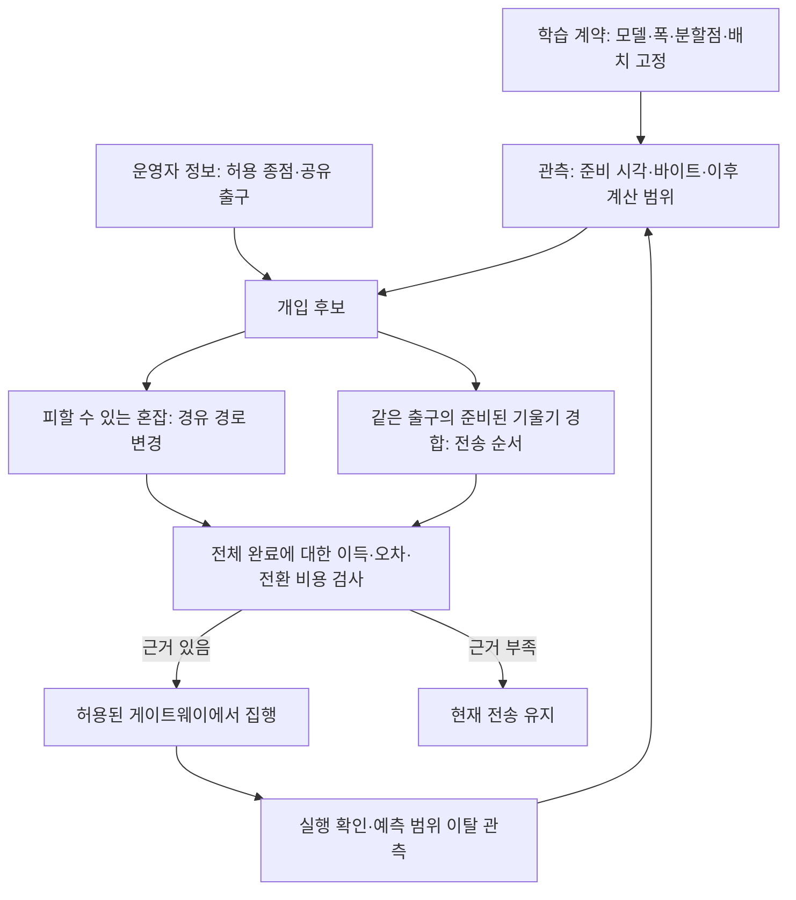

# AwareNet 핵심 기여: 설계 → 반례 실험 → 수정

> **9/23 후속 실행:** [KOREN·Jetson 실측값 주입 재현](../02_실험/실측주입_재현실험_2026-09-23.md). 다른 브랜치 이력에서 젯슨 원시 기록을 복구해 사용했다. 아래의 합성 숫자와 구분하여 입력 출처·가정·결과를 보존했다.

2026-09-22 · 기준 브랜치 `awarenet`

## 1. 이번 결론

**현재의 경로 선택만으로 독창적인 연구 기여가 충분하다고 판단하지 않는다.** 이번에는 “SFL의 기울기 반환 순서가 기기의 남은 계산과 만날 때 생기는 완료 지연”을 후보 문제로 좁혔다. 설계와 실험을 네 차례 반복했고, 이득과 실패 조건을 함께 남겼다.

제안하는 연구 질문:

> 같은 모델·같은 데이터·같은 전송량에서, 공유 엣지 출구의 기울기 반환 순서를 바꿔 기기들의 계산 완료를 앞당길 수 있는가? 그 개입이 유효하다는 근거가 부족하면 자동으로 보류할 수 있는가?

**채택 상태: 조건부 연구 후보. 실제 학습의 기본 정책으로 활성화하지 않았다.** 준비된 기울기가 몰리는 로컬 TCP 실험에서는 약 28.6%의 완료 시간 단축을 확인했다. 그러나 느린 기기의 기울기 자체가 늦게 준비되는 도착 모형에서는 평균 0.55%였다. 따라서 첫 결과를 KOREN 전체 학습의 성능으로 주장하면 안 된다.

이번 결과는 독창성이 증명됐다는 뜻이 아니다. 기존 규칙과의 차이를 입증해야 할 대상을 명확히 했고, 기존 주장보다 검증 가능한 가설을 얻었다는 의미다.

## 2. 기존 설명에서 무엇이 약했나

| 기존 주장 | 부족한 이유 | 이번 수정 |
|---|---|---|
| 혼잡한 경로를 피해 빠르게 전송한다 | 일반 트래픽 분산에도 해당한다 | 전송 완료가 이후 기기 계산과 전체 완료에 주는 영향을 목표에 포함 |
| 먼저 계산한 조각부터 보낸다 | 중첩·조각 전송은 알려진 방법이며 총바이트가 줄지 않는다 | 선전송은 선택 기능. 어떤 준비된 기울기를 먼저 완성할지 분리해 검사 |
| 느린 기기의 폭을 줄인다 | 학습량·정확도 변경이 네트워크 이득과 섞인다 | 이번 모든 비교에서 기기별 페이로드·모델 갱신을 동일하게 유지 |
| 다중 경로이면 대역폭이 늘어난다 | 공통 업링크에서는 성립하지 않는다 | 공유 병목을 먼저 확인하고, 경로 우회와 같은 출구 내 전송 순서를 분리 |
| 예측해서 제어하면 된다 | 잘못된 예측이 라운드를 더 늦출 수 있다 | 예측 범위 안에서 기준선보다 불리해질 수 있는지 계산. 범위 이탈 반례도 공개 |

기존 경로 모듈은 계속 기반 시설로 쓴다. 다만 “경로 변경 자체”를 연구 기여의 전부로 삼지 않는다.

## 3. 선행 연구를 확인한 뒤 버린 독창성 주장

| 연구 | 확인한 관련 내용 | 우리가 그대로 새 기여라고 할 수 없는 것 |
|---|---|---|
| [ECF, CoNEXT 2017](https://research.ibm.com/publications/ecf-an-mptcp-path-scheduler-to-manage-heterogeneous-paths) | 이질적인 경로의 정보를 이용하는 MPTCP 스케줄링 | 단순 대역폭·완료 시간 기반 멀티패스 |
| [TicTac, MLSys 2019](https://proceedings.mlsys.org/paper_files/paper/2019/hash/94cb28874a503f34b3c4a41bddcea2bd-Abstract.html) | 계산 의존성을 이용한 통신 순서 결정 | 학습 계산을 고려한다는 설명만으로 독창성 주장 |
| [P3, MLSys 2019](https://proceedings.mlsys.org/paper_files/paper/2019/hash/3ed923f9f88108cb066c6568d3df2666-Abstract.html) | 파라미터별 허용 지연과 세분화된 전송 우선순위 | 텐서 분할·우선 전송 자체 |
| [Single-Machine Scheduling with Release Times and Tails](https://doi.org/10.1023/B:ANOR.0000030692.69147.e2) 및 [Schrage 규칙 설명](https://link.springer.com/article/10.1007/s00453-018-0417-6) | 준비된 작업의 이후 처리 시간을 이용한 스케줄링 | 아래의 longest-tail-first 규칙 |
| [Communication-and-Computation Efficient SFL](https://arxiv.org/abs/2501.01078) | 분할점·자원 배정·기울기 집계의 공동 설계 | 통신·연산을 같이 최적화한다는 포괄적 주장 |
| [SuperSFL](https://arxiv.org/abs/2601.02092) | 자원별 서브네트워크와 학습 절차 | 학습 알고리즘을 교체한 사실을 네트워크 기여로 제시 |

위 비교는 핵심 관련 연구의 범위 검토다. 전체 문헌에 대한 신규성 검증을 마친 것은 아니다. 구현한 규칙을 P3/TicTac 전체 시스템과 비교 실험한 것도 아니다.

## 4. 설계 1: 기울기는 다음 계산을 시작시키는 입력이다

기울기 수신 완료 시각을 `C_i`, 그 뒤 기기의 독립적인 남은 계산을 `q_i`라 하면:

`J = max_i(C_i + q_i)`

통신만 보면 모든 기울기를 다 보낸 시각이 같아도, `q_i`가 큰 기기가 기울기를 일찍 받으면 계산을 통신과 겹칠 수 있다. 반대로 빠른 기기만 먼저 끝내면 전체 완료는 그대로일 수 있다.

최소 예시: 두 기울기의 전송 시간이 각각 1초이고, 이후 계산은 A=0초, B=1초다. A→B는 전체 3초, B→A는 2초다. 총바이트와 회선 속도는 같다. 이는 알려진 tail 스케줄링의 예이며 새로운 정리로 주장하지 않는다.

### 실험 1: 준비된 기울기 8개, 100시드 × 6조건

단일 20 Mbps 출구, 기기별 256 KiB~1 MiB, 64 KiB 조각. 이질 조건의 이후 계산은 6개 기기 0.03~0.12초, 2개 기기 0.4~1.2초. 전부 **합성 조건**이다. 같은 시드의 모든 정책에 같은 바이트·실제 계산 시간을 넣었다.

| 이질 조건, 100시드 | 평균 완료 시간 | RR 대비 시드별 감소율 평균 | 악화 횟수 |
|---|---:|---:|---:|
| 조각 순환 전송 RR | 2.672초 | — | — |
| 도착 순서 FIFO | 2.368초 | 10.42% | 22/100 |
| 작은 기울기 우선 SJF | 2.401초 | 10.09% | 0/100 |
| 남은 계산 추정이 긴 순서 | 2.093초 | 20.82% | 0/100 |
| 설계 2의 조건부 개입 | 2.096초 | 20.68% | 0/100 |

SJF의 같은 크기 작업은 FIFO 순서를 유지하도록 했다. 초기 구현의 기기 ID 동률 처리가 결과에 영향을 줘 수정한 후 표의 실험을 다시 실행했다. 기준선의 동률 처리를 이용해 이득을 만들지 않는다.

**반례:** 실제 계산 순서와 반대로 예측하면 단순 긴 계산 우선 정책은 46/100회 악화했다. 최악에는 RR보다 34.46% 오래 걸렸다. 동일 계산 조건이나 독립 회선 조건에서는 개선이 없었다. 독립 회선은 공통 큐를 만들지 않고 병렬 전송으로 평가했다.

판정: 평균 이득만으로 이 규칙을 바로 적용하지 않는다.

## 5. 설계 2: 이득을 설명할 수 있을 때만 개입한다

준비된 같은 작업 집합에서 후보의 완료 예측을 `C`, 기준선의 완료 예측을 `B`, 이후 계산 범위를 `[l_i,u_i]`로 둔다. 다음 값은 이 범위 안에서 후보가 기준선보다 나빠지는 정도의 최댓값이다.

```text
R = max_i { C_i + u_i
            - max(B_i + u_i, max_{j≠i}(B_j + l_j)) }
```

각 i를 고정하면 q_i를 상한으로, 다른 q_j를 하한으로 둘 때 차이가 가장 크다. 이후 i에 대해 최댓값을 취한다. 두 정책의 각 완료 예측에 절대 오차 상한 ε가 있으면 `R + 2ε`로 검사한다. 이 값이 필요한 최소 개선량의 음수보다 작을 때만 순서를 바꾼다.

조건은 엄격하다: **같은 준비 완료 작업 집합, 같은 단일 출구, 범위 안의 독립적인 이후 계산, 명시한 완료 오차 상한**이다. 네트워크 경쟁·후속 통신·모델 갱신 순서로 `q_i` 자체가 바뀌면 이 판정의 적용 범위를 벗어난다. ε를 실제 망에서 검증하지 않았으므로 WAN 성능 보장이라고 부르지 않는다.

구현: [barrier_schedule.py](../../sfl/barrier_schedule.py). 작은 작업 집합의 전 순열과 이론적 최적값을 대조하고, 범위 꼭짓점을 전수 확인해 위 계산식을 검사했다.

### 실험 2: 불확실성 검사

- 올바른 예측 범위: 97/100회 개입, 평균 20.68% 단축, 악화 0회.
- 잘못된 점 예측이나 넓은 범위: 100회 모두 개입 보류, RR와 동일.
- **실제를 포함하지 않는 좁은 범위:** 95/100회 개입, 44회 악화. 판정식도 잘못된 입력을 진실로 바꾸지는 못한다.

판정: “성능이 절대 나빠지지 않는다”는 주장을 버린다. 범위의 적중률과 범위 이탈 시 손해를 함께 보고해야 한다.

## 6. 설계 3: 과거 측정만 사용해 갱신하고, 급변을 반례로 둔다

100시드 × 60개 전송 구간. 처음 8구간은 관측만 하고, 과거 12구간의 최솟값·최댓값에 여유를 더해 다음 범위를 만든다. 30번째에 느린 기기와 빠른 기기를 예고 없이 바꾼다. 이번 구간의 실제 계산 시간은 결정 뒤에만 알려준다.

| 구간 | 조건부 개입의 평균 감소율 | 악화 횟수 |
|---|---:|---:|
| 안정 구간 | 19.78% | 0/2,200 |
| 부하가 바뀐 첫 구간 | 2.71% | **38/100** |
| 이후 회복 구간 | 1.46% | 0/1,200 |
| 새 조건 적응 후 | 17.43% | 0/1,700 |

추가한 적중률 감시·일시 보류 장치는 이 실험에서 범위 갱신만 한 정책보다 추가 이득이 없었다. 별도 기여로 내세우지 않는다. 과거 데이터가 없는 초기 구간과 갑작스러운 변화 직후를 숨기면 안 된다.

## 7. 설계 4: 좋은 결과를 만든 가정부터 깨뜨린다

### 7.1 실제 TCP·PyTorch로 전송과 계산 확인

8개 클라이언트 스레드, loopback TCP, 공유 송신 속도 16 Mbps, 64 KiB 조각, 5시드, 5정책, 이질·동일 계산 2조건으로 **50회** 실행했다. 정책 실행 순서를 시드별로 섞었다.

실제 CNN 앞단·서버 뒷단으로 기울기를 만들고, 수신한 기울기로 클라이언트를 역전파·갱신했다. 기기 이질성은 역전파 후 추가한 0.025/0.35/0.55초 지연으로 만들었다. 이는 **실제 기기 속도 실측이 아니라 명시적인 지연 주입**이다. 모든 순전파와 서버 역전파가 끝난 큐에서 타이머를 시작했다.

| 준비된 큐의 이질 조건 | 평균 완료 시간 | RR 대비 감소율 평균 |
|---|---:|---:|
| RR | 1.529초 | — |
| FIFO | 1.310초 | 14.54% |
| SJF | 1.310초 | 14.49% |
| 긴 계산 우선 | 1.090초 | 28.63% |
| 조건부 개입 | 1.090초 | 28.63% |

- 조건부 개입의 시드별 단축: 24.78~31.08%.
- 동일 계산 조건: 0.03% 수준의 차이, 의미 있는 개선으로 해석하지 않는다.
- 모든 정책의 기울기 페이로드: **2,097,152바이트로 동일**. 모든 수신 SHA-256 일치.
- 클라이언트 파라미터는 단일체 역전파 기준과 최대 오차 0.0.
- 독립적인 앞단과 고정된 서버 스냅샷의 한 번 갱신 검사다. 공유 서버를 여러 라운드 비동기로 갱신했을 때의 동일 정확도·수렴을 증명하지 않는다.
- 타이머에는 초기 학습 계산·모델 업로드(WUP)·집계가 포함되지 않는다. **전체 학습 라운드 시간으로 이름을 바꾸면 안 된다.**

### 7.2 “모든 기울기가 이미 준비되어 있다”를 제거

별도의 이벤트 재생기로 도착 시각을 바꿨다. 모든 미완료 기울기가 준비되기 전에는 RR을 사용하고, 준비되기를 일부러 기다려 큐를 만들지 않았다. 마지막 준비 집합에만 설계 2를 적용했다. 네 조건 각각 100시드이며 TCP 실험과 별개의 합성 실험이다.

| 도착 조건 | 조건부 개입의 평균 감소율 | 개입 구간 |
|---|---:|---:|
| 동시에 준비 | 20.68% | 97/100 |
| 서버에서 순차적으로 준비, 일부 겹침 | 15.44% | 89/100 |
| 전송을 다 끝낸 뒤 다음 기울기가 도착 | **0%** | 0/100 |
| 느린 기기의 기울기 자체가 늦게 도착 | **0.55%** | 7/100 |

**이 결과가 채택 여부를 결정한다.** 준비된 큐 실험의 29%를 대표 성능으로 홍보할 수 없다. KOREN에서 준비 완료 기울기가 실제로 경합하는지 먼저 확인해야 한다. 동시 기울기 준비가 드물다면 이 후보를 부기능으로 낮추거나 폐기한다.

## 8. 기존 KOREN 자료가 뒷받침하는 것

기존 `wp_r8mix_rho1_s{1,2,3}_bothmp_widthpath.jsonl`의 앞 4라운드를 제외한 60라운드를 다시 검사했다.

- 각 라운드에서 기기별 `cli_bwd / batches`를 계산했다. 가장 빠른 기기의 배치 평균 역전파는 라운드 중앙값 **0.226초**, 가장 느린 기기는 **0.837초**였다.
- 이후 계산의 이질성이 있다는 근거는 있다. 단, 배치 평균을 마지막 기울기의 정확한 이후 계산 시간으로 사용할 수는 없다.
- 기울기 준비 이벤트와 배치별 계산 기록은 이 로그들에서 **0/60라운드**다. 공통 출구 큐의 겹침과 이 후보의 학습 시간 단축률은 복원할 수 없다.
- 따라서 기존 32대 조건/실제 8대 축소 실험의 개선율을 이번 알고리즘의 성능으로 전용하지 않는다. 회선 축소의 설명과 학습·계산 동등성의 설명도 구분한다.

새 실행을 위해 `fed_client`에 배치별 forward/backward/wait와 배치 ID를, `fed_server`에 기울기 준비·제출 완료 시각과 바이트를 추가했다. 서버 시각은 같은 서버 프로세스의 monotonic clock이다. **비동기 큐 제출 완료와 실제 기기 수신 완료는 다르다.** 큐 점유와 전송 ACK의 시간 기록은 후속 KOREN 계측에 필요하다. 클라이언트와 서버의 서로 다른 시계를 직접 빼서 one-way delay를 만들지 않는다.

## 9. 아키텍처와 경로 변경의 위치



위 그림은 목표 설계다. **이번에 구현한 판정은 Q의 제한된 준비 구간에만 해당**한다. 기존 `network_control.plan_routes`는 경로 후보를 만드는 별도 기준선이며, 같은 판정으로 모든 경로까지 통합 완료한 것이 아니다.

권한 경계:

1. 기기는 일반 TCP로 등록된 서비스에 연결하고 학습 상태 메타데이터만 제공한다.
2. 보유 엣지/서버가 자신이 보내는 기울기의 순서를 제어한다. 단말의 root 권한이나 이동통신망 라우팅 권한은 필요하지 않다.
3. 경로 변경은 보유 게이트웨이의 OVS/OS-Ken과 허용된 터널/출구로 한정한다. KOREN 코어 라우터를 우리가 제어한다고 가정하지 않는다.
4. OS-Ken의 흐름 출력 포트 설정만으로 텐서 순서·대역폭 큐가 만들어지지는 않는다. 세부 순서는 앱 전송기에서, 스위치 경로는 OS-Ken에서 맡는다. OVS 큐를 쓰려면 실제 큐 설정·지원·ACK를 별도로 검증한다. [OVS OpenFlow FAQ](https://docs.openvswitch.org/en/latest/faq/openflow/)

배치마다 OpenFlow 규칙을 바꾸는 구조는 피한다. 경로는 라운드 수준, 준비된 기울기 순서는 출구의 송신 시점 수준으로 다룬다. 이 분리가 현재 구조에서 수정 범위를 작게 유지한다. 신원 인증·암호화는 별도 미완료 항목이며, 권한을 요구하는 위치를 좁힌 것만으로 보안 전체를 해결했다고 말하지 않는다.

## 10. 핵심 기여를 어떻게 주장할 것인가

현 단계에서 방어 가능한 기여 후보는 세 가지다.

1. **문제 규정:** SFL에서 경로 처리량 개선과 학습 완료 개선을 구분하고, 반환 기울기가 해제하는 기기 계산을 평가 대상으로 삼는다.
2. **제한된 제어와 판정:** 공유 출구의 준비된 기울기에 대해 전송량·학습량을 유지하며 순서를 바꾼다. 불확실성 범위 안에서 기준선 대비 손해 가능성을 검사한다. 범위 이탈·도착 비동기화에서의 실패를 명시한다.
3. **배포 가능한 경계의 검증:** 단말망 권한을 가정하지 않는 보유 엣지 집행과 KOREN 관측으로 적용 가능 구간과 불가능 구간을 구분한다. 이 세 번째 항목의 실망 검증은 아직 남아 있다.

현재는 1·2의 프로토타입과 로컬 근거다. 기존 tail 규칙에 새 이름을 붙이는 것만으로 논문 기여가 되지 않는다. 제한된 판정식도 관련 robust scheduling과의 추가 비교가 필요하다. **새로운 일반 알고리즘·세계 최초·전체 학습 29% 개선이라는 표현은 사용하지 않는다.**

## 11. 다음 실험의 채택/폐기 기준

| 순서 | 실험 | 채택/폐기 판단 |
|---|---|---|
| 1 | 기존 실제 8대 리그에서 폭·학습량을 고정하고 준비/수신/큐/배치별 계산 기록 | 제어 가능한 공유 큐의 경합이 없다면 후보의 우선순위를 낮춤 |
| 2 | RR·FIFO·SJF·기존 경로 정책·조건부 순서·경로+순서 절제 비교 | 같은 종점·같은 폭·바이트·데이터 순서로 평가. 가장 강한 단순 기준선을 넘어야 함 |
| 3 | 같은 경로 변경으로 회피 가능한 병목과 공통 출구 병목을 각각 생성 | 어떤 손잡이가 작동했는지 구분. tc 용량/노이즈와 실제 회선 수치의 출처 기록 |
| 4 | 기기 부하와 회선 부하를 갑자기 변경 | 첫 악화 구간·최악 손해·회복 시간·개입 보류율을 모두 보고 |
| 5 | 실제 다중 라운드 학습 | 최종 정확도뿐 아니라 같은 목표 정확도까지의 시간, 서버 갱신 순서와 WUP 포함 전체 완료 검사 |

공학적 임시 기준: 대표 조건에서 가장 강한 단순 기준선보다 전체 라운드 시간이 5% 이상 개선되고, 반복 실행에서 같은 방향이며 정확도 저하가 없어야 본체 편입을 검토한다. 5%는 문헌 법칙이 아니라 남은 개발 시간에 비해 가치가 있는지 판단하기 위한 기준이다. 큐 구간만 좋아지고 전체 라운드가 그대로면 채택하지 않는다.

## 12. 재현과 코드

프로젝트 루트의 Windows PowerShell에서:

```powershell
.\.venv\Scripts\python.exe scripts/analysis/barrier_study.py
.\.venv\Scripts\python.exe scripts/analysis/barrier_drift_study.py
.\.venv\Scripts\python.exe scripts/analysis/barrier_arrival_study.py
.\.venv\Scripts\python.exe scripts/analysis/barrier_socket_experiment.py
.\.venv\Scripts\python.exe scripts/analysis/barrier_trace_audit.py
.\.venv\Scripts\python.exe -m unittest tests.test_barrier_schedule tests.test_network_control tests.test_micro_e2e tests.test_network_runtime tests.test_device_budget tests.test_aggregate_width_sync -q
```

- [고정 구간 계획·범위 검사·과거 관측](../../sfl/barrier_schedule.py)
- [실험 조건](../../configs/barrier_study.json) · [합성 비교](../../scripts/analysis/barrier_study.py) · [급변](../../scripts/analysis/barrier_drift_study.py) · [도착 시각](../../scripts/analysis/barrier_arrival_study.py)
- [TCP/PyTorch 실험](../../scripts/analysis/barrier_socket_experiment.py) · [기존 로그 검사](../../scripts/analysis/barrier_trace_audit.py)
- [보존한 결과 요약·코드 해시](../02_실험/barrier_study_2026-09-22.json). 상세 raw JSONL은 `out/barrier_study/`에 있으며 git 제외다.

검증: 단위·기존 소켓 학습 통합 **41개 통과**, 합성 비교 600조건, 과거 관측 기반 6,000구간, 도착 모형 400조건, 실제 TCP/PyTorch 50회. 이들을 실망 학습 7,000회로 합쳐 표현하지 않는다. 연구 스케줄러는 학습 런타임에 연결하지 않았고, 배치별 관측만 런타임에 추가했다.

이 문서는 [앞선 네트워크 아키텍처](네트워크중심_아키텍처_및_경로주장_2026-09-22.md)의 **연구 기여에 대한 후속 검토**다. 기존 실측의 출처는 [기존 근거보고서](../01_제출발표/기존성과_근거보고서_및_비판검토_2026-09-19.md)를 유지한다.
